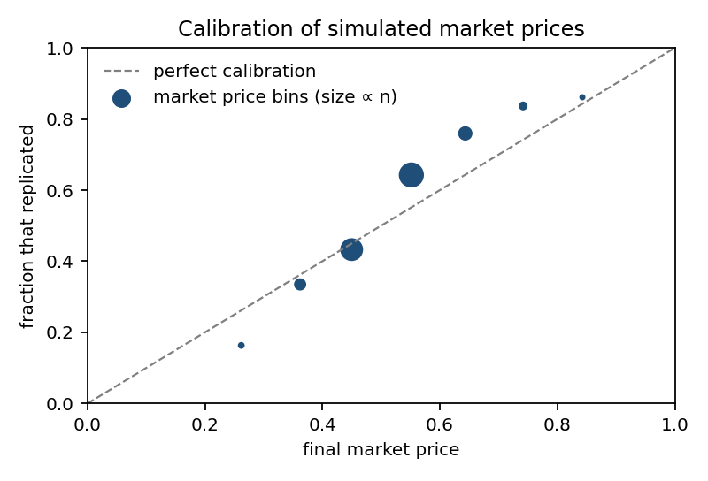
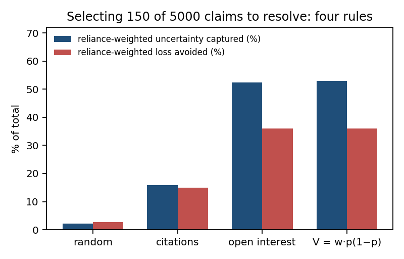
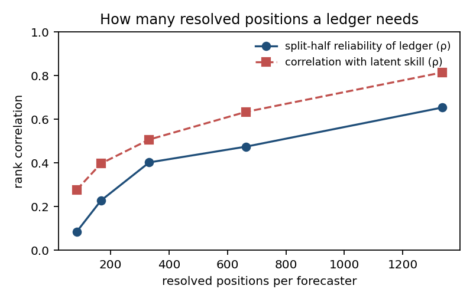
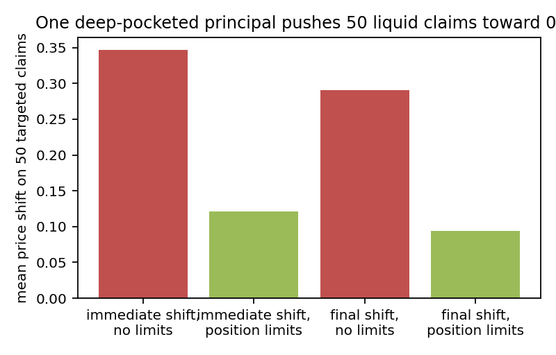
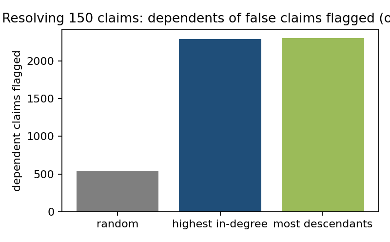

# Price Trust, Record Contribution, Pay for Value

## A full proposal for organizing science when AI does most of the work

*Version 3.4 — full circulation draft, 26 September 2026 (thirteen review rounds across v1–v3; see Appendix H)*

---

### Abstract

The scientific paper has carried six jobs at once: reporting a finding, claiming a discovery, credentialing its authors, justifying the next grant, identifying who is responsible, and conferring distinction. Each job worked because a paper was expensive to produce and mostly human-made, so its existence let institutions *infer* things they could not observe directly — that the result was probably sound, that its producers deserved more money, that the named people were capable. AI-assisted and AI-produced research has made the paper cheap and has broken those inferences. Review is overwhelmed, authorship no longer evidences ability, and counting outputs measures access to compute.

This proposal does not try to restore inference. It replaces it with three instruments that observe directly what the paper only implied. **Truth markets** attach a subsidized prediction market to every registered claim; the price is the reliability estimate, authors post bonds behind their claims, and the money at stake pays for the replication or adjudication that settles the question. **Flight recorders** capture human–AI collaboration while it happens, so that a person's contribution can be measured by replaying the work without them rather than asserted in a contribution statement. **Value-based funding** pays for datasets, tools, methods and results after their usefulness is visible, lets many small pledges steer shared infrastructure, and lets scarce experimental capacity find its price. Around these sit four structural measures: essential-facility access rules for research systems, cooperative ownership, a science dividend that funds human inquiry from AI-produced value, and employment criteria that no longer count papers.

The proposal specifies three pilots totalling about €1.1 million, each with a baseline and a pre-registered stop rule, a five-year transition path, an illustrative reallocation of a funder's budget, a risk register, and replies to the objections we expect. It draws on precedents that already exist at scale — replication prediction markets, decision markets that chose which studies to replicate, retroactive and quadratic funding programs that have distributed tens of millions, content-provenance standards, funding lotteries, and antitrust doctrine — and is explicit about what each precedent does and does not show.

---

### How to read this document

Part I explains what broke, what earlier abundance shocks teach, why incremental fixes fail, and how this proposal compares with the alternatives. Part II specifies the three instruments in detail, each with a worked example, precedents, failure modes and a first build. Part III applies the whole design to six fields, from machine learning to clinical medicine, and is candid about where it fits badly. Part IV covers the institutions around the instruments: ownership, employment, journals and the record, governance and law. Part V makes it operational: pilots and their evaluation, playbooks for each actor, transition, economics, risks, pre-mortems, objections. Part VI supplies evidence: the numbers behind the diagnosis, eight precedents examined at depth, a simulation of the market layer with its results and limits, and the report a field would publish once it stops counting papers. Part VII follows seven people and four institutions through a year of the system and addresses ethics, equity, training and the questions each audience asks. Part VIII specifies the platform, the federation protocol, pre-registration documents for the pilots, and five-year budgets. Appendices contain a glossary, schemas, a protocol template library, a retroactive-round rubric, a data-protection outline, worked numbers, references, the revision history and the simulation details. Boxes marked **What is…** introduce concepts for readers new to them and can be skipped by readers who are not.

A reader with fifteen minutes should read the executive summary (Section 1), the running example (Section 6), and the pilots (Section 22). A funder should add Sections 9, 23, 24, 25, 42 and 43. A scientist wondering whether any of this applies to her field should go to Part III and then to Section 35. A skeptic should start at Sections 27, 28 and 33. A lawyer should start at Section 21. An engineer should start at Sections 40 and 41 and Appendix B. Anyone who wants the evidence before the argument should start at Part VI.

---

### Contents

**Part I — Why**
1. Executive summary · 2. What broke, precisely · 3. Lessons from earlier abundance shocks · 4. Design principles · 5. The alternatives, compared

**Part II — The instruments**
6. The running example: Claim 47 · 7. Truth markets · 8. Flight recorders · 9. Paying for value · 10. Which instruments fit which science

**Part III — Six fields**
11. Machine learning · 12. Formal mathematics · 13. Clinical medicine · 14. Earth and climate science · 15. Psychology and the social sciences · 16. Materials and chemistry with automated laboratories

**Part IV — Institutions**
17. Who owns the machines · 18. What people are employed for · 19. Journals, societies and the record · 20. Governance charter · 21. Legal questions

**Part V — Making it real**
22. Three pilots and how they are evaluated · 23. Playbooks by actor · 24. Transition: the first five years · 25. Economics · 26. Risk register · 27. Pre-mortems · 28. Objections and replies · 29. Further ideas · 30. Summary of the design

**Part VI — Evidence**
31. Anatomy of the collapse: the numbers · 32. Precedent deep dives · 33. A simulation of the market layer · 34. Measuring a field without counting

**Part VII — Living with it**
35. Seven people, one year · 36. Four institutions in transition · 37. Ethics and equity · 38. Training scientists for this system · 39. Questions from seven audiences

**Part VIII — Building it**
40. Platform architecture and engineering plan · 41. Federation and interoperability protocol · 42. Pre-registration documents for the three pilots · 43. Budgets: five-year paths · 44. Conclusion

**Appendices**
A. Glossary · B. Record schemas · C. Resolution-protocol template library · D. Retroactive-round rubric · E. Data-protection outline · F. Worked numbers · G. Annotated precedents and references · H. Revision record · I. Simulation details · J. Sample records for Claim 47 · K. A model funder call · L. A catalogue of gaming strategies and defenses · M. A sample maintained-account release · N. A sample state-of-the-field report

---

# Part I — Why

## 1. Executive summary

**The problem.** In 2025 the NeurIPS conference received 21,575 submissions, up from 9,467 five years earlier, and needed 20,518 reviewers to handle them. After review by three to five experts each, accepted papers were found to contain a hundred fabricated citations. Independent estimates put the share of machine-written reviews at leading venues in the double digits. This is not a machine-learning peculiarity; it is the leading edge of what happens to every field once the cost of producing a plausible paper falls toward zero. The institutions that decide what to trust, whom to fund and whom to hire were built on the assumption that a paper is costly evidence of human work. That assumption is gone.

**The diagnosis.** Not every function of the paper has failed. A cheap paper can still contain a correct result and name an accountable organization. What failed is *inference* — the step from "this document exists" to "this person is capable," and increasingly from "this passed review" to "this is dependable." Reforms that add disclosure rules, contribution statements, submission caps or more reviewers all try to repair inference from outputs. They cannot, because the outputs can be produced by the same tools they are trying to detect.

**The principle.** Three decisions must be made separately, each by an instrument that observes rather than infers:

| Decision | Old proxy | New instrument |
|---|---|---|
| Is this dependable? | Peer review; venue prestige | Truth markets: priced claims, author bonds, resolution bought by the money at stake, calibration ledgers |
| Is more work here worth funding? | Proposals; publication record | Retroactive and quadratic funding; impact certificates; capacity spot markets; a human-judged share with lotteries |
| What has this person demonstrated? | Authorship; counts; h-index | Flight recorders; counterfactual credit by replay; logged examinations |

**The instruments.**

*Truth markets.* Every registered claim carries a specified resolution protocol and a subsidized prediction market. The price is the reliability estimate; the volume measures reliance. When enough is at stake, the market's resolution fund commissions the replication or adjudication. Authors post bonds that refuters can win. Everyone who trades or endorses accumulates a public calibration record that volume cannot inflate. Decision markets have already chosen which studies to replicate, and the studies they priced highest replicated at 83% against 33% for the lowest.

*Flight recorders.* Contribution cannot be recovered from a jointly produced output, but it can be recorded while the work happens. Attested workspaces log prompts, outputs, edits and decisions under the researcher's control. A person's contribution to a logged result is measured by replaying the work without their interventions. Unlogged work gets organizational authorship by default. Examinations become logged sessions.

*Value-based funding.* A fixed share of budgets is paid retroactively for contributions that proved useful — datasets, tools, negative results, maintenance — by paid, rotating evaluators with usage evidence in hand. Impact certificates let early funders of long-horizon work be repaid when it proves out. Quadratic matching lets many small pledges steer shared infrastructure. Dominant assurance contracts make pooled experiments fund themselves. Spot markets price scarce instrument and compute time. A human-judged fellowship share with lotteries remains for what cannot be measured.

**The record.** Underneath the instruments sits a small shared record: claims with resolution protocols, markets and bonds, workflow logs and contribution records, assessment records, and a reliance graph that replaces the citation graph with the thing citations always approximated — what actually depended on what. When a load-bearing claim fails, everything that relied on it is flagged and re-priced.

**The fit.** Part III applies the whole design to six fields. It fits machine learning, formal mathematics, psychology and automated materials science well, because resolution is fast or exact. It fits clinical medicine and earth science partially — through near-term observables, consensus marks, results bonds and honest non-pricing — and the chapters say where it does not fit at all.

**The structures.** Research systems above a capability threshold become essential facilities with regulated access. Laboratories may organize as cooperatives that own their systems. A science dividend, funded from AI-produced value, pays for human inquiry on its own terms. Institutions that receive public research money stop counting papers and are audited for it.

**The pilots.** Three, in one field with fast replication cycles, totalling about €1.1 million over twelve months: a truth market with a resolution fund, a flight-recorder plugin with replay, and a retroactive funding round with impact certificates. Each has a baseline and a stop rule fixed before launch.

**Governance and law.** A charter (Section 20) with rules that a simple majority cannot change — no submitter pays its assessor, no one is paid per verdict, researchers own their logs, registration is free, federation is mandatory — and a legal map (Section 21) that names the gambling, securities, data-protection, competition and employment questions and gives the design's answer to each.

**The ask.** One funder, one field, one year. Nothing here requires everyone to agree first.

**What is new here.** For readers who want to know what this document adds to the literature it draws on, twelve things that do not exist today in any research system:

1. Markets that commission their own resolution from the money at stake, with a mechanical trigger.
2. Author bonds with a premium paid from forfeited bonds, weighted by contest, so that only contested survivals earn.
3. Resolution auctions — a priced labor market for replication.
4. A calibration ledger with provisional periods, difficulty display and realized performance, as a hiring credential.
5. Critic leagues that turn automated criticism into a scored sport.
6. Counterfactual credit by replay of logged human–AI work.
7. Selective, Merkle-proof disclosure of a researcher-owned workflow log.
8. Results bonds posted by trial sponsors, with sponsors barred from trading.
9. Fidelity checks as a separate resolution step for formal claims, across proof assistants with declared trust bases.
10. Protected evaluation sets with an exposure ledger, so that contamination is bounded rather than assumed away.
11. A reliance graph with revalidation cascades, replacing the citation graph with what actually depended on what.
12. Research vouchers — universal, small, application-free capacity — as the floor under every allocation.

---

## 2. What broke, precisely

### 2.1 Six jobs, one artifact

For roughly a century the research paper has performed six distinct institutional functions:

1. **Report** a finding so others can use it.
2. **Claim** priority for a discovery.
3. **Credential** the named authors as capable researchers.
4. **Justify** the next allocation of money to its producers.
5. **Identify** who is responsible if the finding is wrong.
6. **Confer** distinction — prizes, invitations, standing.

These functions were bundled because bundling was efficient. A paper was expensive to produce: it required months of a trained person's time, access to a laboratory, and the ability to survive expert scrutiny. Its existence was therefore *evidence* — not proof, but evidence — that a capable human had done real work that survived criticism. Hiring committees, funders and readers could infer from the artifact things they could not directly observe.

### 2.2 The inference broke, not the artifact

It is tempting to say that AI "broke the paper." That overstates it. A paper produced with heavy AI assistance can still contain a correct result, explain it clearly, and name an organization that will answer for it. Functions 1, 2 and 5 survive in weakened form.

What broke is the inferential step behind functions 3, 4 and 6, and increasingly behind readers' trust in function 1:

- "This person is listed as author of impressive papers, therefore this person is capable." — False when the paper, its contribution statement and its rebuttals can all be generated.
- "This group produced many results, therefore it deserves more resources." — Measures access to compute, not scientific judgment.
- "This paper passed peer review, therefore it is probably sound." — Fails when reviewers are overwhelmed and use the same tools as authors, and when a fabricated citation can pass three to five expert readers.

The evidence is already public. NeurIPS grew from 9,467 submissions in 2020 to 21,575 in 2025. Post-hoc scans found 100 fabricated citations in 53 accepted 2025 papers. One detector's estimate for ICLR reviews was that about a fifth were AI-generated, and a separate study found that AI-assisted reviews systematically raised paper scores and acceptance rates. None of this required malice. It is what happens when the cost of producing an artifact that *looks like* evidence falls faster than the cost of checking it.

### 2.3 Why the incremental fixes fail

Each proposed repair tries to restore inference from the output. Each fails for the same reason: the output can be manufactured by the thing being screened for.

| Proposed fix | Why it fails |
|---|---|
| Mandatory AI-use disclosure | Unverifiable; penalizes honesty; the disclosure can be generated too |
| Detailed contribution statements (CRediT etc.) | The statement is itself an output; the AI can write it; CRediT's own documentation says it does not determine authorship |
| Submission caps per author | Punishes production rather than rationing scarce services; re-imports the human author as the bottleneck; results in name-shuffling |
| More reviewers, reviewer credits, mandatory reviewing | Reviewers use the same tools; mandatory reviewing produces machine reviews of machine papers |
| AI reviewers | Correlated with the AI authors; agreement among copies of one model is one opinion |
| Better metrics (altmetrics, normalized citations) | Any metric computed from outputs is inflated by volume; volume is now free |
| Organizational audits of random output samples | Tells you a process is sound, not whether the specific result you rely on is correct |

Two of these — submission caps and organizational audits — appeared in earlier versions of this proposal. They are withdrawn here. The correct principle is stated in Section 4: ration scarce *services* (expert attention, experiments, prominence), never production; and assess the *specific result* when reliance matters, not the organization in general.

### 2.4 What we are not claiming

We are not claiming that AI has already produced reliable, autonomous science across fields. Bounded demonstrations exist; general autonomy does not. We are not claiming that peer review never worked, or that every paper is now suspect. We are claiming something narrower and harder to escape: institutions that decide trust, money and careers by inference from artifacts will be gamed at scale as soon as artifacts are cheap, and the design must stop depending on that inference before the gaming completes.

---

## 3. Lessons from earlier abundance shocks

This is not the first time the cost of producing knowledge-bearing artifacts has collapsed, and it is not the first time institutions built for scarcity have had to be rebuilt. The history is worth a chapter because it establishes two things skeptics need to hear: that scientific institutions have been redesigned before, often quickly; and that the redesigns that worked had a common shape.

### 3.1 The printing press and the Republic of Letters

Before print, a scholar's claim travelled by letter and by copied manuscript, and reputation was personal — you were trusted because someone who knew you vouched for you. Print made the artifact cheap and anonymous at scale. The institutional response, over about a century, was the learned society and the journal: the Royal Society's *Philosophical Transactions* began in 1665 as a way to establish priority and to filter, by the society's standing, a flood of printed claims that no individual could assess. The journal was an *attention* institution before it was a *quality* institution. Its first job was to say "this is worth your time," and it did so by association with a trusted body, not by examining each claim.

The lesson: when artifacts become cheap, the scarce thing is attention, and the first institutions to emerge allocate attention by trusted association. That is also the failure mode — trusted association becomes prestige, prestige becomes a gate, and the gate is eventually gamed.

### 3.2 Peer review is younger than it looks

Systematic external refereeing is often imagined as a founding feature of science. It is not. Through the nineteenth century most journals published on the editor's judgment; referee systems spread unevenly through the twentieth. *Nature* did not adopt systematic external refereeing until 1973. Peer review as a universal norm is roughly fifty years old — younger than most of the people now defending it as sacred.

The lesson: the institution being overwhelmed is not ancient and was not designed; it accreted. It can be replaced by something designed.

### 3.3 The research university and the grant

The nineteenth-century German research university tied teaching to original research and created the career structure — doctorate, habilitation, chair — that made a scientist's published output the currency of advancement. The twentieth-century grant system, built after 1945, tied that currency to money: publications justified grants, grants produced publications. The paper's six functions (Section 2.1) were fused in this period, and they were fused because a single artifact that did six jobs was administratively efficient for institutions that could not afford to observe scientists directly.

The lesson: the fusion was a convenience, not a principle. Institutions fused the functions because observation was expensive. When observation becomes cheap — a price backed by money, a log, a usage record — the convenience has no reason to survive.

### 3.4 Big science gave up individual authorship and survived

High-energy physics collaborations have published with author lists of thousands, in alphabetical order, since the 1990s. Astronomy surveys grant "builder" status that confers authorship on every paper for a period. Within these communities, hiring does not use the author list — it cannot — and instead uses internal responsibilities, talks assigned by the collaboration, internal review records and letters from people who worked alongside the candidate. These fields have run for three decades without individual authorship as a credential, and they hire, promote and win prizes.

The lesson: a scientific community can operate without the paper as a personal credential, and the substitute it reaches for is exactly what this proposal reaches for — observed roles, internal records and references from co-workers. The recorder and the contribution record are that substitute, generalized and made portable.

### 3.5 Software: the closest analogue and where it breaks

Software production went through the same transition a generation earlier. When programs were scarce, they could be inspected by hand. When they became abundant — billions of commits, petabytes of code — the response was not to review every line; it was infrastructure: version control, dependency graphs, package registries, automated tests, continuous integration, issue trackers, reputation by contribution, forks, provenance. Human review moved to the top of the stack, where judgment could not be automated, and everything below it was mechanized.

Science can borrow most of this and has already borrowed some (preprints are the registry; preregistration is the test; replication is the integration test). Where the analogy breaks is decisive: code can be run, and science needs contact with the world. The scientific equivalent of continuous integration is not "the analysis executes"; it is progressively stronger validation against independent evidence — which is expensive, and which is why this proposal spends most of its energy on how to *allocate* that expensive validation rather than on how to automate it.

The lesson: build the registry, the dependency graph and the tests; then solve the allocation of the one thing that cannot be automated.

### 3.6 Open source: reputation by contribution

The open-source movement solved the credit problem for abundant production without a credential. A contributor is known by what they merged, what they maintain and how their contributions held up — a record that is public, granular and impossible to inflate by volume because a rejected pull request is visible. Foundations (Apache, Linux) formed to hold the commons, to govern it, and to receive corporate money without corporate control. Maintenance became recognized as first-class work, though still underfunded.

The lesson: reputation by contribution scales; foundations are the governance form; maintenance must be funded explicitly or it is not done.

### 3.7 The replication crisis and the preregistration movement

Within science itself, the last fifteen years saw a partial reform: large replication projects showed that a third to a half of published findings in some fields did not hold; preregistration, registered reports and prediction markets on replication emerged as responses; and the metascience community built the evidence that this proposal cites. The reform stalled at the incentive layer — preregistration is still optional in most fields, and the career currency is still the paper — because it never changed what hiring committees count.

The lesson: instruments that improve reliability without changing what institutions count will remain optional forever. That is why the counting ban and the reallocation of funding are in this proposal, and why they are conditions rather than recommendations.

### 3.8 The common shape

Every successful redesign in this history did three things. It **separated** functions that had been fused (attention from quality; credit from output; the commons from its contributors). It **mechanized** what could be mechanized and moved human judgment to where it was scarce. And it **changed what institutions counted**, because nothing else sticks. The proposal in Parts II–V is an attempt to do all three at once, deliberately, rather than waiting a century for them to accrete.


## 4. Design principles

Every mechanism in Parts II and III is derived from ten principles. They are stated here so that a reader can check the mechanisms against them and so that future revisions have something to be checked against.

1. **Observe, don't infer.** A decision about trust, money or capability should rest on something that was measured — a price backed by money, a replay of logged work, a record of demonstrated use — not on properties inferred from an artifact.

2. **Separate the three decisions.** Whether a result is dependable, whether more work deserves resources, and what a person has demonstrated are different questions with different evidence. A good result can justify the first two without settling the third.

3. **Ration services, not production.** Expert attention, experiments, prominent placement and money are scarce and must be allocated. Producing and registering a result must never be restricted; the world is better with ten thousand cheap true results than a hundred expensive ones.

4. **Volume-proof by construction.** Any mechanism that can be improved by producing more must be rejected. A bet costs something whether or not it pays; a replay measures what changed; a retroactive award follows use. An h-index rises with output; a calibration score only rises with being right.

5. **"Unassessed" is an honest state.** Most claims will never be priced, replicated or adjudicated. That is not failure; it is the truth about them. The record must display it rather than convert silence into either acceptance or rejection.

6. **Money attaches to information, never to verdicts.** Assessors are paid for doing agreed work, traders profit from being right, refuters win bonds for sustained refutations. No one is ever paid per favorable verdict, and no submitter ever pays their own assessor.

7. **Accountability attaches to organizations; credit attaches to measured contribution.** An accountable host answers for a result — preserves records, responds to challenges, funds corrections. Personal credit is separate and requires evidence.

8. **People control their own records.** A researcher owns their workflow log and decides what to disclose. Institutions get summaries and sampled audits, never the stream.

9. **Pluralism over canon.** Many maintained accounts of a question may coexist over one shared record. No single organization decides the canon; the record preserves disagreement.

10. **Everything stoppable.** Every pilot has a baseline, a pre-registered stop rule, and an owner who can end it. Expansion is a new decision, not a reward for a persuasive report.

## 5. The alternatives, compared

This proposal is not the only response on offer. Most of the alternatives contain something right, and several are complementary rather than rival. The comparison is by what each does about the three decisions — dependability, funding, capability — and about volume.

| Proposal | What it fixes | What it leaves | Compatible with this proposal? |
|---|---|---|---|
| **Publish-then-review** (eLife-style: publish first, attach public assessments) | Removes the gate; makes assessment visible | Still human reviews of every item; no pricing, no resolution, no credit reform | Yes — assessments become one input to markets |
| **Overlay journals and reusable review** (Peer Community In, Peer Community Journal) | Ends duplicate review across venues; no author fees | Volume unchanged; review remains the bottleneck | Yes — overlay journals are natural maintainers of accounts |
| **Registered Reports** | Separates methods assessment from outcome; kills outcome bias | Applies to a minority of studies; no credit reform | Yes — a registered report is a resolution protocol with a publication promise |
| **Narrative CVs, DORA, "responsible metrics"** | Names the problem; broadens what counts | No enforcement; narrative can be generated; no observable substitute | Partly — the counting ban is DORA with teeth; narrative is replaced by ledgers and logs |
| **Submission caps and reciprocal reviewing** | Reduces load at one venue | Restricts production; re-imports the human author as bottleneck; name-shuffling | No — withdrawn from this proposal for those reasons |
| **AI reviewers** | Scales review | Correlated with AI authors; no accountability; agreement among one model's copies is one opinion | Only as critics in a league with a ledger, never as juries |
| **Detection and disclosure regimes** | Attempts to preserve the human-authorship inference | Unverifiable; punishes honesty; arms race | No — the inference is what broke |
| **Better metrics** (altmetrics, field-normalized citations, network measures) | Improves on raw counts | Any output-derived metric inflates with volume, which is now free | No — principle 4 excludes them |
| **Prediction markets alone** (Hanson's idea futures, 1990s) | Prices claims | No resolution mechanism, no credit, no funding reform, legal obstacles unaddressed | Yes — this proposal is that idea plus resolution funds, bonds, ledgers and everything else |
| **"GitHub for science"** (registries, provenance, dependency graphs, CI) | Builds the substrate | Does not allocate the expensive validation or reform credit and money | Yes — the record layer in Section 19 is this substrate |
| **Decentralized science (DAOs, tokens, IP-NFTs)** | Tried retroactive and quadratic funding at scale; experimented with ownership | Token governance proved fragile; speculation detached from science | Partly — the funding mechanisms survive; token governance does not |
| **Organizational audits** (annual random-sample audits of institutions) | Detects bad processes | Does not certify the result you rely on | No — withdrawn from this proposal |
| **Doing nothing** | Cheapest this year | Review collapses in public; counts measure compute; misattribution becomes the norm | — |

Three observations. First, most reforms proposed from inside publishing improve the *artifact's* review and leave the *inference* intact; they are improvements to a thing that has stopped being load-bearing. Second, the proposals that change what institutions count — DORA, narrative CVs — lack an observable substitute, so committees revert to counting. Third, the mechanisms this proposal borrows from outside science (markets, retroactive and quadratic funding, provenance signing) have each been run at scale somewhere else and are treated here as engineering, not as speculation.


# Part II — The instruments

## 6. The running example: Claim 47

Everything in Part II is illustrated with one claim, followed from registration to reliance. The example is invented but ordinary — a materials claim of the kind produced by the thousand every week.

A materials laboratory operates an AI research workflow under a revocable authorization from its host organization. The workflow reads the literature, proposes that a small amount of a phosphonate additive should slow the degradation of lithium-ion battery electrolytes, designs cycling experiments, runs them on a robotic bench, analyses the data and drafts a report. Halfway through, a battery chemist on the team — call her Lena — overrules the workflow's initial choice of additive family, based on bench experience the literature does not record. Two colleagues authorized the budget and maintained the equipment.

> **Claim 47.** Adding 2% of additive Q to a standard lithium-ion electrolyte halves capacity loss over 1,000 charge cycles.
>
> *Registered by:* Host organization H, on behalf of authorized workflow W-3.
> *Human contributions:* to be established from the workflow log.
> *Resolution protocol:* An independent laboratory runs the preregistered cycling test on three cells from a fresh batch of the specified formulation. "Replicates" means capacity loss reduced by at least 35% relative to control at 1,000 cycles. Adjudication of protocol validity by the assessment service designated at registration.
> *Bond:* €2,000, posted by H.
> *Market:* opened at registration with a €400 market-maker subsidy; resolution fund eligible for a base allocation once the claim crosses the field's priority floor on confirmed reliance times price uncertainty.

The life of a claim under this proposal, in one picture:

```
  REGISTER ──► PRICE ──► FUND RESOLUTION ──► RESOLVE ──► UPDATE
  claim +      market    base allocation +   auction +   ledger scores;
  protocol +   opens;    trade fees +        adjudicate  bond returns or
  bond by      traders   reliant parties                 forfeits; reliant
  host         reveal    pay in                          claims re-flagged;
               what                                      retro awards use
               they                                      usage records
               know
       │                                                      │
       └──────── workflow log runs throughout ────────────────┘
                 (contribution measured by replay at registration)
```

Three things are already different from a paper. The claim is registered by an organization, not by three people asserting they conceived it. Human contribution is a question to be answered from evidence, not a statement to be trusted. And the claim carries, from birth, a precise statement of what would settle it. Everything else builds on these three moves.

### 6.1 What a claim record contains

A registered claim is a small structured record with a human-readable report attached. The structured part is what the instruments act on:

| Field | Content | Why it matters |
|---|---|---|
| Statement | The claim, scoped: population, conditions, effect size, uncertainty | Markets and bonds need something precise to settle |
| Resolution protocol | What test settles it, who may run it, what counts as success, how disputes about the test itself are adjudicated | Fixed at registration so the fight about "was the replication valid" cannot start afterwards |
| Host | The accountable organization, its obligations (records, challenges, corrections) | Accountability attaches to organizations |
| Authorization | The workflow or person that produced it, and the scope of their authority | Agents act under revocable, scoped authorizations |
| Provenance | Data, code, instruments, dependencies, and the workflow log if disclosed | Reproduction, replay and audit |
| Bond | Amount, terms, expiry | Skin in the game; the refuter's prize |
| Market | Subsidy, resolution threshold, resolution fund | The price and the trigger |
| Contributions | Measured human contributions, or "not established" | Credit is measured, not asserted |
| Status | Registered / priced / resolution commissioned / resolved / challenged / superseded — several may hold at once | "Unassessed" is displayed, not hidden |

The report attached to the record can be as long and discursive as any paper. What changes is that the report is no longer the unit that institutions act on.

---

## 7. Truth markets

### 7.1 The idea

Instead of asking two or three anonymous reviewers whether Claim 47 is sound, let anyone who thinks they know something put money on it; read the price; and use the money at stake to pay for the experiment that settles the question.

> **What is a prediction market?**
>
> A prediction market trades contracts that pay out depending on a future event. A contract on "Claim 47 replicates" pays €1 if the replication succeeds and nothing if it fails. If that contract trades at 60 cents, the market is collectively estimating a 60% chance of success.
>
> Why should a price beat a vote? In a vote everyone counts equally. In a market, people who know something profit and people who guess lose. A laboratory that has privately tried and failed to reproduce an effect can sell contracts and collect when the price falls. Their knowledge moves the price; their profit is the payment for revealing it. The University of Iowa has run election markets since 1988. In two large studies led by Colin Camerer and Anna Dreber, markets among scientists predicted which published findings would replicate; the studies with the highest and lowest prices were then replicated and the market was right far more often than not.

> **What is an automated market maker?**
>
> A market needs someone willing to trade at every moment. A bookmaker does this by quoting odds and adjusting them as bets arrive. An automated market maker is a program that does the same by formula: it always quotes a price, raising it when people buy and lowering it when they sell. On average it loses a bounded amount to well-informed traders. That bounded loss is the *subsidy*, and it is the elegant part: the subsidy is exactly the price paid for the information the market extracts. Whoever funds the market maker is buying knowledge at a known maximum cost. The standard design is Robin Hanson's logarithmic market scoring rule.

### 7.2 Claim 47 in the market

*Monday.* The claim is registered. The assessment fund seeds a market maker with €400. The opening price is 50 cents.

*Tuesday.* A group in Grenoble that spent the spring trying to reproduce a related effect, and failing, sells contracts. The price falls to 32 cents. Nobody wrote a letter to the editor; nobody had to publish a negative-result paper that no journal wanted. The information is in the price, and Grenoble will be paid for it if they are right.

*Wednesday.* Host H, which posted the bond and believes the claim, buys. Two other laboratories that have seen encouraging pilot data buy too. The price recovers to 41 cents. Open interest reaches €18,000 — a sign that people with money at risk disagree, which is the market's definition of a claim worth settling.

*Thursday.* A battery manufacturer would like to build on additive Q, but only if the effect is real. It has two moves available and makes both. It buys "no" contracts as a hedge — if the claim fails, the payout offsets the development work it is about to waste — and it pays €8,000 directly into the claim's resolution fund, because what it actually wants is an answer, not a position. Reliance is expressed by paying for resolution.

### 7.3 Markets buy their own resolution

Ordinary prediction markets wait for the world to settle the question. Scientific markets can *commission* the settlement.

Each priced claim has a **resolution fund**. Money enters it from three sources: a base allocation from the field's assessment fund, granted only once the claim crosses the field's published priority floor on confirmed reliance times price uncertainty — so that the fund's money follows what depends on the claim rather than being spread thinly over every market; a small resolution fee — a fraction of a percent — on every trade, so that trading volume itself accumulates the means of settlement; and direct payments from reliant parties who want the question answered. The **trigger** is mechanical: when the resolution fund reaches the cost stated in the resolution protocol, resolution is commissioned. Open interest is not spent — it is traders' money and settles the contracts — but it is one of the signals that determine how the assessment fund prioritizes its base allocations among thousands of markets. The priority rule ranks claims by confirmed reliance (Section 19.3) times price uncertainty, adds direct payments by reliant parties as revealed reliance, and uses open interest as the measure of disagreement; the simulation in Section 33.6 shows why open interest alone is not enough — it tracks what forecasters look at, which need not be what matters.

For Claim 47, the base allocation of €6,000 was granted on Wednesday, when two registered claims declaring reliance on it and a price near 40 cents put it above the field's priority floor; the resolution fee had accumulated €400 by Thursday; and the manufacturer's €8,000 brings the fund to €14,400. The assessment fund, applying its published rule that markets in the top decile of confirmed reliance times price uncertainty are topped up to threshold — Claim 47 is relied on by two registered claims and a manufacturer has paid in — adds the remaining €5,600. Resolution is commissioned on Friday.

The consequence is that the claims which get checked are the ones people are both uncertain about and rely upon. No committee decides which of ten thousand claims deserve replication; the money already said so. A claim nobody trades remains visibly unassessed — not rejected, not accepted, priced at nothing because nobody has needed it yet.

This is not hypothetical. In a study published in 2025, 162 social scientists traded on 41 published experiments knowing that the twelve highest-priced and twelve lowest-priced would be replicated. The high group replicated at 83%; the low group at 33%. The market chose what to test and chose well.

*June.* The replication finds capacity loss reduced by 22% — real, but below the 35% threshold. The contract settles at zero. Grenoble profits from being right; host H and the two optimistic laboratories lose their positions. The manufacturer's hedge pays out, offsetting the development it had started, and it has an independent answer for €8,000 instead of a €20,000 study it would have had to organize itself. Lena's laboratory learns the effect is smaller than claimed and registers a revised claim — "reduces capacity loss by at least 15%" — which supersedes Claim 47; the bond rolls over to it, and a new market opens at 70 cents.

### 7.4 To author is to underwrite

> **What is a bond?**
>
> A builder who wins a public contract posts a performance bond: money held by a third party, forfeited if the work is not delivered. It aligns incentives without anyone having to trust anyone's word.

The host that registers a claim posts a bond behind it, scaled to how strongly the claim is stated. "Halves capacity loss" is strong; €2,000 is posted. Bonds are posted by hosts — organizations — never by individual researchers; a doctoral student never needs capital to make a claim, and a host's decision about which of its claims to bond is a signal in itself. A successful refutation — a failed preregistered replication, a reproducible counterexample, a demonstrated analytical flaw — pays the bond to the refuter. A claim that survives its term returns the bond with a premium.

The premium comes from a **bond pool** funded by forfeited bonds, not from the assessment fund, and each surviving claim's share of the pool is weighted by the open interest its market attracted. This closes an obvious exploit: a host cannot farm premiums by bonding thousands of trivially true claims, because trivial claims attract no trading and therefore earn nothing. Bonds on claims that people actually contested, and that survived, earn the most. Premiums are paid by the losers to the winners of the contest over what is true.

A challenger who lodges a refutation posts a **challenger stake** — 10% of the bond — forfeited to the host if the challenge fails adjudication. This makes noise expensive and sustained challenges profitable.

Bonds do two things the current system cannot.

First, they make cheap criticism valuable exactly when it is right and worthless when it is noise. AI systems can generate a thousand objections to any paper overnight. Under a bond regime, lodging a challenge costs something and winning one pays. The flood of automated criticism turns into a bounty hunt, and the bounties are only collected by challenges that survive adjudication.

Second, they price overstatement. The bolder the wording, the more must be put behind it. A laboratory that wants to claim "halves" rather than "reduces by 15–30%" can do so, at a price. Effect-size inflation — one of the most persistent pathologies of the current literature — acquires a cost.

For Claim 47, the June replication does not forfeit the bond: a smaller real effect is a qualification, not a refutation. The protocol registered at birth said what counted, and the adjudicator applies it.

Credit, in this system, is the bond that survived. Donald Knuth has paid reward cheques for decades to anyone who finds an error in his books; Paul Erdős offered cash for solutions to his problems. Both are bonds on claims at small scale. This proposal makes them the default.

### 7.5 The calibration ledger

> **What is calibration?**
>
> A forecaster who says "70% chance of rain" is calibrated if, on the days she says so, it rains about 70% of the time. Calibration is not boldness or caution; it is stated confidence matching reality. The Brier score, from 1950, measures it: it rewards confidence when right and punishes confidence when wrong, and a hedged forecast that says 50% to everything scores poorly against a forecaster who actually knows.

Every person and every AI system that trades on or endorses claims accumulates a public record. It has two parts. **Realized performance**: profit and loss across resolved positions, which measures skill the way a fund manager's record does. **Calibration**: each trade or endorsement is accompanied by an explicit probability, scored with a proper scoring rule when the claim resolves. Proper scoring rules reward both calibration and sharpness, so a hedged forecaster who says 50% to everything scores worse than one who actually knows. The ledger also displays the number of positions and the average difficulty of the claims taken — measured by how contested their markets were — so that a record built on easy claims is visibly a record built on easy claims.

This record has the property the h-index lacks: **it cannot be inflated by volume.** More papers raise an h-index; more positions only improve a ledger if the positions are good. A scientist who endorses ten claims at 90% and sees five replicate has a worse record than one who endorses them at 60% and sees six replicate — and everyone can see it.

The ledger also solves a problem specific to AI agents. An agent's track record on the ledger is the only evidence of its reliability that cannot be produced by the agent itself. A critic model with a good record on sustained challenges is worth listening to; one with a record of noise is not, however fluent its objections.

This makes a **critic league** possible. Critic agents — and human critics — compete on sustained challenges, ranked on a public leaderboard like a forecasting tournament, with prizes from the bond pool and from challenger stakes forfeited by losing rivals. The flood of automated criticism that threatens to drown every venue becomes a sport with a scoreboard, in which only challenges that survive adjudication score. A laboratory choosing which objections to take seriously reads the league table.

**Provisional ledgers for newcomers.** A researcher's first fifty positions are scored privately and displayed publicly only as "provisional." Nobody's early learning bets follow them for a career, and the ledger starts at zero for everyone on the day the system starts — a senior researcher has no accumulated advantage.

### 7.6 Design details that matter

**Resolution protocols are fixed at registration.** The fight "the replication was done wrong" is the new "the reviewer didn't understand my paper." It is pre-empted by fixing, at registration, what test settles the claim, who may run it, what counts as success, and who adjudicates disputes about validity. Templates for common claim types (Appendix C) make this a five-minute step, not a legal negotiation.

**Protocols can be amended until a market opens, and can be ruled inadequate.** For novel claims the right test is not always obvious at registration. A host may amend the protocol, with the amendment logged, at any time before the first trade. After that, only the named adjudicator may rule that a protocol is inadequate — for example, that its success criterion is unfalsifiable — in which case the market is suspended, the claim is displayed as "unpriceable pending protocol," and the host may re-register with a better one.

**Hosts cannot short their own claims.** A host's bond is its long position. Allowing a host to also sell contracts on its own claim would let it profit from private knowledge that the claim is weak — registering claims in order to bet against them. Hosts, their authorized workflows and their principals may buy but not sell contracts on claims they registered.

**The assessment fund operates under published rules.** How base allocations are sized, how markets are prioritized for top-up, and how subsidies are set are published rules administered by the field's assessment fund under the oversight board (Section 22.5). No individual decides which claim gets resolved.

**Prices need reasons.** A number is not a review, and a scientist who wants to know *why* a claim trades at 32 cents is entitled to an answer. Two records supply it. Every trade may carry a short **rationale**, attached to the position and revealed on resolution, so that the ledger scores not only who was right but whose reasons held up. And every **challenge record** states an alleged defect and a test for it. Together, the market gives the price and the challenge records give the reasons; the critic league ranks the reasons by whether they survived. This is more than peer review supplies today, where the reasons are two paragraphs read once and discarded.

**Resolutions are not final.** A replication can itself be wrong. A resolved claim can be re-opened by a new challenge with a new stake and a new protocol; the original resolution is itself a claim on the record with its own provenance, and the laboratory that performed it has its own ledger. Ledger scores are marked against the resolution at the time and re-marked if it is overturned. "Resolved" means "settled on the evidence then available under the protocol agreed," which is what science has always meant by established.

**Resolution is commissioned by threshold, not by vote.** The trigger is the resolution fund reaching the protocol's cost estimate; the base allocations that fill it are granted by the published priority rule. Both are mechanical and cannot be lobbied.

**Resolution auctions.** When resolution is triggered, accredited laboratories bid to perform it. The lowest credible bid wins, where "credible" is a function of the bidder's own ledger and past resolutions. Bidders post a small performance bond. This creates a market for replication labor, which does not exist today, and gives replication a price.

**Agents trade under principals.** An AI agent trades through the account of an accountable organization, with position limits per principal and disclosure of the models it depends on. Agreement among copies of one model counts as one opinion.

**No-loss markets where real-money markets are illegal.** In many jurisdictions a real-money market on scientific claims is gambling. The Replication Markets project ran on allocated play-money with $142,000 in cash prizes paid to the best forecasters, which is a prize competition, not a bet. Institutional markets, where only accredited organizations trade, are another lawful design. The pilot uses the prize design; the proposal is indifferent between the two as long as trading has a cost and being right pays.

**Not every claim gets a market.** Registration is free. A market is opened when the host asks for one, when a reliant party asks for one, or when the assessment fund's rules select it. Most claims will never be priced. That is correct.

**Structured elicitation feeds the price.** In the DARPA SCORE program, a structured deliberation protocol (repliCATS) matched or exceeded market forecasts on some measures. The market should be able to ingest panel forecasts as trades by an institutional participant. Markets are the aggregation layer, not the only source of judgment.

### 7.7 Precedents and what they show

- *Dreber et al. (2015), Camerer et al. (2016, 2018).* Prediction markets among researchers predicted replication outcomes across three large replication projects. They show that scientists collectively know which findings are fragile, and that markets extract that knowledge.
- *Holzmeister et al. (2025).* A decision market chose which of 41 studies to replicate; the top twelve replicated at 83%, the bottom twelve at 33%. It shows that markets can *allocate* replication, not just predict it.
- *DARPA SCORE (2019–2022).* Forecasts on more than 3,000 claims across eight disciplines, by markets and by structured panels; a subset replicated to ground-truth the forecasts. It shows the approach scales to thousands of claims, and that structured elicitation is a competitive alternative to trading.
- *Replication Markets prize payouts.* $142,000 in cash prizes over 121 resolved questions shows the no-loss legal design works and attracts serious forecasters, including at least one who built a quantitative model and dominated early rounds — a warning about liquidity and a demonstration that skill is rewarded.
- *Hanson's LMSR (2003).* The subsidized market maker with bounded loss is standard and implemented in open-source software.

What these precedents do not show: that markets work for claims whose resolution takes decades (Section 10), that they resist manipulation by parties with large commercial stakes at scale, or that the calibration ledger changes hiring behavior. The pilot is designed around those gaps.

### 7.8 Failure modes and mitigations

| Failure | Mitigation |
|---|---|
| Thin markets: two traders, one moves the price | Low-volume prices are displayed as "unassessed," not as estimates; subsidy weighted toward claims with demonstrated reliance |
| Deep pockets prop up a claim | Position limits per principal; a manipulated price is a subsidy to anyone with real information, who will take the other side; bond forfeiture on refutation |
| Resolution disputes become the new review queue | Protocol fixed at registration; independent adjudicator named at registration; adjudicators have their own ledger |
| Agent swarms trade in concert | Agents trade under principals; shared-model disclosure; correlated positions collapsed to one |
| Claims registered to be unresolvable | Registration requires a resolution protocol; claims without one are "unpriceable" and get no market, no bond, and no credit |
| Gambling law | No-loss prize design or institutional-only markets |
| Markets reward the well-connected forecaster, not the field | The ledger is public; a good forecaster who is not a domain expert is still useful; expertise shows up as profit |

### 7.9 First build

One field with fast, cheap resolution: empirical machine learning, where a claim can be re-run on a held-out benchmark split in days for hundreds of euros. About five hundred registered claims, drawn from the past two years of the field's output with the hosts' consent. A subsidy fund of €150,000, a resolution fund of €100,000 buying at least sixty resolutions, a platform adapted from open-source market software, twelve months. Experimental psychology, with its existing replication culture but €10,000-plus replications, follows in year two.

The test: resolution decisions track prices better than a simple baseline (citation count, venue); the ledger separates good forecasters from bad ones out of sample; cost per resolved claim comes in below a conventional replication study.

---

### 7.10 Contract types and market microstructure

The examples so far use a binary contract — replicates or not. Real claims are richer, and the market design should be too.

**Binary contracts.** Pays 1 if the resolution protocol's success criterion is met. Right for claims with a natural threshold: a proof is checked or not; a benchmark is beaten or not; a drug meets its primary endpoint or not.

**Scalar contracts.** Pays in proportion to a measured quantity — the replicated effect size, the benchmark score, the measured capacity retention. A scalar market on Claim 47 would have traded not on "halves capacity loss: yes/no" but on "capacity loss reduction at 1,000 cycles, in percent," settling at 22. Scalar markets convey far more: the market's expected effect size, its spread, and the probability mass above any threshold a reliant party cares about. Most empirical claims should have scalar markets, with the binary "meets stated claim" derived from them. In implementation a scalar market is a ladder of interval contracts — "reduction in 0–10%," "10–20%," and so on — priced jointly by a combinatorial market maker, which is exactly what the logarithmic scoring rule was designed for; the ladder's prices form a distribution, and "meets stated claim" is the mass above the threshold.

**Conditional contracts.** Pays only if a condition holds — "effect size if the replication uses the original formulation" versus "if it uses the commercial formulation." These let a market express the scope of a claim, and they are the building block for futarchy (Section 9.7) and for fork markets.

**Multi-outcome contracts.** For claims with several possible resolutions — which of three mechanisms explains an observation — a single market over outcomes, priced as a distribution.

**Long-dated and marked contracts.** For long-horizon fields (Section 10.1), contracts with periodic consensus marks and the option of settlement on an intermediate observable.

> **What is the logarithmic market scoring rule, in numbers?**
>
> The market maker holds a quantity *q* of "yes" contracts sold and quotes the price *p* = e^(q/b) / (1 + e^(q/b)), where *b* is the liquidity parameter. With *b* = 300, selling 100 contracts moves the price from 50 to about 58 cents; selling 300 moves it to 73. The market maker's worst-case loss is *b*·ln 2 ≈ 0.69·*b* — with *b* = 300, about €208 on a €1 contract. That worst-case loss *is* the subsidy: the funder knows in advance the most it will pay for the information. Larger *b* means a deeper market that a single trader cannot move far, at the cost of a larger maximum subsidy. The pilot sets *b* so that the worst-case loss equals the market's intended subsidy — €400 for Claim 47 gives *b* ≈ 577.

**Subsidy sizing.** The subsidy for a market is set by a published rule from three inputs: the claim's stated strength (bolder claims get deeper markets because they are worth more to price), the reliance signal (claims other registered claims depend on get more), and a field-level budget. Nobody sets subsidies by hand.

**Position limits.** Per accountable principal, a limit on net position as a fraction of *b* — for example, no principal may hold more than 2·*b* contracts net — so that no single party can pin the price. Agents inherit their principal's limit; a swarm of agents under one principal shares one limit.

**Resolution fee.** A fee of 0.5% on each trade's notional, paid into the claim's resolution fund. A market with €18,000 of open interest that turned over three times has accumulated €270 toward its own resolution.

**Display.** A market's public face shows the price, the spread implied by the last trades, the open interest, the number of distinct principals, and a liquidity flag. Markets below a published liquidity floor display "unassessed" instead of a price, so that a thin market cannot masquerade as a judgment.

**Institutional trading.** A structured panel, a journal, or an assessment organization may trade as an institution, disclosed as such. This is how the repliCATS-style deliberation results enter the price, and how a journal's editorial judgment can be expressed with money rather than a verdict.

**Settlement.** On adjudicated resolution, contracts settle. On protocol expiry without resolution, contracts are voided and positions returned — an unresolved claim is not settled against anyone.


## 8. Flight recorders

### 8.1 The idea

You cannot work out afterwards who contributed what to a piece of work done jointly by people and machines. You can record it while it happens, and then measure each person's contribution by replaying the work without them.

### 8.2 Why reconstruction is hopeless

Return to Lena's paper. Its contribution statement reads: "L.N. conceived the additive selection; M.R. and J.K. supervised." Did she? The workflow wrote the statement. Perhaps accurately; perhaps flattering the humans who authorized its budget. Nothing in the document can tell you, and asking the humans is asking the people with the strongest incentive to say yes.

This is where most reform proposals give up and demand more detailed contribution statements. That is asking a student, after the group project is handed in, who did what. Everyone who has taught knows how that goes. The alternative is to watch the project being done.

The patent system reached the same wall from the other side. In November 2025 the United States Patent and Trademark Office reaffirmed that only a natural person who *conceived* an invention may be named inventor, and that AI tools are to be treated like laboratory equipment. That answers the legal question and leaves the evidential one untouched: how does anyone establish, after the fact, that the human rather than the tool did the conceiving? The Office's own practical advice is to *document* human contribution during the work. That is the flight recorder.

> **What is a flight recorder?**
>
> Every airliner carries a recorder that logs the pilots' inputs and the aircraft's state, continuously, into a protected store. Nobody reads it on a normal flight. When something goes wrong it answers "what actually happened?" without relying on anyone's memory or interest.
>
> The same idea now exists for photographs. Under the C2PA standard, a camera can cryptographically sign each image, and each editing step adds a signed record, so anyone can later tell an original from a manipulation. The signature does not say the photo is *good*; it says what was done to it and by what.

### 8.3 Attested research workspaces

A research flight recorder is a workspace — a computational notebook, an agent framework, a laboratory information system — that writes a signed, tamper-evident stream of:

- every prompt or instruction a human gives an AI system;
- every output the system returns;
- every edit, acceptance, rejection or override by a human;
- every decision point where a branch was chosen;
- every data access and every tool invocation, with versions.

Each entry is hashed into a chain and signed by the workspace; the researcher holds the key. Optionally the workspace runs in a trusted execution environment so that the log's integrity does not depend on the researcher's own machine.

**The log is not a surveillance feed.** The researcher owns it, decides whether and to whom to disclose it, and can keep it sealed forever. But only logged work can support a personal credit claim. Unlogged work is published under the host's name with human contribution marked "not established." That is not a punishment; it is the honest default, and it is what most AI-produced work should say.

For Lena's project the log shows the following. The workflow proposed screening additives from family A, citing the literature. Lena wrote: "Family A always looks good in simulation and always fails at the anode interface — we saw this in 2023. Try the phosphonates." The workflow switched, and additive Q, a phosphonate, emerged from the screen. Her colleagues' logged interventions were two budget approvals and one formatting change.

### 8.4 Counterfactual credit

> **What is counterfactual credit?**
>
> In baseball, a player's value is measured as "wins above replacement": how many more games did the team win with this player than it would have with an ordinary substitute? It is computed by statistically replaying the season without the player. It does not ask the player how important they were.

With a logged workflow the replay can be literal. Remove Lena's intervention from the log and re-run the workflow from that point with the system left to its defaults. In the replay, the workflow screens family A, finds nothing at the anode, and reports a null result. Her marginal contribution to Claim 47 is, measurably, the claim's existence. Remove the formatting change and the replay is identical; that colleague's contribution to *this result* is zero — which says nothing about the value of their role, only that discovery credit for this claim does not belong to them.

For several contributors, the standard tool is the Shapley value: average each person's marginal contribution over all subsets of the other contributors. For three people this is eight replays; for ten it is a thousand, so beyond small teams the standard sampling approximations are used and the record states the sampling error. For stochastic workflows, replay with fixed random seeds and report a distribution rather than a point. Replay also requires the same model versions the original run used; the log pins them, and because commercial models are deprecated, contribution records should be generated promptly or against archived weights — a practical reason to compute credit at the time of registration rather than years later.

This is the direct answer to the objection that "naming the required contribution doesn't establish it." Stop asking. Run the experiment.

### 8.5 Contribution records

A contribution record lists what was measured:

> *Claim 47 — contributions.* L.N.: intervention at step 14 changed outcome from null to positive (replay, 5 seeds, 5/5). M.R., J.K.: budget authorization; no outcome-changing intervention measured. Workflow W-3 (host H): all other steps. Unlogged segments: none.

Unknown shares remain unknown. Nobody inherits credit for owning the software or approving the budget; nobody manufactures percentages; and the record is dull, which is what an honest record looks like.

### 8.6 Examinations become logged sessions

> A driving examiner does not inspect your car and infer your competence. She sits beside you while you drive.

A doctoral defence or a hiring exercise becomes a session in an attested workspace on unfamiliar material, with AI tools permitted and logged. The log shows what the candidate did with the tools — including what they did when the tools were wrong, which is where competence actually shows. This establishes what the person can do *with* the tools, which is what an employer needs to know. It deliberately does not claim to establish unaided genius, which nobody needs to know and nothing can establish.

### 8.7 Design details that matter

**What gets logged is configurable and declared.** A workspace declares its logging level (interactions only; interactions plus data access; full environment), and the contribution record states the level. Credit claims are only as strong as the log that supports them.

**Replay requires reproducibility.** Workflows that cannot be replayed cannot support counterfactual credit; they can still support a descriptive record ("L.N. made 14 interventions; 3 at branch points"). This is an incentive toward reproducible workflows that does not need a mandate.

**Laboratory steps are recorded as roles, not replayed.** Bench work cannot be re-run without you. It is logged as who did what, with instrument records, and credited by role. Counterfactual credit applies to the computational and decision segments.

**Sealed by default; disclosed by choice.** A researcher can disclose the log to a hiring committee and to no one else. Institutions may audit sampled replays with consent; they never get the stream.

**Agents have logs too.** An AI workflow's log is what allows its outputs to be audited and its own reliability to be tracked. The same infrastructure that protects human credit disciplines machine production.

**Logs are personal data.** A workflow log records a person's working behavior and falls under data-protection law in most jurisdictions. Researcher ownership of the key, sealing by default and disclosure by consent are not only design choices; they are what makes the recorder lawful. Employers who want access get summaries under a lawful basis, never the stream.

### 8.8 Precedents and what they show

- *C2PA content credentials.* Cameras from several manufacturers already sign images at capture, and major editing tools add signed provenance. It shows that signed, chained provenance is deployable in consumer hardware and software, and that the standard can be adopted without a mandate.
- *Aviation and rail recorders.* Continuous, protected logging that is read only on demand is a mature safety practice with well-understood privacy arrangements (pilots' unions negotiated them).
- *Reproducible-research tooling.* Containerized pipelines, notebooks with execution records, and workflow managers already make replay feasible for a large share of computational science.
- *"Wins above replacement."* Counterfactual attribution by replay is standard in sports analytics and accepted by the people being measured.

What they do not show: that researchers will accept logging (adoption is the pilot's main question), that replay-based credit agrees with expert judgment (the pilot's main metric), or that the approach extends to conceptual work that happens away from a keyboard (it does not, and the record says so).

### 8.9 Failure modes and mitigations

| Failure | Mitigation |
|---|---|
| Surveillance chills exploration | Researcher owns the key; sealed by default; institutions receive summaries and consented sampled audits only |
| Staged interventions inflate measured credit | A staged intervention that does not change the outcome measures zero; sampled independent replays |
| Non-replayable work | Descriptive records; role credit; incentive toward reproducibility |
| Log tampering | Hash chain plus signatures; optional trusted execution; independent timestamping |
| Credit inequality between logged and unlogged researchers | Organizational authorship is the default and carries no stigma; the recorder is an option for those who want personal credit |
| Vendor lock-in of workspace software | Open log format specified in Appendix B; any workspace can implement it |

### 8.10 First build

A plugin for the environments where AI-assisted research already happens — computational notebooks and agent frameworks — that produces signed logs and supports replay with fixed seeds. Piloted with volunteer groups who want their contributions attributable. About €200,000.

The test: logs replay reliably; replay-based credit agrees with blinded expert judgment on a sample of cases; friction is no higher than working without the recorder; and at least one hiring or doctoral decision uses a logged session.

---

### 8.11 Technical specification of the recorder

**Log entries.** Each entry has a type (prompt, model output, human edit, decision, data access, tool call, environment event), a timestamp, the actor (person or workflow), a content hash, and the hash of the previous entry. Content is stored separately and encrypted under the researcher's key; the chain of hashes is what is signed.

**Chain and signatures.** The workspace signs each entry with a workspace key; the researcher co-signs periodic checkpoints with a personal key; checkpoints are optionally anchored to an external timestamping service so that the *existence* of a log at a date can be proved without revealing its content.

**Selective disclosure.** Each checkpoint commits to a Merkle root over the entries in its range, so a researcher can disclose a subset of entries together with inclusion proofs that they belong to the signed log, without disclosing the rest. A hiring committee can be shown the fourteen interventions on Claim 47 and nothing else, and can verify that they are real.

**Trusted execution.** Where the researcher's own machine cannot be trusted — or where the researcher wants a log that a court would accept — the workspace runs in a trusted execution environment whose attestation is included in each checkpoint. This is optional and costs performance.

**Replay engine.** Replay requires: the exact model versions (pinned by identifier and, where the provider allows, by archived weights); fixed random seeds; a container image for the computational environment; and the data snapshot. The replay engine removes a specified set of human interventions, substitutes the workflow's default behavior at each removed point, and runs to completion. Non-deterministic providers are handled by repeated replays and reported as distributions.

**Contribution computation.** For *n* human contributors: exact Shapley values by 2^n replays for *n* ≤ 6; permutation sampling with reported standard error beyond that. The outcome measure is defined per claim type — for a binary claim, whether the result was obtained; for a scalar, the measured value; for a proof, whether it checks.

**Logging levels.** Level 1: interactions only (prompts, outputs, edits). Level 2: plus data access and tool calls. Level 3: plus full environment capture sufficient for replay. Only Level 3 supports counterfactual credit; Levels 1–2 support descriptive contribution records.

**Threat model.**

| Threat | Defense |
|---|---|
| Researcher fabricates interventions after the fact | Hash chain and timestamp anchoring make insertion detectable |
| Researcher stages an intervention that changes nothing | Replay measures zero |
| Researcher stages an intervention that changes the outcome by supplying the answer | That is a real contribution; the log shows where the answer came from and a sampled audit can ask |
| Employer reads the stream | Encrypted content; researcher key; selective disclosure only |
| Workspace vendor alters logs | Researcher co-signature on checkpoints; open log format; external anchoring |
| Model provider deprecates the model, making replay impossible | Compute credit at registration; archived weights where licensed; descriptive fallback |
| Log used in litigation against the researcher | Same protections as any personal record; the log is the researcher's property |

**Open format.** The log format, the chain construction and the contribution-record schema are published (Appendix B) so that any workspace vendor can implement them and no vendor owns the researcher's record.


## 9. Paying for value

### 9.1 The idea

Stop buying promises through proposals. Pay for inputs and outputs after their value is visible; let many small pledges steer shared infrastructure; let scarce capacity find its price; keep a human-judged share for what cannot be measured.

### 9.2 Retroactive funding

> **What is retroactive public-goods funding?**
>
> A Nobel Prize is retroactive: it pays for work whose value has become obvious. The general form was articulated by Vitalik Buterin in 2021 and has been run at scale by the Optimism collective, which has distributed over sixty million OP tokens — its third round alone allocated tokens then worth roughly $90 million to 501 projects, judged by 146 "badgeholders" on demonstrated impact. The principle: **it is far easier to judge what was useful than what will be.**

Research is full of contributions no proposal system funds well: datasets, software, negative results, methods, replications, and the maintenance that keeps them alive. A fixed share of research budgets — 10% to start — is paid retroactively for such contributions, by paid, rotating evaluators with usage evidence in hand.

For Claim 47: the June replication used a calibration dataset for cycling tests that a small group in Uppsala has maintained for eight years without a grant. The dataset appears in the usage records of forty resolved claims that year. It receives a retroactive award. Nobody wrote a proposal.

**What the precedent teaches.** Optimism's rounds were gamed: in the third round more than a thousand of nearly 1,600 applications were reported for rule violations, badgeholders were overwhelmed by 644 eligible projects, and cross-category comparison proved hard. The design here responds directly: awards require usage evidence from the truth-market and provenance records rather than self-description; evaluator pools are paid and rotated; and rounds are scoped to one field at a time so comparison is like with like.

### 9.3 Impact certificates

> **What is an impact certificate?**
>
> A ticket that says "I funded this work early; if it later receives a retroactive award, I get a share." It is an early investor's stake, except that the payoff comes from a public prize rather than profit. Small funders have run impact-certificate markets since 2023.

The sensible-sounding rule "small allocations earn larger ones on evidence" quietly starves work whose value takes years to show. Impact certificates give long-horizon work a financing route: someone who believes in the Uppsala dataset in year one can fund it and be repaid in year eight. They also create a second price signal — the certificate's trading price is a forecast of future usefulness, and certificate holders have every reason to help the work get used.

### 9.4 Quadratic funding

> **What is quadratic funding?**
>
> Suppose a funder has a €10,000 matching pool for shared tools. Project A is supported by 100 researchers pledging €10 each. Project B is supported by one wealthy laboratory pledging €1,000. Both raised €1,000. Under ordinary matching they get the same. Under quadratic funding the match depends on the *number* of supporters as well as the amount — technically, on the square of the sum of the square roots of the pledges — so A receives nearly the whole pool and B almost none.
>
> The formula was published by Buterin, Hitzig and Weyl in 2018; Gitcoin has used it since 2019 to distribute more than $60 million to open-source projects through several million individual donations.

For shared scientific infrastructure — the tool, the database, the instrument everyone in a field needs but nobody's grant covers — this is the right allocation rule. The community pledges small sums; the pool follows the pledges. Sybil resistance (one person pretending to be a hundred) comes from pledging through accountable principals, the same identities the rest of the system uses; Gitcoin built a dedicated identity layer for exactly this reason.

### 9.5 Dominant assurance contracts

> **What is a dominant assurance contract?**
>
> Kickstarter runs all-or-nothing campaigns: if the target is missed, everyone is refunded. Alex Tabarrok's 1998 refinement: if the target is missed, contributors are refunded **plus a bonus.** Now there is no reason to wait for others to pay first. Pledging is the best move whether or not the project happens.

Three laboratories each need the same €20,000 low-temperature measurement of additive Q. Each would rather someone else paid. A dominant assurance contract solves this in an afternoon: each pledges €7,000; if all three pledge, the measurement runs; if fewer do, pledgers are refunded plus €500 from the fund. Pooled demand for experiments — which earlier versions of this proposal could only describe — now has a mechanism.

### 9.6 Spot markets for capacity

> **What is a spot market?**
>
> Cloud providers sell spare capacity at a fluctuating, visible price. When demand is low an hour of computation costs pennies; when it spikes the price rises and the least urgent jobs wait. Nobody applies for compute; they buy it.

Instrument time, robotic laboratory runs and compute can be sold the same way. Cloud laboratories already sell experiments by the run. An AI-driven investigation with a budget buys capacity directly; so does a human researcher. The price of an hour on a given instrument becomes public information, which tells funders exactly where the bottlenecks are and where to invest in more capacity. Reserved allocations for newcomers, fixed in advance, prevent the market from pricing out those without budgets.

### 9.7 Futarchy, on a slice

> **What is futarchy?**
>
> "Vote on values, bet on beliefs." Robin Hanson's proposal: a community decides what outcome it wants — say, the number of independently confirmed useful results in a field after three years — then runs *conditional* markets on which of several candidate investigations would best produce it. Prices, not a committee, choose.

This is the most radical mechanism here and the most exposed to gaming of the outcome measure. It is included for 5% of a budget, as an experiment, with the measure chosen by the funder and watched.

### 9.8 What remains human-judged

Not everything can be scored. Questions nobody has asked, conceptual work, and research whose value cannot be measured within any reasonable horizon still need people to back people. Fellowships on the "people, not projects" model remain, with one modification: when a panel cannot distinguish between qualified applicants, the decision is made by lottery. The Swiss National Science Foundation already does this at its funding boundary. A coin flip is fairer than a tie-break on prose style and cheaper than pretending the panel sees differences it cannot.

Below the fellowship sits something simpler: a **research voucher**. Every accredited researcher receives a small annual allocation of compute, data access and experiment capacity with no application at all — spendable on the spot market, in pooled experiments, or on resolution funds. It is universal, it is small, and it is the cheapest possible protection for newcomers and unfashionable questions, because it requires no one's approval. It is the research equivalent of a library card.

### 9.9 How the funding pieces interlock

| Need | Instrument | Signal it uses |
|---|---|---|
| Reward what proved useful | Retroactive funding | Usage evidence from provenance and resolved markets |
| Finance long-horizon work | Impact certificates | Expected future retro awards |
| Fund shared infrastructure | Quadratic funding | Number of pledgers |
| Fund pooled experiments | Dominant assurance contracts | Pledges with refund-plus-bonus |
| Allocate scarce capacity | Spot markets | Visible price |
| Choose between investigations | Futarchy slice | Conditional market prices |
| Back people and unformed questions | Fellowships with lotteries | Panel judgment, then chance |

### 9.10 Failure modes and mitigations

| Failure | Mitigation |
|---|---|
| Retroactive funding rewards the visible | Usage evidence required; evaluators paid and rotated; one field per round |
| Sybil attacks on quadratic matching | Pledges through accountable principals; identity layer |
| Spot markets price out newcomers | Reserved allocations fixed before outcomes |
| Futarchy measure gamed | Small slice; measure chosen by funder; audited |
| Impact certificates become speculation detached from science | Certificates pay only from retro awards, which require usage evidence |
| Retro rounds swamped by applications | Nomination via usage records, not self-application |

### 9.11 First build

A retroactive round of €500,000 for datasets and tools in the same field as the truth-market pilot, with a small impact-certificate market attached and about €50,000 for operations. The test: awarded items show measured use; certificate prices predict awards; awards reach groups outside the already well-funded.

---

### 9.12 Operating rules for the funding instruments

**Retroactive rounds.** One field per round; an annual calendar; a published eligibility rule ("appears in the usage records of at least three resolved claims or one maintained-account release in the round's field"); nominations generated from usage records, with a short self-nomination route for items the records miss; twelve to twenty paid evaluators drawn by lot from a conflict-screened pool, serving one round; a rubric (Appendix D) scoring demonstrated use, reproducibility of the item itself, and maintenance status; allocation by evaluator vote with published reasons; an appeal window; and a published audit comparing awards with usage. Evaluators are themselves scored — on consistency with the rubric and on how their picks fare in later usage — and the score affects future selection.

**Impact certificates.** Issued by the item's host at registration in a fixed number; sold to funders of the work; each certificate pays its fraction of any later retroactive award for the item, minus the host's retained share; transferable only among accredited institutions in the pilot; a public order book so that certificate prices form a forecast of usefulness.

**Quadratic funding rounds.** Pledges accepted only from accountable principals with an identity that costs something to obtain; a per-principal pledge cap; matching by the standard formula with the pool split across a field's declared infrastructure needs; a collusion detector that discounts pledges from clustered principals; published results.

**Dominant assurance contracts.** Parameters: target amount, deadline, bonus rate (5% in the pilot), and the executing laboratory named in advance with its price. If the target is met, the laboratory is paid and the result is registered as a claim with a resolution protocol of its own; if not, pledges are refunded with the bonus from the assurance fund.

**Capacity spot markets.** A uniform-price auction per time slot for each listed instrument or compute class; a reserve price covering marginal cost; a newcomer reserve of 15% of slots at reserve price allocated by lot; published clearing prices, which are the bottleneck signal for facility investment.

**Futarchy slice.** For a program with a 5% futarchy slice: the funder publishes an outcome measure and a resolution date; candidate investigations are registered; conditional markets open on the measure under each candidate; after a fixed trading period, the candidate with the highest conditional price is funded and the other candidates' markets are voided. The outcome measure is chosen by the funder, not by the market, and changed only between rounds.

**Vouchers.** Each accredited researcher receives an annual voucher of compute, data-access and capacity credits, spendable on the spot market, in pooled experiments, or paid into resolution funds. Unspent credits expire. The voucher is small — the point is that it exists without application.


## 10. Which instruments fit which science

Not every instrument fits every field, and a proposal that pretends otherwise will be dismissed by the fields it fits worst. The table is candid.

| Kind of science | Resolution available? | Truth markets | Bonds | Recorders / replay | Retro funding |
|---|---|---|---|---|---|
| Formal mathematics and verified software | Yes: proof checking, counterexample | Markets on "proved or refuted by date X"; resolution by formal check | Strong fit | Strong fit: proof assistants already log everything | Libraries, tactics, formalized datasets |
| Computational science, ML | Yes: reproduction, held-out benchmarks | Strong fit; fast cycles | Strong fit | Strong fit | Datasets, tools, benchmarks |
| Fast experimental science (materials, chemistry, psychology) | Yes: replication in weeks | Strong fit | Fit | Computational segments; roles for bench work | Datasets, protocols, instruments |
| Slow experimental science (clinical, ecological) | Years | Long-dated contracts; intermediate observables | Long terms | Partial | Cohorts, registries, maintenance |
| Observational science (cosmology, climate, epidemiology) | Decades or never directly | Markets on next survey / next data release; consensus marks | Weak | Partial | Data pipelines, models |
| Theory and conceptual work | Rarely direct | Markets on adoption by maintained accounts; on derived predictions | Weak | Weak (much work is off-keyboard) | Retro awards for adopted frameworks |
| Humanities and interpretive scholarship | Mostly no | Not applicable | Not applicable | Weak | Editions, archives, tools |

### 10.1 Long-horizon fields

Fields whose claims resolve over decades — cosmology, climate, evolutionary biology, much of medicine — cannot be priced on the same terms as a materials claim. Four adaptations keep them inside the system without pretending:

1. **Intermediate observables.** A claim about the universe's expansion history implies predictions for the next survey's data release. Markets trade on those, which resolve in years, not centuries.
2. **Consensus marks.** A long-dated contract is periodically "marked" by an expert panel whose own calibration is tracked on the ledger. The panel does not settle the claim; it provides an interim price against which trading and bonds can be measured.
3. **Knowledge bonds.** For claims that will not resolve within a career, bonds can be structured as long-dated instruments whose value depends on survival, transferable and tradeable, so that a researcher can be paid for a surviving claim without waiting forty years.
4. **Honest non-pricing.** Where none of the above applies, the claim is registered, its provenance recorded, and its status displayed as "unpriceable." Retroactive funding and recorders still apply. Nothing is forced.

### 10.2 Formal mathematics

Formal mathematics is the one domain where resolution is exact and cheap: a proof assistant checks a proof. This makes markets and bonds unusually clean — a market on "Conjecture C will be formally proved or refuted by 2028" resolves mechanically — and it makes recorders nearly free, since proof assistants already log every step. Different assistants and foundations (higher-order logic, set theory, dependent type theory) impose different notions of what "checked" means, and the resolution protocol must name the checker and its trust base; a claim checked in one system is not automatically established for a user of another. The proposal treats proof assistants as a family of resolution services, not as a single template.

# Part III — Six fields

The instruments are general; their fit is not. This part applies the whole design to six fields, chosen to span the range from exact and cheap resolution to slow and contested. Each chapter answers the same questions: what a claim looks like, what settles it, who would trade and why, what the recorder captures, what retroactive funding would reward, where the hazards are, and what a first-year pilot would test. Where the fit is poor, the chapter says so.

## 11. Machine learning

**What a claim looks like.** "Method M achieves score S on benchmark B under budget C." Thousands are made each month. The field has already invented most of the substrate — public benchmarks, leaderboards, shared code — and is already drowning in the artifacts.

**What settles it.** A re-run on a *held-out* split of the benchmark that the authors have never seen, under the stated budget, by a laboratory that did not produce the claim. The word "held-out" carries the weight. Models are trained on the public internet, which includes the public test sets, so a resolution on a public split proves nothing. The resolution service therefore operates **protected evaluation sets**: sealed test data, versioned, exposed only inside the service, with an exposure ledger recording every evaluation run against them and which model families have been evaluated, so that contamination can be bounded rather than assumed away. When a set has been queried enough that its answers have leaked into training data, it is retired and a fresh one commissioned — a cost the resolution fund covers.

**Contract type.** Scalar, on the held-out score; binary "meets stated claim" derived from it. Conditional contracts on budget classes.

**Who trades.** Anyone who has tried to reproduce the method — which in machine learning is most of the field within a month. The twenty thousand reviewers at a large conference are the natural first trading population, with allocated points and prizes. Companies that want to deploy a method are reliant parties who pay for resolution. Critic agents are unusually effective here because a counterexample is often a script.

**The recorder.** Computational notebooks and agent frameworks are the field's native environment; a Level 3 log is cheap. Replay is straightforward when seeds are fixed and model versions pinned. The counterfactual-credit question — did the researcher or the coding agent find the trick — is answerable by replay in a way no other field can match.

**Retroactive funding.** Datasets, benchmarks, evaluation harnesses, and the maintainers of widely used libraries — the field's most under-rewarded contributors. Usage records are especially clean because imports are explicit.

**Hazards.** Benchmark gaming survives the transition unless the protected evaluation sets are real. Correlated AI critics from one model family must be collapsed. Safety screening applies to resolution requests involving model releases with dual-use capability.

**First-year pilot.** This is the field chosen for Pilot A (Section 22). Five hundred claims from two conference cycles; protected evaluation sets for the ten most-used benchmarks; sixty-plus resolutions in twelve months; the reviewer pool as traders.

## 12. Formal mathematics

**What a claim looks like.** A theorem or a conjecture, stated formally in the language of a named proof assistant, together with an informal statement of what it is intended to mean. The two are separately registered because they are separately checkable.

**What settles it.** For a claimed theorem: a proof checked by the named assistant, with the trust base declared — which kernel, which axioms, which unverified components (native code, external solvers) the check relied on. Different assistants rest on different foundations — the higher-order-logic family, set-theoretic systems, dependent type theories — and a check in one does not transfer to another without an alignment. The resolution protocol therefore names the assistant and its trust base, and the record displays "checked in system X under trust base T" rather than a bare "formally verified." For a conjecture: a market on "proved or refuted by date D," resolved by a check of whichever proof or counterexample arrives. This is the one field where resolution is exact, mechanical and cheap, and where a bond can settle in minutes.

**Two things a proof check does not establish.** *Fidelity*: that the formal statement says what the informal one means. Misformalization — a theorem about the empty set, a hypothesis that makes the conclusion vacuous — is the field's characteristic failure, and it is invisible to the checker. The resolution protocol includes a **fidelity check**: an independent reading, by a person or an adversarial system, that the formal statement matches the registered informal one, recorded as a separate assessment. *Intelligibility*: that a human can read and learn from the proof. Systems differ enormously here — some produce structured, readable proofs; some produce term dumps. Intelligibility is not a resolution criterion but it is a value, and retroactive funding rewards it explicitly: a readable proof of a known theorem can earn an award that an unreadable one cannot.

**Contract type.** Binary on proof-checked; multi-outcome on "proved / refuted / open at date D." Bonds by hosts on claimed proofs — a laboratory or a system that registers "we have proved P" posts a bond that a failed check forfeits.

**Who trades.** Mathematicians who know the neighborhood of a conjecture; automated provers under principals; anyone holding a partial result. Conjecture markets formalize a practice the field already has in Erdős-style prizes.

**The recorder.** Proof assistants log every step already; the log is nearly free. Counterfactual credit is unusually sharp: remove the human's proof steps and let the automated components try to close the goal. The measure of a mathematician's contribution to a machine-assisted proof becomes "what the machine could not do without her," which is exactly what the field means by a contribution.

**Retroactive funding.** Libraries, alignment work between systems' libraries, readable re-proofs, and the maintainers who keep large formal libraries compiling — work that produces no theorems and currently earns no credit.

**Hazards.** Misformalization as the dominant exploit; vacuous generalizations registered as results; floods of machine-generated trivial lemmas (which attract no trading and therefore earn nothing, by the bond-pool rule); and the temptation to treat one system's check as the standard for all. The reliance graph is explicit in this field — a theorem's dependencies are its imports — and revalidation cascades from a withdrawn lemma are mechanical.

**First-year pilot.** A conjecture market over a curated list of open problems; a claimed-theorem registry with fidelity checks; a retroactive round for library maintenance and readable proofs; and a replay study on machine-assisted proofs measuring human contribution. The field is the natural second computational pilot after machine learning, and the only one where a resolution can be watched happening.

## 13. Clinical medicine

**What a claim looks like.** "Intervention I improves outcome O in population P compared with comparator C, with effect E." The field already registers trials prospectively, pre-specifies primary endpoints, and reports results to registries — the closest thing science has to resolution protocols, imposed a generation ago by journal editors acting together.

**What settles it.** A confirmatory trial, or independent analysis of patient-level data from the registered trial by a statistician who did not run it, or prospective outcomes in registries and cohorts. Resolution takes years; some claims resolve only through decades of use. The long-horizon adaptations of Section 10.1 apply: markets on intermediate observables (the confirmatory trial's primary endpoint, due on a known date), consensus marks between them, and honest non-pricing for claims no trial will test.

**Contract type.** Scalar on the effect size; binary on the primary endpoint; conditional on population subgroups that the protocol pre-specifies — never on subgroups invented afterwards, which is the field's characteristic exploit.

**Who trades.** Clinicians and methodologists who read the trial design and know which effects survive; internal forecasting markets on trial outcomes already exist in some pharmaceutical companies. **Sponsors may not trade on their own trials** — the host-cannot-short rule with teeth, because a sponsor's private data makes any position insider trading. Sponsors post bonds instead: a **results bond** on the primary endpoint claim, forfeited to a successful challenger, returned with premium if the claim survives the confirmatory trial. A sponsor's reason to post one is that payers and regulators can price reliance on a bonded claim differently from an unbonded one — in a field where the sponsor's own trial is the evidence, a bond is the only credible signal of confidence the sponsor can send. Payers and health systems are the reliant parties, and they pay for resolution.

**The recorder.** Applicable to the analysis pipeline — the choices of model, covariate and cutoff that determine whether an endpoint is met — and to trial-design workflows. A logged analysis makes the garden of forking paths visible. Not applicable to clinical care, which is regulated separately.

**Retroactive funding.** Registries, cohorts, biobanks, data-sharing infrastructure, and the statisticians who maintain analysis standards — the assets on which every resolution depends and which no trial budget pays for.

**Hazards.** This is the field where the political-acceptability risk (Section 26, item 17) is sharpest: markets on whether a treatment works can be portrayed as betting on patients. The design responds by using the prize form, by restricting markets to registered trials with pre-specified endpoints, by excluding any market on an individual's outcome, and by running the screening service (Section 17.5) with clinical ethics representation. Insider information is the second hazard, handled by barring sponsors and their agents from trading. The third is that a reliant party — a payer — could fund resolution selectively to kill a costly therapy; the mitigation is that resolution runs the registered protocol, not the payer's, and the adjudicator is independent.

**First-year pilot.** Not a first-year field. A third-year pilot: prize-form markets on the primary endpoints of fifty registered confirmatory trials due within eighteen months; results bonds posted voluntarily by two or three sponsors; a retroactive round for registries; a recorder study on analysis pipelines with a methods group. The pilot's own outcome measure is whether prices at trial registration predicted endpoint outcomes better than the trial's own pre-registered power calculations.

### 13.7 Preclinical biomedicine

Between the laboratory bench and the clinical trial lies the largest reliability problem in science by cost. Estimates put the United States' annual spending on preclinical research that cannot be reproduced at roughly $28 billion, with about half of published preclinical findings failing to replicate — the number that industrial drug-discovery groups quietly assume when they re-run academic results before investing.

**What a claim looks like.** "Compound C reduces marker M in model organism O by effect E." Thousands a month, from academic laboratories that publish and industrial laboratories that mostly do not.

**What settles it.** Independent replication in the same model, typically €10,000–€50,000 and weeks to months; cheaper than a trial, dearer than a benchmark. Contract research organizations already perform exactly this work for industry, privately; resolution auctions would make them the field's public resolution laboratories.

**Who trades.** Industrial groups hold precisely the information the field lacks — which academic findings survived their internal reproduction — and currently have no way to express it. A market gives them one: trading, or paying into resolution funds, without publishing. This is the field where the "laboratory with private doubts" in Section 24.2 is a pharmaceutical company, and where its silence has cost the most.

**Bonds and the reliance graph.** A preclinical claim that a trial relies on is load-bearing by definition; the reliance graph makes the dependency explicit and the assessment fund prioritizes its resolution. A results bond on the preclinical claim, posted by the host, is the field's equivalent of the trial sponsor's results bond in Section 13.

**Hazards.** Animal-research ethics approvals are part of every protocol; the screening service includes veterinary ethics representation. Industrial traders' information advantages are the point, not a hazard, but their agents must trade under disclosed principals so that a firm cannot manufacture independence.

**Fit.** Strong, and the stakes are the largest in the document. A second-year experimental pilot alongside psychology, if a contract laboratory network will bid.


## 14. Earth and climate science

**What a claim looks like.** A projection — "under scenario S, quantity Q will lie in range R by year Y" — or a mechanism — "process X contributes fraction F of observed change Z." The projections resolve in decades; the mechanisms may never resolve directly.

**What settles it.** Very little settles directly. What resolves on human timescales is the **next data release**: the next year's global temperature, the next satellite altimetry product, the next ice-core reconstruction. Every long-range projection implies near-term predictions, and the field's models are routinely scored against them. The design therefore prices the near-term implications, marks the long-dated contracts by consensus panels whose own calibration is on the ledger, and displays the long-range claims as "priced by implication," which is more honest than either "established" or "unassessed."

**Contract type.** Scalar on next-release observables; long-dated contracts on decadal quantities with periodic marks; conditional contracts on scenario. Knowledge bonds (Section 29) are designed for exactly this field.

**Who trades.** Modeling groups, observationalists, reinsurers and agricultural planners who are the field's reliant parties and already pay for forecasts. Position limits and institutional-only variants matter more here than anywhere, because the field has well-funded adversaries with an interest in particular prices.

**The recorder.** Applicable to model development and analysis workflows, which are computational and increasingly AI-assisted. Replay is expensive — a climate model run is not a notebook cell — so Level 3 logging applies to analysis and Level 2 to model runs, with descriptive contribution records.

**Retroactive funding.** Observational networks, reanalysis products, data pipelines and the curators of long time series — the field's infrastructure, chronically funded from the margins of project grants.

**Hazards.** Manipulation by interested parties; politicization of prices; the temptation to treat a consensus mark as a resolution. The design keeps the mark and the resolution visibly distinct, limits positions, and publishes every institutional trader's identity.

**First-year pilot.** Not a first-year field. A modest, low-risk entry: markets on the next two annual data releases for a dozen well-defined observables, traded by modeling groups with allocated points, to test whether near-term prices track model skill; and a retroactive round for observational infrastructure, which needs no market at all.

## 15. Psychology and the social sciences

**What a claim looks like.** "Manipulation M produces effect E on measure O in population P." The field's replication crisis was the largest, and its response — preregistration, registered reports, multi-site replications — was the most developed. It is also the field where prediction markets on replication have been validated repeatedly, including the decision-market study in which markets chose what to replicate and were right.

**What settles it.** A preregistered, adequately powered, independent replication — often cheap when the study is online. Resolution protocols exist in embryo in the field's registered-report templates.

**Contract type.** Scalar on the replicated effect size, which matters more than the binary because the field's characteristic finding is that effects are real but half the claimed size. Conditional contracts on population and context address the "it didn't replicate because the context differed" dispute by pricing the context in advance.

**Who trades.** The field's researchers have already shown they can do this well. Reliant parties are policy bodies and practitioners.

**The recorder.** Its most valuable application anywhere: a logged analysis pipeline makes p-hacking and the garden of forking paths visible in the record. A researcher who registers a claim with a Level 3 log has, by that act, made her analytic choices auditable — an incentive toward preregistration that requires no mandate.

**Retroactive funding.** Validated instruments, stimulus sets, participant panels, multi-site infrastructure, and the coordinators of large collaborative replications.

**Hazards.** Heterogeneity disputes; the ethics of some manipulations, which the screening service covers; and the field's exposure to political reaction when claims touch contested social questions.

**First-year pilot.** The natural second-year field after machine learning, as Section 22 sets out: five hundred claims, online replications at €5,000–€20,000, a resolution fund sized for sixty resolutions, and the field's existing replication laboratories as resolution bidders.

### 15.6 Economics and finance

**What a claim looks like.** An empirical estimate — "policy P raised outcome O by β in population Q" — or a structural claim about a mechanism. The field replicates its laboratory experiments at rates comparable to psychology (in one large project, 11 of 18 replicated) and has a reproducibility problem of a different kind in its observational work, where results depend on analytic choices made after seeing data.

**What settles it.** For laboratory experiments, replication as in Section 15. For observational estimates, independent re-analysis from raw data under a pre-specified specification, and — the field's own contribution — *many-analyst* studies in which dozens of teams analyze the same data and the dispersion of their estimates is itself the finding. A resolution protocol for an observational claim names the specification; a scalar market prices the estimate; and the dispersion across independent re-analyses is displayed as the claim's analytic uncertainty, distinct from its sampling uncertainty.

**Who trades.** Economists are unusually comfortable with markets and already run forecasting tournaments on their own findings. Central banks, treasuries and firms are reliant parties with budgets.

**The recorder.** A logged analysis pipeline makes specification search visible — the garden of forking paths again, in the field where it is most consequential for policy.

**Fit.** Strong for experimental work, good for observational work with the many-analyst adaptation, weak for theory. A natural third field once psychology's pilot has run.


## 16. Materials and chemistry with automated laboratories

**What a claim looks like.** Claim 47's home. "Composition C, processed by procedure P, has property V." Automated laboratories now produce such claims at rates no human synthesis group can match, and an early flagship of the approach had to correct its record after outside critique of its characterization step, clarifying that "novel" had meant new to its prediction platform rather than new to science — the field's own demonstration that expanding production without independent assessment reproduces the abundance problem inside the laboratory.

**What settles it.** Independent synthesis and characterization by a laboratory that did not produce the claim, under the registered protocol, with reference materials and blind cross-calibration. Resolution auctions among cloud and contract laboratories are natural here: several already sell experiments by the run. Cost is €5,000–€30,000; time is weeks.

**Contract type.** Scalar on the measured property; conditional on processing route.

**Who trades.** Synthesis groups that have tried the neighborhood; companies that would use the material and pay for resolution; automated critics that search the reliance graph for inconsistent property claims.

**The recorder.** Automated laboratories are the recorder's ideal host: the workflow is already logged, and the human interventions — Lena's overrule — are exactly the kind of decisions replay can measure. Bench steps are recorded as roles.

**Retroactive funding.** Reference materials, calibration datasets, characterization standards, materials databases, and the groups that maintain them.

**Hazards.** Dual-use chemistry is the sharpest screening problem in the design: a resolution request is a synthesis request, and the route from "someone wants this answered" to "a robot makes it" must pass screening twice. The second hazard is characterization quality — an automated laboratory that certifies its own products with its own software — which the independence rule and inter-laboratory comparison address.

**First-year pilot.** A second-year experimental pilot alongside psychology if a cloud laboratory partner is available: two hundred property claims, resolution auctions among three laboratories, dominant assurance contracts for pooled measurements, and a recorder study on an automated workflow with human overrules.


# Part IV — Institutions

## 17. Who owns the machines

The three instruments answer what is dependable, what deserves money, and what a person contributed. They do not answer who controls the research systems that produce most of the output, and no mechanism design does. If a handful of organizations own those systems, provenance will document the concentration beautifully and do nothing about it.

### 17.1 Essential-facility access

> **What is the essential facilities doctrine?**
>
> In 1912 the United States Supreme Court ruled that the railroads which jointly owned the only bridges and terminals into St Louis could not exclude competitors from them. If you own the only bridge, you must let others cross at a fair toll. The principle has since been applied to power grids, telephone networks and ports, and has counterparts in European competition law.

Research systems above a capability threshold — defined by what they can do, not by who owns them — are treated as essential facilities: their operators must license access to accredited researchers at regulated rates, with the accreditation and the rates set by a public body, and with the same safety screening the operator applies to itself. This is the legal defense against concentration. Consortium ownership of open systems is a complement, not a substitute, because a consortium can exclude outsiders too.

### 17.2 Research cooperatives

> Credit unions, agricultural cooperatives and the Mondragon industrial group are businesses owned by the people who work in or use them. They have competed successfully for a century.

Laboratories organized as cooperatives own their research systems and share revenue from what those systems produce. The "decentralized science" experiments of the early 2020s tried token-based governance with mixed results; the cooperative form is older, legally mature in every jurisdiction, and answers "who benefits when the machine discovers something" without a lawsuit.

### 17.3 A science dividend

> Alaska pays every resident an annual dividend from a fund built on oil royalties; Norway's sovereign wealth fund does the same at national scale.

Value produced by AI research systems flows in part into a permanent fund that pays for human inquiry, training and fellowships. This is the financial answer to "what are humans for," and it is deliberately separate from any claim that humans out-produce machines. Human science is funded because understanding, education and independent scrutiny are goods in themselves. The dividend is how, not why.

**A wrinkle the patent office created.** Because inventorship requires a natural person who conceived the invention, an invention that was in fact conceived by an AI system has, under current United States guidance, no valid inventor and therefore no patent. Two consequences follow. First, organizations have a strong incentive to name a human inventor whether or not one exists — which is exactly the misattribution this proposal is trying to end, and which flight recorders would expose. Second, a science dividend cannot rely on patent royalties from AI-conceived inventions, because there may be none. It must be funded instead by a levy on commercial use of research systems above the essential-facility threshold, or by licensing revenue from the systems themselves. Either way, the fund's source is the machine's productivity, which is the point.

### 17.4 Data and evidence trusts

Evidence that many programs need — reference datasets, calibration materials, cohort data — is held in trusts with fiduciary duties to the research community rather than to any producer. Trustees are appointed under published charters with fixed terms. This is the institutional form for the Uppsala dataset once it is recognized as infrastructure rather than one group's side project.

### 17.5 Safety, ethics and screening

Markets, resolution auctions and capacity spot markets route work to laboratories automatically. That is the point, and it is also a hazard: an automated route from "someone wants this answered" to "a robot runs it" is exactly where dual-use and human-subjects risks concentrate.

Three rules apply everywhere in the design. **Screening precedes routing.** Every resolution protocol and every capacity purchase passes a screening step — automated for the routine, expert for the flagged — before it is offered to any laboratory, and again at the laboratory before execution. **Ethics approval is part of the protocol.** A resolution protocol that involves human participants, animals or hazardous materials names the approval it requires; without it the claim is unpriceable. **Payment never overrides screening.** A reliant party's money in a resolution fund buys priority, not exemption. Laboratories retain the right to decline.

Screening is itself a service with disclosed operators, an appeal route, and its own ledger, because a screening service that quietly blocks unwelcome science is a censorship mechanism with a safety label.

### 17.6 Geopolitics

Research systems are treated by governments as strategic assets, subject to export controls and national-security review, and the concentration this chapter worries about is partly a concentration among states. The design does not pretend otherwise. Three commitments keep it usable across borders. The **record** is neutral: registration, pricing and resolution do not depend on where a host sits, and the federation protocol lets operators in different jurisdictions exchange records under their own law. **Access rules** are national: an essential-facility obligation is enacted by each jurisdiction for systems within its reach, and the design does not require any state to open its systems to another's researchers. **Screening** respects export control: a resolution request that would move controlled knowledge or material across a border is screened under the applicable regime like any other hazardous request. What the design offers a government is a research record it can trust without owning, which is more than the current system offers anyone.

---

## 18. What people are employed for

### 18.1 The counting ban

Participating institutions remove publication counts, journal rank and citation indices from hiring, promotion and doctoral decisions, and are audited for compliance. The San Francisco Declaration on Research Assessment has urged this since 2012 and has thousands of signatories and little effect; China's 2020 rules restricting evaluation by paper counts show that enforcement is possible when someone decides to enforce. The lever is money: funders make the ban a condition of institutional eligibility.

### 18.2 The hiring file

Without paper counts, a hiring file contains:

- the candidate's **calibration ledger** — how their stated confidence in claims matched outcomes;
- one or two **logged exercises** on unfamiliar problems, with tools allowed;
- the things they **built or maintained**, and the retroactive awards those attracted;
- **contribution records** from logged work, showing measured marginal contributions;
- **references** from people who worked alongside them.

Every item is measured or observed. None can be inflated by running a model overnight. The file is also shorter than a current one, because it contains no list of two hundred papers nobody on the committee will read.

### 18.3 The doctorate as residency

The current doctorate is a stapled thesis of papers; its examination is a discussion of a document. Under this proposal it becomes a **residency**: a period of supervised participation in real research programs, with logged contributions, followed by a **logged examination** on unfamiliar material with tools permitted. Medicine certifies competence separately from research output; so can science. The residency also answers the training question: if entry-level checking is automated, where do future experts come from? From doing the work under supervision, as they always have, with the log as evidence.

### 18.4 The apprenticeship share

A defined share of the assessment budget — adjudications, replays, retroactive evaluations — is reserved for supervised trainees, with mentor review and attributable records. Supervision time is counted as real cost. This is not charity; it is how the system produces the adjudicators and evaluators it needs in ten years.

### 18.5 A week in 2031

*Monday.* A researcher opens her attested workspace and continues an investigation with her workflow. The log runs; she does not think about it.

*Tuesday.* She notices a claim in an adjacent field that her group relies on is trading at 38 cents. She reads the provenance, sees a plausible confounder nobody has raised, and lodges a challenge with a small stake and a specified test. The host's bond is €3,000; if her challenge is sustained she collects.

*Wednesday.* Her group's calibration dataset is nominated for a retroactive award because eleven resolutions this quarter used it. She spends an hour making the usage evidence legible.

*Thursday.* A pooled measurement she pledged toward via a dominant assurance contract clears its target. Three groups will get the result for a third of the price each.

*Friday.* She reviews a trainee's replay of a contested contribution record, signs off with a note, and logs the hour as apprenticeship supervision. Her own ledger shows 214 positions, Brier score 0.19, improving.

At no point does she count her papers. She has written two this year, both syntheses, both useful.

### 18.6 Human tracks

Chess did not die when engines surpassed players. It split: human competition continued under anti-cheating rules and became more popular, while engines became the analysis tools everyone trains with. Science will split the same way, and the design should say so rather than let it happen by accident. **Open tracks** admit any mixture of human and machine work, under organizational authorship and measured contribution. **Human tracks** — for training, for examination, and for the intrinsic value of a person working a problem through — run with disclosure rules and logged sessions, the way a chess tournament runs with anti-cheating measures. Neither track is superior; they answer different questions. What the design refuses is the pretense that open-track work was human-track work, which is the pretense the current system rewards.

### 18.7 Protections for early-career researchers

Three features of the design exist specifically for people at the start of a career. Bonds are posted by hosts, so a student never needs capital to make a claim. Ledgers are provisional for the first fifty positions and start at zero for everyone on the same day. And a logged contribution record is the first instrument in the history of science that lets a junior researcher prove what they did on a project in a way a senior co-author cannot absorb.

### 18.8 The honest paragraph

Nothing in this proposal guarantees that everyone finds a new role in "judgment," "curation" or "asking the right questions." Those activities are inside the automation scenario too. Research employment may shrink or shift. The honest response is to preserve existing commitments, fund training and the apprenticeship share, pay for human inquiry from the science dividend on its own terms, and measure what happens — not to pretend that a reorganized labor market is guaranteed. A proposal that promised otherwise would not deserve to be believed.

---

## 19. Journals, societies and the record

### 19.1 What journals become

Journals stop being the gate through which a result enters existence. They become three things they are better at:

- **Maintained accounts.** A journal or society takes responsibility for the current account of a question: what is established, what is disputed, what the markets say, what would change the account. Releases are versioned and citable; the live version updates as claims resolve.
- **Syntheses and explanation.** Long-form writing that makes a field intelligible. In an abundant system this becomes more valuable, not less.
- **Adjudication.** A journal can operate as the independent adjudicator named in resolution protocols, paid by the assessment fund, never by the submitter. Its reputation then rests on the quality of its adjudications, which are themselves on the ledger. One rule of separation: a journal may not adjudicate claims that fall within an account it maintains, because a maintainer has a stake in how its own account's claims resolve. Adjudication and maintenance of any given question are held by different organizations.

Different journals maintain different accounts of the same question over one shared record. Pluralism is a feature.

### 19.2 The minimal shared record

The common infrastructure is deliberately small. It specifies how records travel, not how science is done:

| Record type | Purpose | Existing basis |
|---|---|---|
| Identifiers, versions, provenance | Addressable, immutable, linked research objects | DOIs, RO-Crate, content hashes |
| Accountable authorizations | Who may register and spend, under whose responsibility | ORCID plus organizational identity |
| Claim records with resolution protocols | What is claimed and what would settle it | New; template in Appendix B |
| Market and bond records | Prices, positions, bonds, resolutions | New; open-source market software |
| Workflow logs and contribution records | Provenance of human–AI work; measured credit | C2PA-style chained signatures; new schema |
| Assessment records | What was checked, by whom, with what result and limits | Signed, versioned; COAR Notify for transport |
| Usage records | What was relied on by what | Derived from provenance and resolutions |
| Maintained-account releases | Versioned syntheses with revision conditions | New; journals as maintainers |

Everything else — disciplinary methods, formats, ontologies — stays local.

### 19.3 The reliance graph replaces the citation graph

Citations were always a proxy for reliance: a paper cited what it built on, mixed with what it wished to acknowledge, what it argued against, and what its reviewers asked for. The usage record is the thing itself. Claim R **relies on** claim C when R's provenance or resolution protocol depends on C — its data, its method, its result. Reliance is recorded when R is registered, and it is confirmed when R resolves, because a resolution that depended on C is a use of C that mattered.

The reliance graph does three jobs the citation graph could not. It identifies **load-bearing claims** — those with many dependants — and the assessment fund prioritizes their resolution, because a wrong load-bearing claim is expensive. It drives **revalidation cascades**: when a load-bearing claim fails resolution, every claim that relied on it is flagged "support withdrawn," its market reopens, and its host is notified; nothing is silently declared false, but nothing silently keeps standing on a foundation that has gone. And it supplies the **usage evidence** for retroactive funding, so that awards follow what was relied upon rather than what was cited for politeness.

### 19.4 Relation to existing infrastructure

The proposal extends rather than replaces: preprint servers and repositories keep hosting reports; OpenAlex and Crossref keep resolving identifiers; ORCID keeps identifying people; the Open Science Framework keeps hosting preregistrations, which are the ancestors of resolution protocols; COAR Notify already carries assessment records between repositories and services. What is new is the claim record with its resolution protocol, the market layer, the workflow log, and the usage record. Each can be added to existing infrastructure without a new platform. Where a platform is needed — the market and the ledger — it is open-source, operated by a non-profit under published rules, and federated: several operators can run instances that exchange records, so that no single operator becomes the new gatekeeper.

### 19.5 AI agents as participants

Rules about agents appear throughout this document; this section states them in one place.

**Every agent acts under a principal.** An agent — a research workflow, a trading bot, a critic, an automated laboratory — registers, trades, challenges or performs resolutions only under a revocable, scoped authorization from an accountable organization. The authorization states what the agent may do (register claims in field F; trade up to limit L; lodge challenges up to N per month; perform resolutions of template T) and expires. Budgets, position limits and challenge budgets attach to the principal and are shared across all its agents.

**Every agent has a passport.** An agent's registration records its model lineage — base model, version, fine-tuning provenance where disclosed — and its operator. Agents that share lineage are collapsed for the purpose of counting independent opinions: a thousand critics from one model family are one critic with a thousand voices.

**Every agent has a ledger.** Trades, challenges and resolutions performed by an agent are scored exactly as a person's are. A critic agent earns its place in the league by sustained challenges, and a resolution-performing laboratory that is largely automated earns its accreditation the same way a human laboratory does.

**Agents cannot hold bonds, receive awards or be named in contribution records.** Bonds are posted by hosts; awards go to hosts; contribution records list people and name the workflow as the workflow. This is not a metaphysical claim about agents; it is where accountability sits.

**Agent-produced claims get organizational authorship.** A claim produced with no logged outcome-changing human intervention is registered under the host's name with "human contribution: not established." That is the honest default and it carries no stigma; most machine-produced work should say it.

**Agents are screened like everyone else.** A resolution request or a capacity purchase from an agent passes the same screening as one from a person, and the principal answers for it.

### 19.6 How a price should be read

A market price is a probability estimate from people with money at risk. It is not a verdict, and the display should prevent three misreadings. A price of 70 cents does not mean "70% of the claim is true"; it means the market puts a 70% chance on the resolution protocol succeeding — which is why the protocol is displayed beside the price. A thin market's price is not an estimate; below the liquidity floor the display says "unassessed." And a price is a claim about the *registered statement*, not about the broader idea behind it; a claim that "halves capacity loss" can trade low while a claim that "reduces it by 15%" trades high, and the public interface should show the family of claims together. For non-experts, the maintained account (Section 19.1) is the intended reading surface; it says what the prices mean in words.

## 20. Governance charter

Mechanisms without governance are captured by whoever runs them. This chapter is the charter the proposal would operate under, written so that a funder could adopt it with modest edits.

### 20.1 Bodies

**The Commons Council.** The top governance body for a federation of participating fields. Composition: elected representatives of participating fields (one per field), representatives of funders in proportion to contribution but capped at one third of seats, two researcher-rights representatives elected by registered individuals, two representatives of reliant parties (industry, health systems, policy), and two independent members with expertise in mechanism design and research integrity. Terms of three years, staggered, renewable once. The Council sets the shared record standards, approves field onboarding, appoints the audit office, and hears final appeals.

**Field assessment funds.** One per participating field, administered by a small paid secretariat under published rules approved by a field committee of elected researchers, the fund's contributing funders, and one Council appointee. The fund sets subsidies, resolution-fund floors and top-up rules by formula; it does not decide individual claims.

**Adjudication services.** Accredited by the Council; several per field; chosen per protocol at registration by the host from the accredited list, excluding any with a disclosed conflict. Each keeps a ledger of its rulings and their later fate.

**Screening services.** Accredited by the Council with representation from ethics and safety bodies; operate the pre-routing and pre-execution checks in Section 17.5; subject to appeal.

**The audit office.** Independent of the funds and services; samples resolutions, replays, retroactive awards and screening decisions; publishes annual coverage reports stating what fraction of registered claims were priced, resolved, challenged, and what the filters missed on sampled unpriced work.

**Platform operators.** Non-profit; several, federated; bound by the open record formats; may not trade, hold bonds or receive awards; funded by the assessment funds on published terms.

### 20.2 Rules that cannot be changed by a simple majority

Some rules are constitutional in the sense that changing them requires a two-thirds Council vote and a six-month notice period, because they are the ones a captured Council would change first:

- No submitter pays their own assessor.
- No one is paid per favorable verdict.
- Hosts cannot short their own claims; sponsors cannot trade their own trials.
- Researchers own their workflow logs.
- Registration is free and unrestricted.
- Newcomer reserves in every allocation are fixed before outcomes.
- Every pilot and every program has a pre-registered stop rule.
- Record formats are open and federation is mandatory.

### 20.3 Conflicts

Every participant in a governance body, an adjudication or a screening decision, and every evaluator in a retroactive round, files a standing conflict disclosure — funding, employment, positions held, bonds posted — updated quarterly and public. Recusal is mandatory where a disclosed interest touches a decision; a recusal that should have happened and did not voids the decision on appeal.

### 20.4 Appeals

Three levels. First, to the service that made the decision, with a different reviewer. Second, to a field appeals panel of three, drawn by lot from a standing pool, none from the original service. Third, to the Council, for questions of rule interpretation only. Appeals are logged, time-limited, and their outcomes are on the record. An appellant posts a small stake, forfeited if the appeal is frivolous, refunded otherwise.

### 20.5 Amending the rules

Field-level rules (subsidy formulas, floors, fees, templates) change by field-committee vote with thirty days' notice and a published rationale. Shared-record standards change by Council vote with ninety days' notice and a migration plan. The audit office may propose amendments but cannot enact them.

### 20.6 Onboarding a field

A field joins by nominating a host community, adopting the shared record formats, selecting at least two accredited adjudication services, publishing its resolution-protocol templates, funding an assessment fund at a minimum level, and running a first-year pilot with a stop rule. The Council approves onboarding on those conditions and nothing else; there is no judgment of the field's "readiness" beyond them.

### 20.7 Federation

Operators exchange records under a published protocol so that a claim registered on one instance is visible, priceable and citable on all. Ledgers are portable: a researcher's positions and scores move with her. A field may run its own operator; a funder may run its own; none may refuse to federate. This is what prevents the record from acquiring a landlord.

### 20.8 Who elects, and who pays

The electorate for researcher-rights seats is every individual with a ledger account in a participating field — the same registration that lets a person trade. Field representatives are elected by the individuals registered in that field. Governance — the Council, the audit office, the appeals pools — is funded by a levy of 3% on each field assessment fund, published in the fund's accounts, so that governance is paid by the system it governs and by no single funder.

### 20.9 What the charter does not do

It does not define scientific merit, choose research questions, or rank fields. It does not decide which claims are resolved; formulas and money do. It does not employ researchers or set their pay. It is a set of rules for keeping the instruments honest, and it is deliberately dull.

## 21. Legal questions

The proposal touches gambling, securities, data-protection, competition, employment and intellectual-property law, in several jurisdictions at once. This chapter names the questions, states the design's answer, and marks what counsel must settle. It is not legal advice.

### 21.1 Markets and gambling law

A real-money contract on a future event is, in many jurisdictions, either a regulated derivative or an unlawful wager. Three lawful forms exist. **Prize competitions**: participants trade allocated points and receive prizes for performance; no participant risks money; this is the form the Replication Markets project used and the form the pilot uses. **Regulated event contracts**: in the United States, event contracts on some subjects trade on exchanges regulated by the commodities regulator; whether scientific claims would be approved is untested. **Institutional markets**: trading confined to accredited organizations under contract, which in several jurisdictions falls outside consumer gambling law. The design is indifferent among these as long as trading has a cost and being right pays. Counsel must settle the form per jurisdiction before any real-money variant.

### 21.2 Bonds and escrow

A bond posted by a host is money held by a third party under conditions — an escrow. The escrow agent's obligations, the adjudicator's authority to direct forfeiture, and the appeal route must be in a contract the host signs at registration. The template in Appendix B is a starting point; counsel drafts the instrument.

### 21.3 Impact certificates and securities law

A transferable claim on a future payment, sold to raise funds, resembles a security. Three mitigations, in increasing conservatism: trade only among accredited institutions; make certificates non-transferable claims on a prize; or operate under a regulatory sandbox. The pilot uses the most conservative form available in its jurisdiction. Whether a market in certificates can be run more openly is a question for counsel and, eventually, for regulators, and the proposal does not depend on the answer.

### 21.4 Workflow logs and data protection

A workflow log records a person's working behavior and is personal data. The design's answers map onto data-protection law directly: the researcher is the controller of her own log; disclosure is by consent, selective, and revocable for future disclosures; an employer's access to summaries requires a lawful basis and a data-protection impact assessment (Appendix E outlines one); logs are encrypted with the researcher's key so that the platform operator is a processor of ciphertext. Retention is the researcher's choice. Where a log is used in a hiring decision, the candidate has the same rights she has over any personal data in a hiring file.

### 21.5 Essential facilities and competition law

The essential-facilities doctrine exists in United States and European competition law but has been applied narrowly, to physical infrastructure that cannot practically be duplicated. Extending it to research systems above a capability threshold requires either a regulatory instrument — a statutory access obligation, as exists for telecommunications networks — or competition enforcement in a case where exclusion is demonstrated. The proposal's position: regulators should consult on a statutory obligation now, because case-by-case enforcement would arrive years after the concentration it is meant to prevent. This is the proposal's most legally ambitious element and the one most likely to be delayed; nothing else in the design depends on it.

### 21.6 Employment law and the counting ban

Removing publication counts from hiring and promotion is within an institution's discretion in most jurisdictions, provided the criteria that replace them are stated, applied consistently and non-discriminatory. Logged examinations are assessments like any other, subject to accommodation duties; candidates who decline logging must have an equivalent route. A funder's condition that eligible institutions adopt the ban is a contractual term of the grant.

### 21.7 Intellectual property

Inventorship law in the United States now states that AI systems are tools and only a natural person who conceived an invention may be named inventor; European practice is similar in effect. Consequences: an AI-conceived invention may have no patentable inventor; organizations have an incentive to name one anyway; and a workflow log is the natural evidence of who conceived what — which cuts both ways, because it will also show when nobody did. Registration in the record is a public disclosure that can defeat later patents by others (defensive publication) and can defeat the registrant's own application if made before filing; hosts with patent intentions register after filing or under time-locked disclosure. Copyright in reports, data and code is unaffected by the design; licences are declared at registration.

### 21.8 Liability of hosts

A host answers for a claim: preserves records, responds to challenges, funds corrections. Whether it is *liable* to a reliant party who acted on a claim that failed is a matter of the terms under which the claim was published and the reliant party's own diligence, exactly as today. The design adds a fact that did not exist before — a price and a resolution status that the reliant party could see — which, if anything, shifts responsibility toward the party that relied on an unpriced or low-priced claim.

### 21.9 Cross-border operation

Fields are international; law is not. The federation protocol (Section 20.7) allows operators in different jurisdictions to run under different legal forms — a prize-form market in one country, an institutional market in another — while exchanging records. A claim's price is global; the legal wrapper around each trader is local.


# Part V — Making it real

## 22. Three pilots and how they are evaluated

The pilots are designed to be small, measured against a stated baseline, and stoppable. They run in the same field so that their records interlock: the truth market produces resolution and usage data; the retroactive round consumes it; the flight recorder produces contribution records that the field's hiring committees can use.

### 22.1 Choosing the field

Criteria: claims resolvable in weeks; an existing replication or benchmark culture; a community with some appetite for experiment; and, decisively for the first year, low cost per resolution. Empirical machine learning satisfies all four and is the first-year choice: a claim can be re-run on a held-out benchmark split for hundreds of euros, so the resolution fund buys enough resolutions to test the instrument. Experimental psychology satisfies the first three and is the natural second-year field with a larger resolution fund. A materials subfield with robotic synthesis is a third candidate if a cloud laboratory partner is available. Within the chosen field, the pilot goes to whichever community volunteers a host organization and five hundred claims.

### 22.2 Pilot A — Truth market with resolution fund

**Scope.** ~500 claims registered from the field's last two years with hosts' consent; each with a resolution protocol from a template; bonds optional in the pilot (hosts who post them are tracked separately). The field must be one where resolution is cheap — in computational science and machine learning, re-running a claim on a held-out benchmark split costs hundreds to a few thousand euros — so that the resolution fund buys at least sixty resolutions. In an experimental field, where a replication costs €10,000–€30,000, the same fund would buy five to ten, too few to test the instrument; such a field is a second-year pilot with a larger fund or a smaller claim set.

**Budget.** Subsidy fund €150,000; resolution fund €100,000 (target: ≥60 resolutions at ≤€1,700 average); platform and operations €50,000. Total €300,000.

**Participants.** Any accredited researcher; institutional traders (structured panels) allowed; AI agents under principals with position limits.

**Legal design.** Play-money allocation with cash prizes for forecasting performance; no real-money wagers.

**Resolution.** Triggered when the resolution fund reaches the protocol's stated cost, with base allocations granted by confirmed reliance and price uncertainty; resolution auction among pre-accredited laboratories; independent adjudicator per protocol.

**Timeline.** Months 1–2 registration and protocol templating; months 3–10 trading and resolutions; months 11–12 analysis.

**Primary outcomes.** (i) Predictive accuracy of final prices against resolution, versus citation-count and venue baselines. (ii) Number and cost of resolutions triggered. (iii) Out-of-sample separation of forecasters by ledger score.

**Stop rule.** If, under the pre-registered analysis, prices do not beat the citation baseline at predicting resolution on the first 40 resolutions, stop and publish.

### 22.3 Pilot B — Flight recorder with counterfactual replay

**Scope.** A plugin for two common environments (a notebook system and an agent framework) producing signed, chained logs; a replay engine with fixed seeds; a contribution-record generator.

**Budget.** Engineering €120,000; pilot support and independent replays €60,000; operations €20,000. Total €200,000.

**Participants.** Ten to twenty volunteer groups in the same field; at least two hiring or doctoral committees willing to use a logged session.

**Timeline.** Months 1–4 build; months 5–10 use; months 11–12 replays and analysis.

**Primary outcomes.** (i) Replay success rate. (ii) Agreement between replay-based contribution records and blinded expert judgment on 30 sampled cases. (iii) Measured friction versus unlogged work. (iv) At least one real decision using a logged session.

**Stop rule.** If replay-based credit does not correlate with blinded expert judgment above chance on the sample, stop and publish.

### 22.4 Pilot C — Retroactive round with impact certificates

**Scope.** A €500,000 round for datasets, tools, methods and negative results in the field; nominations generated from usage records of Pilot A's resolutions and the field's provenance graph; twelve paid, rotating evaluators; a small impact-certificate market where early supporters of nominated items can hold certificates paying from awards.

**Budget.** Awards €500,000; evaluator pay and operations €50,000. Total €550,000.

**Timeline.** Months 1–8 usage-record accumulation; months 9–11 evaluation; month 12 awards and analysis.

**Primary outcomes.** (i) Awarded items show measured use. (ii) Certificate prices predict awards. (iii) Distribution of awards across groups by prior funding level.

**Stop rule.** If awards concentrate in the top-funded quartile beyond their share of measured use, redesign before a second round.

### 22.5 Governance common to all three

An oversight board of five: the funder, the host community, an independent assessment organization, a researcher-rights representative, and a methods statistician. Conflict disclosures published. Every resolution protocol in Pilot A passes the screening step in Section 17.5 before it is offered to a laboratory; protocols involving human participants name their ethics approval or are unpriceable. All protocols, code and data open. A pre-registered analysis plan for each pilot. Results published regardless of outcome — the pilots are themselves claims with resolution protocols.

### 22.6 Combined budget

| Pilot | Cost |
|---|---|
| A — Truth market | €300,000 |
| B — Flight recorder | €200,000 |
| C — Retroactive round | €550,000 |
| Oversight, evaluation, publication | €50,000 |
| **Total** | **€1,100,000** |

For comparison, the field's conventional review effort for one large conference — twenty thousand reviewers at a conservative four hours each — is roughly eighty thousand hours of donated expert time per year, worth several million euros at any reasonable rate, producing no reusable record.

---

### 22.7 Evaluation framework

The pilots are experiments and are run as such. This section fixes, before launch, what will be measured, against what, and how.

**Primary outcomes and baselines.**

| Pilot | Primary outcome | Baseline | Pre-registered test |
|---|---|---|---|
| A | Accuracy of final price in predicting resolution (Brier score over resolved claims) | Citation count and venue tier as predictors; the field's existing reviewer scores where available | Paired comparison of Brier scores on the same resolved claims; superiority at α = 0.05; the resolution count that gives adequate power for the smallest difference worth detecting is fixed by the pre-registered power calculation, with 60 resolutions as the planning assumption |
| A | Cost per resolved claim | Published cost of a conventional replication in the field | Descriptive; reported with confidence interval |
| A | Ledger separation | — | Out-of-sample: does the first half of a trader's record predict the second half? Rank correlation |
| B | Agreement of replay-based contribution with blinded expert judgment | Contribution statements as written | Rank correlation on 30 sampled cases; blinded experts rate contributions from the log without the replay result |
| B | Friction | Unlogged work by the same groups on comparable tasks | Time per task, self-report and instrumented; non-inferiority margin 10% |
| C | Measured use of awarded items | Measured use of non-awarded nominees | Comparison of usage in the twelve months after the round |
| C | Distribution of awards by prior funding quartile | Distribution of measured use by quartile | Awards should not exceed use share in the top quartile |

**Secondary outcomes.** Participation rates; number of principals per market; frequency and outcome of challenges; adjudication times; appeal rates; screening decisions; share of claims that remain unpriced; researcher attitudes by survey before and after.

**Threats to validity, and what is done about them.** *Selection*: hosts who consent to register claims are not a random sample; the pilot reports the consenting share and compares consenters to non-consenters on observable characteristics. *Novelty effects*: participation may be high because the pilot is new; the twelve-month window is reported by quarter. *Contamination*: traders may learn resolution outcomes informally; resolution laboratories sign confidentiality terms and settlement is announced simultaneously. *Experimenter allegiance*: the analysis is pre-registered and performed by the oversight board's statistician, not the pilot leads.

**Data governance.** Pilot data — trades, logs (with consent), awards, surveys — are held by the oversight board, anonymized where individuals are identifiable, and published with the results under an open licence. Workflow logs are never published; only aggregate replay results are.

**Publication commitment.** Each pilot is registered as a claim with a resolution protocol: "Pilot A's prices will beat the citation baseline on the first 60 resolutions." The pilots trade on their own market. A pilot that fails its stop rule is published as a failure with the same prominence as a success.


## 23. Playbooks by actor

Each playbook is a twelve-month sequence a single actor can follow without waiting for anyone else. They are written as checklists because that is how they will be used.

### 23.1 A funder

1. Month 1: Commit €1.1 million for the three pilots and name a program officer; adopt the governance charter with edits; appoint the oversight board.
2. Month 2: Choose the field by the criteria in Section 22.1; contract a platform operator; accredit two adjudication services and one screening service.
3. Month 3: Add a 5% retroactive slice to one existing program, with the round rules in Section 9.12 and the rubric in Appendix D.
4. Month 4: Announce that from the next call in the pilot field, every funded claim must carry a resolution protocol from the template library, and that the maintained account replaces the narrative progress report for that work.
5. Month 6: Open a capacity spot market at one facility the funder supports, with a newcomer reserve.
6. Month 9: Issue research vouchers to all investigators on active grants in the pilot field.
7. Month 12: Publish the pilots' results regardless of outcome; decide continuation by the stop rules; begin the counting-ban consultation with grantee institutions for the following year.

### 23.2 A university

1. Month 1: One department adopts logged doctoral examinations as an option for candidates, with an equivalent unlogged route.
2. Month 2: Rewrite that department's promotion criteria as role requirements; remove counts, journal rank and citation indices; specify what evidence replaces them (Section 18.2).
3. Month 4: Install the recorder plugin for volunteer groups; provide key management and a data-protection impact assessment (Appendix E).
4. Month 6: Charter a research cooperative or consortium share for one research system the university relies on, so that it is not a customer of a system it cannot inspect.
5. Month 9: Run one hiring process on the new file format; audit it.
6. Month 12: Report to the funder consortium on friction, on the number of decisions made under the new criteria, and on what disappeared in return.

### 23.3 A journal or society

1. Month 1: Select one question the journal will maintain an account of; publish the account's first release with its revision conditions.
2. Month 2: Apply for accreditation as an adjudication service for claims outside that account; publish conflict rules.
3. Month 4: Stop pre-publication review for submissions that arrive with a registered claim and protocol; publish them with the price and status displayed.
4. Month 6: Commission one synthesis of the maintained account's question from a paid author.
5. Month 9: Trade, as a disclosed institution, on claims in the account, expressing editorial judgment with allocated points rather than verdicts.
6. Month 12: Publish the account's second release, with what changed and why.

### 23.4 A conference

1. Six months before: Announce that each accepted paper will register one claim with a protocol from the template library; publish the templates.
2. Three months before: Contract the platform and a resolution service with protected evaluation sets for the field's main benchmarks.
3. At acceptance: Open a market on each registered claim; allocate points to every reviewer and author; announce the prize pool.
4. During the conference: Display prices alongside papers; run a critic-league session where challenges are lodged live.
5. One month after: Resolve the two hundred claims with the most open interest by resolution auction on held-out data; settle markets; publish the ledger's first entries.
6. Three months after: Report cost, participation, and the correlation between prices, reviewer scores and resolutions — the field's first measurement of its own review.

### 23.5 A laboratory

1. Month 1: Register the group's three strongest claims of the past year with resolution protocols; post bonds on two.
2. Month 2: Install the recorder for one ongoing project; agree the logging level with the group.
3. Month 4: Nominate the group's most-used dataset or tool for the field's retroactive round, with its usage evidence.
4. Month 6: Pledge toward one pooled measurement under a dominant assurance contract.
5. Month 9: Lodge one challenge, with a stake, against a claim the group has private reason to doubt.
6. Month 12: Generate contribution records for the logged project and use them in the group's annual review.

### 23.6 An individual researcher

1. Trade on ten claims in your field with the allocated points; attach a rationale to each.
2. Keep a Level 3 log on one project you care about being credited for; keep the key.
3. Register one claim from your own work with a protocol; ask your host to bond it.
4. Pledge your voucher toward one shared tool in a quadratic round.
5. Read the reliance graph for the claim your current project depends on most; if it is unpriced, ask a reliant party to fund its resolution.
6. When you next apply for a position, offer your provisional ledger and one logged exercise alongside whatever the institution still asks for.

### 23.7 A regulator

1. Month 1: Open a consultation on a statutory access obligation for research systems above a capability threshold; ask for evidence on thresholds and rates.
2. Month 3: Clarify, in guidance, the lawful forms for prize-based scientific forecasting competitions.
3. Month 6: Convene data-protection authorities on the workflow-log model, so that the researcher-as-controller arrangement is recognized.
4. Month 9: Offer a regulatory sandbox for impact certificates.
5. Month 12: Publish findings; draft the instrument.


## 24. Transition: the first five years

Nothing here requires everyone to agree first. The sequence is designed so that each step is useful on its own and makes the next cheaper.

**Year 1 — Prove the instruments.** Run the three pilots in one field. Publish everything. Begin the counting-ban conversation with two or three willing institutions.

**Year 2 — Second field, first institutions.** Repeat in a contrasting field (experimental if the first was computational). Two institutions adopt logged examinations for doctoral defences and remove counts from one department's promotion criteria. One funder adds a 5% retroactive slice to one program. One journal begins maintaining an account of one question and acts as adjudicator for the pilot's protocols.

**Year 3 — Funder conditions.** One national or foundation funder makes the counting ban a condition of institutional eligibility and adds resolution protocols as a condition for claims it funds. Markets extend to claims funded that year. Impact certificates trade on a public venue. A capacity spot market opens at one shared facility.

**Year 4 — Structure.** Essential-facility rules drafted for research systems above a capability threshold; consultation on accreditation and rates. First research cooperative chartered. Science dividend fund established with a levy on commercial use of covered systems.

**Year 5 — Consolidation.** Several fields, several funders, several journals. Maintained accounts become the default citation target for policy and industry. Hiring files in participating institutions contain ledgers and logs, not counts. The pilots' stop rules, all still in force, have either been passed or have ended something.

> **What a conference could do next year.**
>
> A machine-learning conference accepts five thousand papers. For each, the authors register one claim with a resolution protocol drawn from a template — for most ML claims, "reproduces on the stated benchmark within stated tolerance, on a held-out split the authors have not seen." A market opens on each; the twenty thousand reviewers, who already spent four hours per paper, are invited to trade with allocated points and compete for prizes. By the end of the conference the field has five thousand prices instead of fifteen thousand reviews nobody will read again; the two hundred claims with the most money at risk are resolved on held-out data within a month by resolution auction; the ledger begins. Bonds are optional in year one. Nothing about submission changes. The cost is a platform integration and a prize pool smaller than the catering budget.

### 24.1 What each actor does first

| Actor | First move | Cost |
|---|---|---|
| A funder | Fund the three pilots; add a retroactive slice to one program | €1.1M plus 5–10% of one program |
| A university | Adopt logged doctoral examinations in one department; remove counts from its promotion criteria | Policy change; training |
| A journal or society | Maintain one account; act as adjudicator for one set of protocols | Editorial time, paid by the assessment fund |
| A conference | Register accepted claims with resolution protocols; open markets on them | Platform integration |
| A laboratory | Post bonds on its strongest claims; adopt a recorder for one project | Bond capital; plugin install |
| A researcher | Trade on ten claims in her field; keep a log on one project | Hours |
| A regulator | Begin consultation on essential-facility rules for research systems | Staff time |

### 24.2 Why each party would participate before anyone requires it

A design that only works under mandate will never get its mandate. Each party has a reason to join while the system is still voluntary.

| Party | What they get from joining early |
|---|---|
| A laboratory with strong results | A bond that survives is a credential no paper count can match; a priced claim attracts reliant parties and pooled experiments; a logged workflow makes its people's contributions attributable before a senior co-author can absorb them |
| A laboratory with private doubts about a published claim | Payment for being right, without having to publish a negative-result paper nobody wants |
| A company that needs to rely on a result | Independent resolution for a fraction of the cost of its own study; a hedge; a place to express reliance without publishing |
| A journal or society | A paid role — adjudication and maintained accounts — that replaces an unpaid, collapsing one |
| A funder | Its money produces prices, resolutions and usage records instead of unread reports; its portfolio's reliability becomes measurable |
| A junior researcher | Contributions measured and attributable; a ledger that starts at zero for everyone; newcomer reserves in every allocation |
| A replication laboratory or contract research organization | A market for replication labor that does not exist today |
| A forecaster with no laboratory | Payment and a credential for knowing which claims are fragile |
| A university | A hiring file that can be read in an afternoon and cannot be gamed by volume |

The party with the least to gain is a laboratory whose standing rests on volume. That is the party the current system over-rewards, and the design is not neutral about it.

### 24.3 What disappears in return

Adoption fails if the new obligations are added on top of the old. Institutions that adopt the counting ban stop requesting publication lists. Funders that accept resolution protocols stop requesting narrative progress reports for the same work; the maintained account is the report. Journals that adjudicate stop pre-publication review for claims with protocols. Double reporting proves nothing and kills adoption.

---

### 24.4 What could go faster

Three actors could compress the five-year path to two. A **coalition of conferences** in one field — machine learning has three that together receive fifty thousand submissions a year — could register claims and open markets in the same cycle, producing a ledger with thousands of resolved positions within eighteen months and making the ledger a credential years earlier than the simulation's reliability curve would otherwise allow. A **philanthropic funder** unconstrained by public procurement could fund the platform build and the first two pilots in a quarter rather than a year. And an **AI laboratory that opened its held-out evaluation sets** to an accredited resolution service, under the exposure-ledger rules, would remove the largest practical obstacle to Pilot A — building protected evaluation sets from scratch — and would gain, in return, the only independent record of its own systems' claims.

None of these is required. Each is a reason the five-year path is a ceiling, not a floor.


## 25. Economics

### 25.1 An illustrative reallocation

Consider a funder disbursing €100 million a year through investigator grants. Under this proposal, after transition:

| Line | Share | Amount | Notes |
|---|---|---|---|
| Investigator and program grants (conventional and autonomous) | 45% | €45M | Reduced from ~90%; still the largest line |
| Shared facilities and capacity (including spot-market subsidy and newcomer reserves) | 15% | €15M | Telescope-time model |
| Retroactive awards | 10% | €10M | Datasets, tools, negative results, maintenance |
| Assessment: market subsidies, resolution funds, adjudication, replays | 10% | €10M | Replaces unpaid peer review |
| Fellowships (people, not projects; lotteries at the boundary) | 10% | €10M | Human-judged share |
| Quadratic matching pool for infrastructure | 5% | €5M | Community-steered |
| Futarchy experiment | 2% | €2M | Small, watched |
| Apprenticeship, training, oversight, publication | 3% | €3M | Real cost, counted |

The shares are opening bids. The point is that assessment, retroactive reward and shared capacity — currently funded from volunteers' evenings and grant overheads — become explicit lines.

### 25.2 What assessment costs today

Peer review is not free; it is unpriced. A 2021 estimate put the global time spent on journal peer review in 2020 above 100 million hours, with the salary-based value of United States reviewers' time alone above $1.5 billion — and the authors note the figure is an underestimate because it covers only a portion of journals. That expert time is spent on a process that produces no reusable record and, at the leading venues, cannot catch a fabricated citation. A 10% assessment line that produces prices, resolutions, ledgers and usage records is not an additional cost; it is the first time the cost has been written down.

### 25.3 Cost per resolved claim

A conventional replication study in psychology or materials costs €20,000–€80,000 and takes a year to organize. Under Pilot A, the marginal cost of resolution is the auction price plus adjudication, and the decision to resolve is made in days. The pilot's target — cost per resolved claim below a conventional replication — is conservative; the larger saving is in the claims that are never resolved because nobody relied on them.

### 25.4 Who pays for the science dividend

A levy of a small percentage on commercial use of research systems above the essential-facility threshold, or licensing revenue from publicly owned systems, capitalizes the fund. At the scale of the current AI research infrastructure market, a 1% levy would capitalize a fund of hundreds of millions within a few years. The number is illustrative; the mechanism is not.

---

### 25.5 A model of the value of resolution

A short formal sketch makes the allocation logic explicit and shows what the markets are actually optimizing.

Let each registered claim *c* have an unknown truth value, a current price *p_c* (the market's probability that it holds), a resolution cost *k_c*, and a reliance weight *w_c* — the value at stake for the parties and claims that depend on it, observable from the reliance graph and from direct payments into the resolution fund. The expected value of resolving *c* now, relative to leaving it unresolved, is approximately

  *V_c* = *w_c* · *p_c* (1 − *p_c*) · *g* − *k_c*,

where *p_c*(1 − *p_c*) is the uncertainty (maximal at a 50-cent price) and *g* converts "one unit of reliance under uncertainty" into value — the loss avoided when a reliant party stops acting on a false claim or starts acting on a true one. The assessment fund's priority rule — top up resolution funds for markets with the highest open interest first — is a proxy for ranking by *V_c*: open interest rises with both reliance and disagreement. Direct payments by reliant parties are those parties revealing their own *w_c*.

Under the current system, *k_c* is paid for a roughly random subset of claims (whichever a replication project happens to select), *w_c* is unobserved, and *p_c* is unknown. The gain from the design is not that resolution is cheaper — it may not be — but that it is spent where *w_c* · *p_c*(1 − *p_c*) is largest. For a field with 5,000 claims a year and a resolution budget for 150, the difference between resolving the 150 with the highest *V_c* and 150 chosen by the current process is the whole case for the market layer; Appendix F quantifies it under stated assumptions.

### 25.6 Sensitivity

The economics depend on four assumptions, and the design's claims are robust to some and not others.

| Assumption | If it fails | Consequence for the design |
|---|---|---|
| Enough traders participate to price at least a third of claims that matter | Most markets are thin | The record still works; markets display "unassessed"; resolution is allocated by direct payments and reliance alone — worse than the target but no worse than today |
| Resolution costs in the pilot field average under €2,000 | Fewer resolutions per euro | Pilot A tests fewer claims; the stop rule may not be reachable; the second-year field must have a larger fund |
| Reliant parties will pay for resolution | Resolution funds fill only from base allocations and fees | The assessment fund carries the whole cost; the priority rule still allocates it by open interest |
| Institutions actually adopt the counting ban | Committees keep counting | Everything else still produces information; but the incentive to register and bond weakens, and the proposal's largest effect — on what careers reward — does not materialize |

The last row is the one that matters. The instruments can be built by a funder alone; the counting ban needs institutions, and without it the design improves the record without changing the incentives that fill it.


## 26. Risk register

| # | Risk | Likelihood | Impact | Mitigation | Owner |
|---|---|---|---|---|---|
| 1 | Markets too thin to price most claims | High | Medium | Display low-volume prices as unassessed; subsidy weighted by reliance; structured panels as institutional traders | Pilot A lead |
| 2 | Commercial manipulation of prices | Medium | High | Position limits; bond forfeiture; manipulation is a subsidy to informed traders | Market operator |
| 3 | Resolution disputes recreate the review queue | Medium | Medium | Protocols fixed at registration; named adjudicator; adjudicator ledger | Adjudication service |
| 4 | Gambling law blocks real-money markets | High in some jurisdictions | Low | Prize design; institutional-only markets | Legal counsel |
| 5 | Researchers refuse logging | Medium | High for Pilot B | Researcher-owned keys; sealed by default; organizational authorship without stigma | Pilot B lead |
| 6 | Replay-based credit disagrees with expert judgment | Medium | High for Pilot B | Stop rule; descriptive records as fallback | Pilot B lead |
| 7 | Retroactive rounds gamed by self-promotion | High (precedent) | Medium | Nomination from usage records; paid rotating evaluators; one field per round | Pilot C lead |
| 8 | Impact certificates become detached speculation | Low–Medium | Medium | Certificates pay only from awards requiring usage evidence | Pilot C lead |
| 9 | Counting ban ignored in practice | High | High | Funder conditions; audits; "what disappears in return" | Funders |
| 10 | Essential-facility rules captured by incumbents | Medium | High | Public accreditation body; published rates; sunset and review clauses | Regulator |
| 11 | Concentration persists despite rules | Medium | High | Cooperatives; consortium systems; the dividend funds alternatives | Coalition |
| 12 | Long-horizon fields excluded | High if ignored | Medium | Intermediate observables; consensus marks; honest non-pricing | Field maintainers |
| 13 | Junior researchers bear transition costs | Medium | High | Existing commitments honored; apprenticeship share; training funded | Institutions |
| 14 | Double reporting kills adoption | High if ignored | High | Explicit list of what disappears | Funders, institutions |
| 15 | AI agents game every mechanism at once | Medium | High | Volume-proof design; principals; ledgers for agents; sampled audits | Oversight board |
| 16 | The proposal becomes a platform monopoly | Low–Medium | High | Open record formats; federation; no single operator | Oversight board |
| 17 | Political outcry over "betting on science" | Medium | High | Prize design, not wagering; start in fields where no life is the contract; exclude markets that create incentives to harm | Communications; screening service |
| 18 | Securities or gambling regulators block certificates or markets | Medium | Medium | Conservative legal forms; sandbox; institutional-only variants | Counsel |
| 19 | A wrong resolution stands | Medium | Medium | Resolutions are re-openable claims; performing laboratories have ledgers | Adjudication service |

---

## 27. Pre-mortems

A pre-mortem imagines that the project has failed and asks why. Four scenarios, each with what the design does about it and what it cannot.

### 27.1 The market that a large laboratory owned

*Year three. A well-resourced laboratory registers hundreds of claims, posts large bonds, and trades heavily under a dozen affiliated principals. Its claims trade high; its rivals' claims trade low; its results are resolved first because its own payments fill the resolution funds. Smaller groups conclude the market is a machine for laundering prestige into price.*

What the design does: position limits per principal; disclosure that collapses affiliated principals; a manipulated price is a subsidy to anyone with information, and the laboratory's rivals are exactly the people with it; bonds are forfeited on refutation, so a laboratory that props up weak claims pays for it; resolution priority follows open interest across *all* principals, not one; the audit office samples unpriced work. What it cannot do: prevent a laboratory that is actually right most of the time from acquiring a strong ledger. That is not a failure.

What would tell us it was happening: a concentration index on trading volume by principal group, published monthly, crossing a pre-set threshold.

### 27.2 The recorder that became a management tool

*Year two. A university adopts the recorder enthusiastically and, six months later, begins requiring Level 3 logs for all staff, reading summaries in performance reviews, and using "outcome-changing interventions per month" as a productivity metric. Researchers stop exploring, log only what looks good, and the metric becomes the new paper count.*

What the design does: the researcher owns the key and the constitutional rule cannot be changed by a field committee; a university cannot lawfully require access to the stream; "interventions per month" is an output metric and is excluded by principle 4 from any allocation the design controls. What it cannot do: stop an institution from inventing a bad metric on its own; the playbook's audit of what disappeared in return is the only lever.

What would tell us: a survey item on perceived surveillance, tracked quarterly; a rise in Level 1 logging where Level 3 was the norm.

### 27.3 The retroactive round that rewarded the famous

*Year one. The retroactive round's usage records are thin because the truth market has only produced sixty resolutions. Evaluators, short on evidence, fall back on reputation. Awards go to the datasets everyone has heard of, maintained by the groups that least need money.*

What the design does: the stop rule in Pilot C — awards may not exceed use share in the top funding quartile — ends the round if this happens; nomination from usage records rather than self-application; evaluator scoring against later usage. What it cannot do: manufacture usage evidence in a first year. The mitigation is in the playbook: the retroactive round runs on the field's whole provenance graph, not only on the pilot's resolutions.

What would tell us: the quartile distribution, published with the awards.

### 27.4 The backlash

*Year one, month four. A newspaper runs "Scientists Bet on Whether Cancer Drug Works." A minister demands the funder withdraw. The pilot is cancelled before its first resolution.*

What the design does: the pilot is in machine learning, not medicine, precisely so that this story cannot be written about it; the prize form means no one bets money; the screening service excludes markets that create incentives to harm; the communications plan leads with the decision-market result — a market that chose what to replicate and was right — rather than with the word "market." What it cannot do: guarantee that a story will not be written. The DARPA precedent is in the record because it is real.

What would tell us: media monitoring is cheap; the oversight board reviews it monthly and can pause a market class.

### 27.5 What the pre-mortems have in common

Each failure is a capture: of the market by money, of the log by management, of the awards by reputation, of the program by politics. The design's defenses are the same in each — published rules that individuals cannot bend, disclosure, sampling of what the filters missed, and a stop rule someone is willing to invoke. The last is the one that depends on people rather than mechanisms, which is why the oversight board has a researcher-rights seat and a statistician, and why expansion is never a reward.


## 28. Objections and replies

**"This turns science into gambling."** Real-money markets on claims are gambling in some jurisdictions and are not required. The pilot uses allocated play-money with prizes; institutional-only markets are another lawful form. What matters is that trading has a cost and being right pays. Peer review already asks scientists to bet their time and reputation on judgments; this makes the bet visible and scores it.

**"This turns science into finance."** It attaches money to information, which science has always done through grants, prizes and salaries. The difference is that here the money follows demonstrated reliability and use rather than a proposal's prose. Every mechanism is chosen to be volume-proof; the one thing the current system rewards — producing more — is the one thing none of these reward.

**"Markets will be wrong."** Sometimes. The evidence is that they are wrong less often than reviewers, and, unlike reviewers, they say how confident they are and get scored. A wrong price is corrected by whoever knows better and is paid for it. A wrong review is corrected by nobody.

**"This is surveillance."** The log is owned by the researcher, sealed by default, disclosed by choice. Institutions never see the stream. The alternative — inferring capability from outputs the researcher may not have produced — is worse for the researcher, not better.

**"What about theory, mathematics, the humanities?"** Section 10 is candid: markets and bonds fit fields with resolution and fit others weakly or not at all. For formal mathematics, resolution is a proof check and the fit is excellent. For conceptual work, markets on adoption by maintained accounts and retroactive awards apply; recorders mostly do not. For interpretive scholarship, only the record and retroactive funding apply. The proposal does not pretend otherwise.

**"Won't AI agents just game everything?"** They will try. That is why every mechanism is volume-proof, why agents act under accountable principals with position limits, why agreement among copies of one model counts once, and why agents have their own ledgers. A mechanism that can be gamed by producing more is excluded by design principle 4. Gaming by being *right* is not gaming.

**"Junior researchers will be exploited."** The transition risk is real and is in the register. Existing commitments are honored; the apprenticeship share is funded; and a junior researcher's logged contributions are, for the first time, attributable in a way a senior co-author cannot appropriate.

**"What about the Global South and under-resourced institutions?"** Newcomer reserves are fixed before outcomes in every allocation mechanism; quadratic funding favors breadth of need over depth of one pocket; essential-facility access is by accreditation, not by wealth; and the counting ban removes an advantage that currently accrues to those who can afford volume. The proposal is not neutral on this; it is designed to reduce the advantage of resources.

**"Companies won't participate."** They will if the bargain is real: independent characterization they can use with customers, pooled experiments at a third of the price, access to shared capacity, and a place to express reliance (buying contracts) without publishing. Confidentiality windows can be honored with time-locked disclosure. What they cannot have is a veto on unfavorable results after paying.

**"Why would anyone trade?"** Because being right pays, in prizes or money; because reliant parties need to know; because the ledger is a credential; and because structured panels trade as institutions. The Replication Markets project attracted serious forecasters with modest prizes.

**"This has been tried — DeSci, tokens, blockchains."** Some pieces have; the proposal cites what worked (retroactive and quadratic funding at scale) and what did not (token governance). Nothing here requires a blockchain. It requires signed records, a market maker, and a replay engine.

**"Isn't this just a more sophisticated metric?"** A metric is computed from outputs and can be inflated by producing more. A price backed by money, a replay of logged work and a usage record cannot. The distinction is principle 4 and it is the whole design.

**"Betting on whether a cancer treatment works is ghoulish."** This objection killed a market before: in 2003 a DARPA program proposing markets on geopolitical events was cancelled within days of public outcry over "terrorism futures," whatever its analytical merits. Three answers. First, the pilot design is a forecasting competition with prizes, not wagering, and forecasting tournaments on clinical and public-health questions already run without outrage. Second, the alternative to a market on whether a treatment works is not dignified silence; it is a patient population relying on a claim nobody has priced or checked. Third, the design explicitly excludes markets whose resolution would create an incentive to harm — a market on an individual's outcome, for example — and the screening service in Section 17.5 exists to draw that line. Political acceptability is a real risk and is in the register; it is managed by framing, by design, and by starting in fields where nobody's life is the contract.

**"You are atomizing knowledge into betting slips."** A claim record is scoped and can be as coarse as a theory's central prediction; the report attached to it is as discursive as any paper; and not everything must be a claim — exploratory findings, methods and syntheses are registered without one. Markets need a resolvable statement; they do not need science to be made of nothing else. The reliance graph (Section 19.3) is precisely a representation of how claims depend on each other, which is the holism the objection is worried about, made inspectable.

**"Impact certificates are securities; markets are regulated; you will be shut down."** Possibly, in some jurisdictions, in some forms. Impact certificates can be structured as non-transferable claims on prizes, or traded only among accredited institutions, or run in a regulatory sandbox; the pilot uses the most conservative form. Markets use the prize design. The proposal is indifferent to the legal wrapper as long as trading has a cost and being right pays; the risk register assigns this to counsel and it is not a reason to do nothing.

**"Commercial research can't register claims — the data are secret."** Markets trade on outcomes, not on data; a claim can be priced while its provenance is sealed, and resolved by an independent laboratory under a confidentiality agreement with time-locked disclosure. What the company gives up is only the ability to keep an unfavorable resolution off the record after it has paid for one.

**"Can't anyone game the reliance graph by declaring dependencies?"** Declared reliance and confirmed reliance are different records. A claim may declare that it relies on anything; reliance is *confirmed* only when a resolution of the declaring claim actually depended on the relied-on object — data used in the replication, a method executed, a result assumed. Only confirmed reliance feeds resolution priority, retroactive nomination and revalidation cascades. Declaring a thousand dependencies earns nothing until something is resolved on them.

**"Who watches the screening service and the Council?"** The screening service has disclosed operators, an appeal route and a ledger of its decisions, and the audit office samples what it blocked. The Council is bound by constitutional rules it cannot change by simple majority, its members file public conflict disclosures, funders are capped at a third of its seats, and a third of its seats are elected by registered individuals. None of this makes capture impossible; it makes capture visible, which is the most any governance design can promise.

**"What if the pilots fail?"** Then they stop, and the field has learned something at a cost lower than one year of one conference's review effort. The stop rules are in Section 22 and they are real.

---

## 29. Further ideas

These are not in the pilots. Some are half-built; some are provocations. They are here because the problem is large and the design space is not exhausted.

**Executable claims.** Register each claim with a machine-checkable prediction and a data schema; as data arrives, the record scores the claim automatically and the market trades on the score. Unit tests for science, with money attached.

**Resolution auctions as a labor market.** Section 7 introduces them; the full version is a standing exchange where accredited laboratories list capacity and price for replication classes, and where a laboratory's ledger is its credit rating.

**Adversarial collaboration exchanges.** Disputes are listed with pooled bounties; opposing parties register what would change their minds; independent laboratories bid to run the discriminating test. Precedent: the registered adversarial collaboration on theories of consciousness, which showed the organizational pattern works even when minds do not change.

**Debate as review.** Two AI systems argue for and against a claim before a time-limited judge; the transcript is the review artifact and the judge's decision is on the ledger. Proposed in AI-safety research in 2018; never tried at scale on scientific claims.

**Attention tokens.** Each researcher receives a fixed annual budget of review-priority credits and pledges them to claims they intend to rely on; a claim's place in the human-review queue is the sum of pledges. This replaces "important" with "needed."

**Warranted results.** Producers sell results with a warranty; underwriters price the risk of retraction; the premium is the public reliability signal and pays for the audits. Product safety certification has worked this way for over a century.

**Replication insurance for funders.** Funders buy insurance against the failure of findings they funded; premiums are priced off the markets. A funder whose portfolio replicates badly pays more, which aligns funders with reliability rather than volume.

**Commit-reveal preregistration.** Publish a cryptographic hash of a prediction to a public timestamp chain; reveal later. Preregistration becomes free, universal and impossible to backdate. Priority disputes are settled by the chain.

**Time-capsule predictions.** Scientists register ten-year predictions about their fields; the ledger scores them at maturity. A prediction record becomes a career document.

**Fork markets.** When two maintained accounts of a question diverge, a market on which will be adopted by the field's major accounts by a given date gives the disagreement a price and a resolution.

**Knowledge bonds, fully specified.** Section 10.1 introduces them; the full version is a standard instrument with a coupon that steps down on each sustained challenge and a face value paid at term to whoever holds it, so that a long-horizon claim's survival is priced continuously and a researcher can sell a stake in a claim that will outlive her career.

**Scientific escrow.** Commercial data deposited under time-lock and released automatically after an agreed period, so that confidentiality windows cannot become permanent vetoes.

**Open replication utilities.** Publicly funded laboratories whose only product is resolution — the public library of experimental science — bidding in resolution auctions at cost and guaranteeing that no field's resolution market depends on private capacity alone.

**Claim insurance pools.** Reliant parties in an industry pool premiums to insure against the failure of claims they build on; the pool prices claims off the markets and funds resolution of its own exposures. A pharmaceutical payer pool would have funded the resolution of Claim 47 without any individual company acting.

**Data unions.** Researchers who generate data under a field's protocols pool it under a union that negotiates access terms with research systems collectively, so that the training-data side of concentration has a counterparty.

**Verifiable computation badges.** Results whose computation is attested by a trusted execution environment or a succinct proof carry a badge that means "this ran as described." For computational science this can replace reproduction for a class of claims.

---

## 30. Summary of the design

The paper was a remarkable compression: one artifact that told institutions what to trust, whom to fund, whom to hire and whom to honor. It worked because producing one was expensive and human. That condition has ended, and the institutions built on it are failing in public.

This proposal does not try to make the paper expensive again. It replaces inference with observation. A claim's dependability is priced by people who pay to be wrong and are paid to be right, and the money at stake buys the experiment that settles it. A person's contribution is recorded while it happens and measured by replaying the work without them. Value is paid for after it is visible, by evaluators with usage evidence in hand, and shared infrastructure is steered by the many who need it rather than the few who can pay. Around these sit rules about who may own the machines, how people are employed and trained, and how human inquiry is funded when machines produce most of the results.

None of it requires everyone to agree first. It requires one funder, one field and one year, three pilots with stop rules, and the willingness to let the results end something. Parts VI to VIII supply what an argument cannot: the numbers behind the diagnosis, the precedents at depth, a simulation of the instruments, the people who would live with them, and the specifications, pre-registrations and budgets needed to build them.

---

# Part VI — Evidence

Parts I to V argue. This part shows. It lays out the numbers behind the diagnosis, examines the precedents at the depth a skeptic would demand, reports a simulation of the market layer built for this document, and specifies how a field would measure its own health once it stops counting papers.

## 31. Anatomy of the collapse: the numbers

### 31.1 Volume

NeurIPS, the largest machine-learning conference, received 9,467 submissions in 2020 and 21,575 in 2025 — a doubling in five years — and accepted 5,290 of the 2025 submissions. Handling them required 20,518 reviewers, 1,663 area chairs and 199 senior area chairs. The program chairs' own account is that recruiting at that scale forces reliance on less experienced reviewers and that the process becomes noisier as it grows. ICLR 2025 received 11,603 submissions; ICML 2025 received 12,107. Reports circulated that several hundred papers accepted on their reviews were subsequently rejected for lack of physical venue capacity. This is what a bottleneck looks like when the input keeps doubling.

### 31.2 Verification failure

After review by three to five experts each, the accepted NeurIPS 2025 papers were scanned post hoc and found to contain 100 fabricated citations across 53 papers — about one percent of the accepted program — including citations with placeholder author names that any reader would have caught. The conclusion drawn by the analysts was not that reviewers were negligent but that citation verification is not part of the reviewing workflow at all, and that the process has scaled past its verification capacity. A commercial detector estimated that about a fifth of ICLR reviews were AI-generated; a separate study found that AI-assisted reviews systematically raised paper scores and acceptance rates, so that the review process itself had become a lottery weighted by which reviewers used which tools.

### 31.3 Fraud at industrial scale

Retractions passed 10,000 in 2023, a record, with more than 8,000 from the journals of a single publisher whose special-issue model — guest-edited collections, which had grown from 17% to 53% of its output between 2019 and 2022 — had been colonized by paper mills. The retracted papers had already been cited more than 35,000 times. The publisher shut down the imprint. The global retraction rate has risen above 0.2% of published articles, and integrity researchers describe the retracted set as the visible tip: the papers that were caught.

### 31.4 The unpriced cost

The volunteer time spent on journal peer review in 2020 exceeded 100 million hours — over 15,000 years — with a salary-based value above $1.5 billion for United States reviewers alone, $600 million for China and roughly $400 million for the United Kingdom, on an average of 4.73 reviews per reviewer per year at about six hours each. The authors call these underestimates. The time buys, at the leading venues, a process that cannot detect a fabricated citation and, across the literature, a retraction rate that keeps rising. Separately, the cost of irreproducible preclinical research in the United States was estimated at roughly $28 billion a year, with about half of preclinical findings failing to reproduce.

### 31.5 What these numbers do and do not show

They show that the artifact is cheap, the checking is not keeping up, and the volunteers who do the checking are numerous, unpaid and overwhelmed. They do not show that most published work is wrong — replication rates in the fields that have measured them run between a third and two-thirds, not zero — nor that peer review is worthless. They show that the *inference* institutions make from a reviewed paper is no longer reliable, which is the narrow claim Section 2 makes and the only claim this proposal needs.

## 32. Precedent deep dives

Each precedent is examined for what happened, what the numbers were, what it establishes for this proposal, and what it does not.

### 32.1 The decision market that chose what to replicate

In a study published in 2025, 162 social scientists traded on the replicability of 41 experiments that had been published in *PNAS* between 2015 and 2018 using online participants. They traded knowing the rule: the twelve studies with the highest final prices and the twelve with the lowest would be replicated, along with two chosen at random. The replications were run with samples averaging 3.5 times the originals. Of the top twelve, 83% replicated; of the bottom twelve, 33%. Overall, 54% of the 26 selected studies replicated, with effect sizes averaging 45% of the originals — in line with previous large replication projects.

*What it establishes.* A market can allocate replication, not merely predict it, and the allocation is informative: the market's high group replicated at two and a half times the rate of its low group. This is the empirical core of "markets buy their own resolution."

*What it does not.* The market had a sponsor who paid for every selected replication; nobody had to fund resolution from the money at stake. The traders were academics with allocated points, not parties with commercial interests. The claims were cheap to replicate. And 41 claims is a proof of concept, not a system.

### 32.2 SCORE, Replication Markets and repliCATS

The United States defense research agency's SCORE program set out to generate confidence scores for roughly 3,000 claims drawn from studies published across 60 journals in eight social and behavioral disciplines between 2009 and 2018, with about 5% selected for direct replication as ground truth. Two teams elicited forecasts by different methods. Replication Markets ran prediction markets in monthly rounds of about 300 claims from mid-2019 to mid-2020 and paid $142,000 in cash prizes over 121 resolved questions. The repliCATS team used a structured deliberation protocol with more than 550 participants and, by the program's own announcement, met its accuracy thresholds and was renewed for a second phase. One market participant, using a quantitative model derived from earlier replication studies and later "playing the market," reportedly earned about $10,000 — and, by another participant's account, took most of the good opportunities early.

*What it establishes.* Forecasting thousands of claims is operationally feasible; a prize-based, no-loss design attracts serious forecasters and is lawful; structured panels are competitive with markets and should feed them; and a single skilled trader can dominate a thin market, which is the liquidity warning in Section 7.8.

*What it does not.* The COVID-19 disruption delayed the replications, so the full ground-truthing of 3,000 forecasts came later than planned, and no institution changed a hiring or funding decision on the basis of the scores.

### 32.3 Trial registration, 2005

The International Committee of Medical Journal Editors — twelve journals — announced in 2004 that from September 2005 they would publish only trials registered in a public registry before enrollment. Between 20 May and 11 October 2005 the number of trials in the largest registry rose from 13,153 to 22,714, an increase of 73%; by April 2007 it exceeded 40,000, with more than 200 new registrations a week. Data quality lagged: 24% of industry registrations in the interval left the primary-outcome field blank, and the proportion of industry trials with non-specific intervention names fell from 10% to 2% only under pressure.

*What it establishes.* A small group of gatekeepers acting together can change the behavior of an entire field within months, without legislation, by making a record a condition of the thing researchers want. Resolution protocols are the descendants of trial registration; the counting ban as a funder condition is the same lever.

*What it does not.* Registration did not by itself improve the quality of what was registered; that required continued enforcement. And the journals could impose the condition because they were still the gate — a lever that is weakening, which is why this proposal moves it to funders.

### 32.4 Retroactive funding at scale

The Optimism collective has run retroactive public-goods funding rounds since 2021. Round 1 distributed $1 million to 58 of 76 nominated projects through 24 badgeholders. Round 2 distributed 10 million OP tokens to all 195 nominated projects through 69 badgeholders, with a median award of 22,825 OP. Round 3, in early 2024, allocated 30 million OP — worth roughly $90 million at distribution — to 501 projects out of 643 eligible, judged by 146 badgeholders; 1,594 had applied, and more than 1,000 applications were reported for rule violations. The collective's own lessons: badgeholder bandwidth was overwhelmed; comparing a governance tool with a developer library was hard; some applicants optimized their profiles for votes rather than demonstrating impact; and, despite all that, the incentive effect on builders was strong. Across all rounds, more than 60 million OP have been distributed, with 850 million reserved.

*What it establishes.* Retroactive funding can be run at a scale of hundreds of recipients and tens of millions of dollars; evaluators can distribute it; it creates a real incentive.

*What it does not.* It does not resist gaming without evidence of use — which is exactly why this proposal nominates from usage records and scopes rounds to one field.

### 32.5 Quadratic funding at scale

Gitcoin's first quadratic-funding round in 2019 had 200 contributors and $38,000; its fifteenth distributed $4.4 million; the program has since distributed more than $60 million through several million individual donations to thousands of projects. Its operators built a dedicated identity system to resist Sybil attacks, because the mechanism rewards the number of contributors and is therefore attacked by manufacturing contributors.

*What it establishes.* The mechanism works at scale and has a known, engineered defense.

*What it does not.* Its recipients are open-source software projects with visible use; scientific infrastructure is similar but not identical, and the pilot must show that a field's researchers will pledge.

### 32.6 Patent offices and the AI inventor

Courts in several jurisdictions have held that an AI system cannot be named inventor. In November 2025 the United States patent office rescinded its 2024 guidance, which had applied the joint-inventorship factors to human–AI collaboration, and stated that inventorship rests on the traditional conception standard, that AI tools are to be treated like other research tools, and that the joint-inventorship analysis applies only among natural persons. Its practical advice to applicants is to document human contribution.

*What it establishes.* The legal system has decided that human conception is what counts and that it must be documented. The recorder is the documentation.

*What it does not.* It leaves AI-conceived inventions without an inventor and therefore, in principle, without a patent, which changes the economics of the science dividend (Section 17.3) and creates a standing incentive to misattribute.

### 32.7 Big-science authorship

High-energy physics collaborations have listed thousands of authors alphabetically for three decades; astronomical surveys grant "builder" status conferring authorship on every paper for a fixed period. Within these communities, hiring committees do not read author lists — they cannot — and rely instead on internal responsibilities, assigned talks, internal review records and letters from colleagues.

*What it establishes.* A scientific community can function, hire and win prizes without the paper as an individual credential, and the substitute it reaches for is observed roles and records.

*What it does not.* These communities are small, tightly governed and share instruments; their substitute for credit is not portable across institutions, which is what the contribution record is meant to fix.

### 32.8 Content provenance in consumer devices

The content-credentials standard signs media at capture and adds signed records for each edit, so that anyone can distinguish an original from a manipulation. Cameras from several manufacturers and major editing tools implement it.

*What it establishes.* Signed, chained provenance can be deployed in consumer hardware and software without a mandate, and users accept it.

*What it does not.* Adoption depends on vendors implementing the standard; a research-workflow recorder will need the same vendor cooperation or an open plugin that does not depend on it.

### 32.9 Registered Reports: what pre-results review changed

Registered Reports — peer review of the protocol before results exist, with publication guaranteed regardless of outcome — were launched at the journal *Cortex* in 2013 and are now offered by more than 300 journals. The evidence on what they change is consistent. In a random sample of standard psychology and psychiatry studies, 96% reported results supporting the hypothesis; among Registered Reports the figure was 44%. Another analysis found 60% of Registered Reports reporting null results, five times the rate in regular articles. Registered Reports were also rated higher than matched regular articles on methodological and analytical rigor.

*What it establishes.* Fixing the test before the result changes what gets reported and how carefully — the empirical basis for resolution protocols fixed at registration. The format also demonstrates that journals can commit to publication before outcome without collapse.

*What it does not.* Adoption remains a minority practice, and a 2026 analysis of career incentives argues why: when strong results can buy publication in prestigious venues, the results-independent format is a worse bet for an author who expects strong results. An instrument that improves reliability without changing what institutions count stays optional. This is the finding this proposal's counting ban and funding reallocation are designed to answer.

### 32.10 Funding lotteries

Several funders now allocate some grants by lottery among proposals judged fundable: New Zealand's Health Research Council has run a lottery-based grant since 2013; the Volkswagen Foundation and the Swiss National Science Foundation use partial randomization; the practice has spread to a handful of others. Surveys of applicants to the New Zealand scheme found majority support. The rationale is that panels cannot reliably rank proposals near the funding line, that pretending they can is costly, and that randomization is fairer to unconventional work than a tie-break on presentation.

*What it establishes.* Randomization at the boundary is administratively feasible, legally unproblematic and acceptable to applicants — the basis for lotteries in the fellowship share and in retroactive evaluator selection.

*What it does not.* Lotteries only randomize among proposals that passed a filter; they do nothing about what the filter excludes, which is why the design pairs them with reserves for unfamiliar work and with vouchers that need no filter at all.


## 33. A simulation of the market layer

The claims in Section 7 about pricing, allocation, ledgers, bonds and manipulation can be checked against a model before they are checked against the world. This section reports an agent-based simulation written for this document. It is a toy: its purpose is to show that the mechanisms behave as described under stated assumptions, to produce numbers the pilot can be compared against, and to expose where the design's promises depend on parameters. The code and parameters are in Appendix I.

### 33.1 The model

Five thousand claims each have a latent replication probability drawn from a distribution with mean 0.55, in line with observed replication rates; the realized outcome is a coin flip at that probability. Each claim has a reliance weight drawn from a heavy-tailed distribution, so that a few claims carry most of what depends on anything, and a "citation" proxy that is weakly informative about both reliability and reliance — generous to the baseline. Two hundred forecasters, the size of the population in the decision-market study, have skills drawn from a distribution in which most are modest and a few are good; each observes a noisy signal of a claim's latent probability, with noise falling with skill. Forecasters look at claims with a probability that rises with reliance — attention follows what matters — and trade against a logarithmic market maker with liquidity parameter 300, moving the price partway toward their belief, more aggressively when skilled, subject to a per-trade cap and a per-principal position limit of half the liquidity parameter. Trading runs for three passes. A resolution fee of 0.5% accrues on notional.

### 33.2 Results

**Pricing.** Across the 55% of claims that attracted any trade, final prices had a Brier score of 0.226 against the realized outcomes. The base rate alone scores 0.246; a logistic model on the citation proxy, fitted in-sample, scores 0.246; a hypothetical oracle that knew each claim's latent probability would score 0.198. The market closes about 42% of the distance between ignorance and the best achievable, with two hundred modestly skilled forecasters looking at each liquid claim a handful of times. The calibration plot is close to the diagonal.



**Allocation.** With a budget to resolve 150 of the 5,000 claims, four selection rules were compared on two measures: the share of total reliance-weighted uncertainty captured by the selected claims, and the share of reliance-weighted loss avoided — where a reliant party is assumed to act on a claim priced above 50 cents and loses the claim's weight if it acts on a false one or fails to act on a true one.

| Selection rule | Reliance-weighted uncertainty captured | Reliance-weighted loss avoided |
|---|---|---|
| Random | 2.2% | 2.7% |
| Highest citation proxy | 15.9% | 14.9% |
| Highest open interest | 52.4% | 36.0% |
| Highest *w·p(1−p)* | 52.9% | 36.0% |



Selecting by open interest — the design's mechanical rule — captured twenty-four times the reliance-weighted uncertainty of random selection and three times that of a citation-based rule, and performed indistinguishably from the explicit value-of-information rule it is meant to proxy. The assumption in Appendix F that market-guided selection would capture "roughly 25%" of reliance-weighted uncertainty was conservative under these parameters.

**Ledgers.** Scoring each forecaster's explicit beliefs against outcomes on a random half of claims and correlating with the other half gives the split-half reliability of the ledger. With about 84 resolved positions per forecaster it was only 0.09 — the ledger barely separated forecasters — even though the correlation with latent skill was 0.32. Increasing participation raised it: 167 positions gave 0.23; 332 gave 0.40; 663 gave 0.48; 1,334 gave 0.65, with correlation to latent skill reaching 0.81.



This is the simulation's most useful negative result. A ledger becomes a reliable credential only after several hundred *resolved* positions. It supports the provisional-ledger rule; it argues for building ledgers first in fields where resolution is cheap and frequent, as Section 22 does; and it warns that "hiring by ledger" is a multi-year proposition, not a first-year one.

**Bonds.** Eight hundred claims were bonded at €1,500: four hundred drawn from high-reliance, contested claims and four hundred from low-reliance, rarely traded ones. Roughly 45% of each group failed and forfeited, filling a pool of about €505,000. Distributed to surviving claims in proportion to open interest, the average premium on a surviving contested claim was about €2,150; on a surviving trivial claim, about €134 — a sixteen-fold difference. Bonding claims nobody contests earns almost nothing, as the design intends.

**Manipulation.** One principal with a large budget pushed fifty liquid claims toward 85 cents after the first trading pass. Without position limits the immediate average shift was 35 cents, and subsequent trading by informed forecasters corrected it only to 29 cents. With the position limit the immediate shift was 12 cents, corrected to 9. Mean absolute pricing error on the targeted claims was 0.13 clean, 0.26 manipulated without limits, and 0.14 manipulated with limits.



Position limits cut the manipulator's effect by about two thirds; the "manipulation is a subsidy to informed traders" argument is visible but partial, because informed traders in the model are capital-constrained too. Limits are not optional.

**Coverage.** Under these parameters 55% of claims attracted any trade and 45% crossed a liquidity floor of fifty contracts. The remaining claims are unassessed, which the display shows.

### 33.3 What the simulation does not model

Traders have no strategic behavior beyond following their beliefs; there are no herding effects, no rationale-sharing, no learning from prices. Resolution is assumed accurate. Reliance weights are exogenous rather than derived from a reliance graph. Claims are independent; there are no cascades. Manipulation is a single actor with a single strategy. Skill is fixed rather than learned. The citation baseline is fitted in-sample, which flatters it. The model is deliberately simple so that each result can be traced to one assumption; every one of these omissions is a question for the pilot.

### 33.4 What the pilot should check against it

Three numbers. Whether market prices beat the citation baseline by a Brier margin of the order the model shows (about 0.02); whether selection by open interest captures a large multiple of random selection's reliance-weighted uncertainty, measured on the pilot's own resolutions; and how many resolved positions the pilot's forecasters accumulate in a year — because if it is under a hundred, the ledger will not yet separate anyone, and the pilot should say so rather than report noise as a credential.

### 33.5 Cascades on a reliance graph

A second experiment tests the reliance graph. Five thousand claims were generated in sequence, each relying on zero to three earlier claims chosen with preference for claims that were already relied upon — the standard model of how citation and dependency networks grow. The resulting graph is heavy-tailed: a third of claims have any dependents at all, and the fifty most relied-upon claims — one percent — carry 62% of all dependency relationships. With the same replication probabilities as before, 2,251 of the 5,000 claims are false, and 2,749 claims stand, directly or through a chain, on at least one false claim.

Resolving 150 claims chosen at random flags 535 of those 2,749 dependents for revalidation. Resolving the 150 with the most dependents flags 2,306 — more than four times as many, and 84% of everything that was standing on something false.



The lesson is the one Section 19.3 states: resolution priority should follow confirmed reliance, and a wrong load-bearing claim is the most expensive thing in a field. The experiment also shows why cascades must flag rather than declare false — 2,306 claims flagged is a lot of re-pricing, most of which will confirm that the dependent claim survives on its other supports.

### 33.6 Sensitivity

The market simulation was re-run under seven variations. Pricing accuracy, coverage, allocation and manipulation resistance are reported for each.

| Variation | Market Brier | Citation baseline | Share priced | Uncertainty captured by open-interest selection | Final manipulation shift (with limits) |
|---|---|---|---|---|---|
| Baseline | 0.226 | 0.246 | 55% | 52% | 0.09 |
| Half as many forecasters (100) | 0.227 | 0.246 | 38% | 52% | 0.08 |
| Less skilled forecasters | 0.228 | 0.246 | 55% | 52% | 0.09 |
| More skilled forecasters | 0.223 | 0.246 | 55% | 52% | 0.08 |
| Thin liquidity (*b* = 100) | 0.226 | 0.246 | 55% | 52% | 0.07 |
| Deep liquidity (*b* = 900) | 0.226 | 0.246 | 55% | 52% | 0.08 |
| Attention uncorrelated with reliance | 0.219 | 0.246 | 97% | **2%** | 0.08 |

Two findings matter for the design. Pricing accuracy is robust: it barely moves with liquidity, moves modestly with skill, and halving the forecaster population reduces coverage rather than accuracy. Allocation is not robust to one assumption. When forecasters' attention is spread uniformly rather than following reliance, open interest stops tracking what matters and selection by open interest captures 2% of reliance-weighted uncertainty — no better than random — even though pricing accuracy improves because attention is spread more evenly. The design's priority rule must therefore use confirmed reliance from the graph and direct payments by reliant parties as primary inputs, with open interest as a signal of disagreement rather than of importance. Section 7.3 has been amended accordingly.


## 34. Measuring a field without counting

A field that stops counting papers needs something else to report. This section specifies the annual state-of-the-field report a participating field would publish, built from the record rather than from outputs.

### 34.1 Coverage

- Claims registered, with and without resolution protocols; share of the field's estimated output this represents.
- Share of registered claims priced; share above the liquidity floor; distribution of principals per market.
- Share resolved; share challenged; share superseded; share expired unresolved.
- Coverage of the audit office's sampled unpriced work: what fraction of a random sample of unpriced claims, when assessed, turned out to be load-bearing or wrong — the measure of what the filters missed.

### 34.2 Reliability

- Resolution success rate by claim type and template; effect-size ratio of resolved to claimed, for scalar claims — the field's shrinkage factor.
- Calibration of final prices against resolutions, as a reliability diagram.
- Bond outcomes: posted, forfeited, returned; premium distribution.
- Cascades triggered by failed load-bearing claims, and the number of dependent claims re-priced.

### 34.3 Attention and reliance

- Distribution of open interest across claims; the concentration of reliance (a Gini coefficient over reliance weights).
- The field's load-bearing claims: the top fifty by confirmed reliance, with their prices and statuses.
- Reliant-party payments into resolution funds, by sector.

### 34.4 Ledger health

- Number of forecasters with 100, 300 and 1,000 resolved positions — the reliability thresholds from Section 33.
- Split-half reliability of the ledger, computed exactly as in the simulation.
- The critic league table and the sustained-challenge rate.

### 34.5 Money

- Assessment spending by line: subsidies, resolution, adjudication, replays, audits.
- Retroactive awards: number, distribution by prior funding quartile, and the measured use of awarded items twelve months later.
- Capacity spot-market clearing prices by instrument class — the bottleneck signal.

### 34.6 People

- Contribution records generated; share with Level 3 logs; agreement of replay-based credit with sampled expert judgment.
- Hiring and doctoral decisions made under the new criteria, and an audit of whether counts crept back in.
- Apprenticeship hours supervised.
- Survey results on perceived surveillance, friction and fairness.

### 34.7 What the report does not contain

It does not report claims per host, papers per person or any output count as a measure of productivity. It reports these only as denominators for coverage. A field that publishes this report has replaced the metric that broke with the observations that did not.


# Part VII — Living with it

A design is also a set of lives. This part follows seven people and three institutions through a year of the system, then addresses the ethical and educational questions the design raises and the questions each audience actually asks.

## 35. Seven people, one year

The people are composites. Their year is 2031, three years after their field joined.

### 35.1 The postdoc

Aisha is in her second postdoc in computational biology, on a fixed-term contract, in a laboratory whose principal investigator signs every paper. Three years ago she would have spent this year producing two first-author papers and hoping her advisor's name carried them.

Instead she keeps a Level 3 log on the project she cares about. In March the workflow she operates proposes a normalization step she knows will fail on the laboratory's older data; she overrides it and records why. In August the claim that came out of that project is registered under the laboratory's name, and the contribution record — generated at registration, replayed with five seeds — shows that her override is the reason the result exists. Her advisor's logged interventions were two budget approvals. The record says so, and her advisor, who has a ledger of his own to think about, does not dispute it.

She has traded on a hundred and forty claims this year and attached a rationale to each. Her ledger is still provisional — she crossed fifty positions in June — but the fifty positions she has since made are scored, and her Brier score on them is better than her advisor's. When she applies for a lectureship in November, the file contains that, the contribution record, one logged exercise the university set, and three letters. Nobody asks how many papers she has. She has written one, a synthesis, and it was useful.

### 35.2 The principal investigator

Marek runs a twelve-person laboratory in experimental psychology and has, for twenty years, been assessed by the number of papers his laboratory produced. He was suspicious of the system and joined because the funder required it.

His laboratory registered its nine strongest claims from the past two years, and the host posted bonds on four. Two survived their first year; one was qualified — the effect was real and half the size — and the bond rolled to the revised claim; one was refuted by a preregistered replication and the bond went to a group in Leuven he had never heard of. That stung. It also cost him nothing he had not agreed to risk, and the laboratory's maintained account of the question was corrected in a week rather than never.

What surprised him was the retroactive round. The stimulus set his laboratory built in 2019 and had maintained since, unfunded, turned out to be in the usage records of thirty-one resolved claims across the field. It received an award larger than his last project grant. He hired a research software engineer to maintain it properly.

He does not trade much. He reads the critic league table when a challenge is lodged against one of his claims, and he has learned that a challenge from a critic with a strong record is worth a week of his time and one from a critic with none is worth a glance.

### 35.3 The editor

Ingrid edits a society journal in materials science. Three years ago it received four thousand submissions a year and found reviewers for perhaps half of them on time. Its pre-publication review of claims that arrive with a registered protocol stopped in year one.

The journal now does three things. It maintains the account of one question — the durability of a class of electrolyte additives — and publishes a release each quarter stating what is established, what the markets say, what would change the account. It adjudicates resolution protocols in areas outside that account, paid by the field's assessment fund, and its adjudications are on the ledger; two have been overturned on appeal, which was uncomfortable and public. And it commissions syntheses, paid, from people who can write.

Its submissions fell by half. Its readership rose. Its reviewers, released from an obligation they had stopped meeting, mostly became traders, and several are in the critic league. Ingrid's own institutional trading account — the journal trades with allocated points, disclosed as an institution — expresses editorial judgment with money rather than verdicts, and its ledger is the journal's reputation now.

### 35.4 The industrial scientist

Tomasz works for a battery manufacturer that would like to use additive Q. He does not publish. Three years ago his company would have spent €20,000 and four months reproducing the claim internally, and told nobody the result.

This year he read the price — 41 cents — and the challenge records, paid €8,000 into the claim's resolution fund, and bought a hedge. The resolution came back in June: real, smaller than claimed. The hedge paid for the development work his team had already started. He has since paid into the resolution funds of six other claims his company relies on. The company's name appears on the record as a reliant party, which its competitors can see and which has, he suspects, prompted two of them to do the same — pooling, under a dominant assurance contract, a low-temperature measurement all three needed.

He has a ledger. It is very good, because he trades only on claims his company has tried to reproduce. He is not sure his employer knows it is public.

### 35.5 The forecaster

Yuki has no laboratory. She has a doctorate in statistics, a job in insurance, and the habit of reading preprints on the train. Three years ago there was nothing she could do with what she noticed.

She has 1,900 resolved positions, mostly in machine learning, where resolution is cheap and frequent, and a Brier score in the top two percent of the field's ledger. Her prizes this year were €14,000. Two laboratories have asked her to look at claims before they register them; she declines, because trading on a claim she has advised on would put her on the wrong side of the disclosure rules. A hiring committee in a department she has never visited used her ledger as evidence that ledgers work.

She is the person the system did not know it needed.

### 35.6 The replication laboratory

Dr. Osei runs a contract laboratory that used to do quality-control testing for industry and now bids in resolution auctions. Its accreditation rests on its own ledger — every resolution it has performed, and whether any was overturned. One was, in year two; the laboratory re-ran it at its own cost and its ledger records both.

It employs nine people, including two who came from academic laboratories and are doing better science, they say, than they did there, because every experiment they run settles something someone cares about. It wins about a third of the auctions it enters, at prices that have fallen by a quarter since year one as more laboratories entered. It has begun to specialize in the field's three most common templates. It is, Dr. Osei says, the first laboratory whose only product is knowing.

### 35.7 The workflow operator

Priya is the accountable person for an automated materials workflow at a national laboratory. Her name is on every claim it registers, as the responsible party under the host's authorization, not as an author.

The workflow registers about forty claims a month. Most are unpriced; a dozen a year attract trading; two or three are resolved. Its ledger — the workflow has one — shows that its registered claims survive resolution at 71%, which is better than the field's human laboratories and which Priya is quietly proud of, though the record is careful to say that it is the workflow's record and that her contribution to any given claim is "not established" unless the log shows an outcome-changing intervention, which it does about once a quarter.

She spends her days on screening — every synthesis request the workflow generates passes the screening service before it reaches a robot, and she reads the flagged ones — and on the contribution records of the four human researchers who work alongside the system. One of them, she has noticed, changes outcomes more often than the others. The record has noticed too.

## 36. Four institutions in transition

### 36.1 A mid-sized national research council

The council funds about €400 million a year across all fields and was, in year zero, the first funder to commit. Its program officer, who had run a replication initiative a decade earlier and watched it stall, proposed the three pilots and the charter.

*Obstacles.* The council's legal department took four months to accept the prize-form market; the deciding argument was that the council already ran essay prizes and forecasting was not different in law. The council's evaluation committees resisted the retroactive slice on the grounds that it removed their discretion; the compromise was that the first round's evaluators were drawn from the committees. The counting ban could not be imposed on institutions in year one; it was announced for year three, with two years' notice, and two institutions volunteered early.

*What changed by year three.* The council's machine-learning program had 1,800 registered claims, 700 markets, 260 resolutions and a ledger with 40 forecasters above 300 positions. Its retroactive round had run twice and its awards were in the usage records of subsequent resolutions at three times the rate of comparable conventional grants. The council's narrative progress reports for the pilot field had been replaced by maintained accounts, which its program officers read and its committees, at first, did not trust. Its total assessment spending was 9% of the field's budget, up from an unrecorded zero.

*What did not.* Two fields refused to join, one on the grounds that its claims resolved too slowly and one on the grounds that markets were undignified. The council let them wait. Its own board asked, in year two, for a count of papers produced under the new route; the program officer supplied the coverage report instead and, after a difficult meeting, the board accepted it.

### 36.2 A research university

The university has 4,000 academic staff and a promotion system built on publication counts normalized by field. Its department of computer science volunteered for the counting ban in year one.

*Obstacles.* The promotion committee's first attempt to write role requirements produced a document that listed publications under a new heading. The second, written with the researcher-rights representative from the oversight board, listed what each role was for and what evidence would show it. The data-protection office required a full impact assessment before the recorder plugin could be installed; it took three months and Appendix E. Two senior staff refused to log anything and were assured, correctly, that organizational authorship carried no penalty. A doctoral candidate asked for an unlogged examination and got one.

*What changed by year three.* Eleven hiring and promotion decisions in the department used the new file: ledgers, logged exercises, contribution records, references. An audit found that in two of them, committee members had looked up publication counts anyway; the department published the audit. Doctoral examinations in the department were logged by default with an unlogged option; candidates chose logging in nine cases out of ten, and the examiners reported that the logs told them more in an hour than the thesis discussion had in three. The department's share of the university's retroactive awards was disproportionate, because its datasets were in more usage records than anyone else's.

*What did not.* The university's central promotion system still counted papers for every other department, and staff in the pilot department worried aloud about mobility. The answer — that their contribution records were portable and that two other universities had adopted the same file — was true and only partly reassuring.

### 36.3 A learned society and its journal

The society has 6,000 members, a journal with a hundred-year history, and an income that depended on subscriptions to that journal.

*Obstacles.* Ending pre-publication review for claims with protocols was opposed by the editorial board as an abdication. The compromise was to keep review for submissions without protocols, which within two years became a minority. The society's finances required that adjudication and maintenance be paid work; the assessment fund's terms provided it, but the society's treasurer wanted a contract before the fund existed, which took a year. Members asked whether the society was "endorsing gambling"; the president's answer, that the society had endorsed betting one's reputation on an anonymous review for a century and was now asking members to bet with allocated points and be scored, was reported in the newsletter and, after some correspondence, accepted.

*What changed by year three.* The journal maintained accounts of four questions and published quarterly releases with revision conditions that its members cited in grant applications. It adjudicated 140 resolutions, with three overturned on appeal. Its subscription income fell; its assessment income exceeded the loss. Its institutional trading ledger was better than most individuals', because its editors traded conservatively and rarely.

*What did not.* The society's annual meeting still gave a prize for the best paper. Nobody could think of what else to give a prize for, until the third year, when it gave one for the best sustained challenge.

### 36.4 A large conference

The conference receives twenty thousand submissions a year and, three years ago, needed twenty thousand reviewers.

*Obstacles.* The program committee feared that registering a claim per paper would be seen as an extra burden; it was made part of the submission form, drawn from the ten templates, and took authors a median of eleven minutes. The reviewer pool was suspicious of trading; the first year offered it as optional alongside review, and 60% of reviewers traded. Protected evaluation sets for the field's ten main benchmarks did not exist; a resolution service built them in four months from data the benchmarks' maintainers had held back, and the exposure ledger began recording every evaluation. Two large laboratories objected that their claims would be "shorted by competitors"; the answer — that a competitor who shorts a true claim loses money to the laboratory's own host, which may buy — satisfied one and not the other.

*What changed by year three.* Every accepted paper carried a registered claim; 80% of them were priced within a month of acceptance; the two hundred with the most open interest were resolved on held-out data within six weeks by auction, at a cost below the catering budget; the correlation between reviewer scores and resolution outcomes was measured for the first time in the field's history, and was low. Reviewing did not disappear — papers without protocols still needed it — but the number of reviews fell by a third, and the reviews that remained were, the program chairs said, better, because the reviewers who stayed were the ones who wanted to review.

*What did not.* Submissions did not fall. The field's laboratories still produced twenty thousand papers, because the counting ban had not yet reached their institutions. The conference could price them and resolve the ones that mattered; it could not stop them being written, and the design does not try.


## 37. Ethics and equity

### 37.1 Markets and human subjects

A market on a claim about human participants does not itself involve them, but the resolution it commissions does. The design's rule is that a resolution protocol involving human participants names its ethics approval or the claim is unpriceable; that the screening service includes ethics representation; and that no market may be opened on an individual's outcome. The residual question — whether a market on a clinical claim changes the incentives of those running the trial — is answered by barring sponsors and their agents from trading and by the results bond, which aligns the sponsor with the truth rather than with the price.

### 37.2 Recorders and consent

The recorder is an instrument of consent by construction: the researcher holds the key, chooses the logging level, seals by default and discloses selectively. Two situations need more than that. A junior researcher may feel unable to refuse logging if a supervisor expects it; the design's answer is that organizational authorship carries no penalty and that institutions may not require Level 3 logs, a rule the charter makes constitutional. And a log may capture other people — collaborators, participants — whose consent the researcher cannot give; the schema records interactions with systems and data, not the identities of third parties, and the data-protection outline in Appendix E treats any such capture as a risk to be designed out.

### 37.3 Retroactive funding and fairness

Paying for demonstrated use rewards what was used, and use is correlated with visibility, language, and geography. The design's mitigations — nomination from usage records rather than self-application, evaluator rotation, the quartile check — address visibility within a field. They do not address a deeper skew: the usage records of a field dominated by well-resourced groups will show those groups' resources being used. The newcomer reserves in every allocation, and the research voucher, exist because no retroactive mechanism can fix a distribution it did not create.

### 37.4 The Global South and the language of the record

The record is in English by default, its templates are drafted by the fields that join first, and its markets are populated by the forecasters who have time to trade. Each of these is a bias, and the design does not remove them. What it does: accreditation for essential-facility access is by qualification, not by wealth; quadratic funding favors breadth of need; vouchers require no application; ledgers start at zero for everyone; and the counting ban removes an advantage that currently accrues to those who can afford volume. Whether these outweigh the biases is an empirical question the state-of-the-field report (Section 34) is designed to answer, by reporting participation and awards by region.

### 37.5 Accommodation

Logged examinations are assessments and carry the same accommodation duties as any other. A candidate who cannot use a particular workspace, or for whom timed tool use is a barrier, has an equivalent route, and the institution's playbook says so. A researcher who cannot or will not trade is not thereby disadvantaged in hiring, because the ledger is one item in a file, not a requirement.

### 37.6 The ethics of not doing this

The current system misattributes machine work to people, overwhelms the volunteers who check it, and distributes careers by a metric that now measures compute. Those are ethical failures too, and they fall hardest on the people with the least power to escape them. The comparison that matters is not between this design and an ideal, but between this design and the trajectory it replaces.

## 38. Training scientists for this system

### 38.1 What changes in the curriculum

Four skills the current curriculum does not teach become central. **Writing a resolution protocol** — stating in advance what would settle a claim — is the discipline of preregistration generalized, and is taught by doing it for one's own work and for others'. **Forecasting** — assigning calibrated probabilities to claims and being scored — is a skill with a known training method (feedback on scored forecasts) and a known learning curve; a graduate student can reach useful calibration within a year of scored practice. **Log hygiene** — working in an attested workspace so that one's contributions are attributable — is a habit, learned like version control. **Replication** — performing resolutions to a registered protocol — is the practical core of the residency.

### 38.2 The residency in detail

Year one: rotations through two research programs as a logged contributor, with contribution records generated each quarter; a scored forecasting practice of at least a hundred positions; one resolution performed under supervision at an accredited laboratory or resolution service.

Year two: a sustained contribution to one program with a Level 3 log; a registered claim with a protocol, bonded by the host; a role in one adjudication or retroactive evaluation as an apprentice; a critic-league entry.

Year three: the logged examination on unfamiliar material with tools; a synthesis for a maintained account; the contribution record and ledger that constitute the doctoral file.

The thesis survives as the synthesis. The stapled papers do not.

### 38.3 Training the assessors

The system needs adjudicators, evaluators, screeners and auditors, and it needs them in ten years as much as now. The apprenticeship share of the assessment budget funds supervised participation in each role, with mentor review, and a trainee's assessments are on the ledger from the start, marked as supervised. Supervision hours are counted and paid.

### 38.4 Continuing education

A working scientist joining the system late needs perhaps two days: one on protocols and markets, one on the recorder and contribution records. The playbook for individuals (Section 23.6) is the syllabus. The forecasting practice takes longer, and the provisional-ledger rule is what makes it safe to learn in public.

## 39. Questions from seven audiences

### 39.1 From students and early-career researchers

*Will my advisor take credit for my work?* Not from a Level 3 log. The contribution record shows whose intervention changed the outcome, and an advisor's budget approval measures zero. This is the first instrument in the history of science that answers this question with evidence.

*Do I need money to make a claim?* No. Bonds are posted by hosts. You register under your host's authorization.

*What if my early bets are bad?* Your first fifty positions are provisional and scored privately. Everyone's ledger started at zero on the same day.

*Is the log going to be used against me?* You hold the key. Your institution can see summaries only with your consent and a lawful basis, and cannot require Level 3 logging.

*What happens to the thesis?* It becomes a synthesis, plus a logged examination, plus a contribution record. It is shorter and it is yours.

*What if my field is not in the system?* Then nothing changes for you yet. Trade in a neighboring field if you like; the ledger is portable.

### 39.2 From established researchers and reviewers

*I have reviewed for thirty years. Is that worth nothing now?* It is worth a ledger, if you trade on the claims you would have reviewed. Your judgment is the same; the difference is that it is scored and it counts.

*What if a market says my life's work is at 30 cents?* Then either it is wrong and you can profit by taking the other side, or it is right and you have learned something a review would never have told you. Either way the price is a claim about a registered statement, not about you.

*Do I have to trade?* No. The ledger is one item in a file, and organizational authorship is a complete route to publication.

*What is a bond going to cost me?* Nothing, personally. Your host decides which claims to bond. A forfeited bond costs the host what it agreed to risk, and it buys a correction that would otherwise have taken years.

*Won't this favor the glib?* The opposite. A fluent paper and a fluent contribution statement are exactly what the system stops rewarding. It rewards being right, which the glib are not more often than anyone else.

### 39.3 From editors and societies

*Are you abolishing journals?* No. You are being offered three paid roles — maintainer, adjudicator, synthesizer — in place of one unpaid one that is collapsing.

*Who decides what our journal's account says?* You do, under a published policy, with revision conditions. Another journal may maintain a different account. Both sit over the same record.

*Can we adjudicate our own account's claims?* No. Separation is a rule.

*What happens to our impact factor?* It stops mattering, because the counting ban removes it from decisions. Your adjudication ledger and your institutional trading ledger are your reputation.

*Our reviewers are exhausted. Is this more work?* Less. A trade takes minutes and is scored; a review takes hours and is discarded.

### 39.4 From industry

*Why would we register anything?* You need not. What you need is to rely on claims, and reliance is what the system prices. Pay into a resolution fund; hedge; pool measurements with competitors under an assurance contract; buy capacity on the spot market.

*Our data are confidential.* Markets trade on outcomes, not data. Resolution can be run under confidentiality with time-locked disclosure.

*Can we trade on our own trials?* No. Post a results bond.

*What do we get for the science dividend levy?* Access to research systems under the essential-facility rule, a record you can trust without owning, and a field that resolves the claims you rely on instead of leaving them to your internal testing.

*Is this legal?* Section 21 maps it. The pilot uses the most conservative forms. Nothing in it requires you to wager.

### 39.5 From policymakers and funders

*What does this cost?* About €1.1 million for three pilots; at scale, an assessment line of roughly 10% of a field's budget, which replaces an unpriced volunteer cost estimated above 100 million hours a year worldwide.

*What is the political risk?* Section 27.4. The pilot is in machine learning, where nobody's life is the contract; the form is a prize competition; the screening service excludes markets that create incentives to harm.

*What do we get in year one?* Prices on five hundred claims, sixty resolutions, a contribution record on volunteer groups, and a retroactive round — and a published answer, either way, to whether the instruments work.

*What if the pilots fail?* They stop. That is the point of stop rules.

*Why should we act before the universities?* Because you hold the lever. Trial registration changed a field in months because twelve editors made it a condition. The counting ban and the resolution-protocol condition are the same lever, and only funders hold it now.

*What is the one thing to do first?* Fund Pilot A. Everything else can follow it.


### 39.6 From journalists and the public

*Are scientists betting on science now?* In the pilot, no one wagers money. Researchers forecast with allocated points, are scored on accuracy, and the best forecasters win prizes — the same arrangement as a forecasting tournament. What is new is that the forecasts are attached to specific claims and pay for the experiments that settle them.

*Does a price of 70 cents mean the finding is 70% true?* It means the people with points at stake put a 70% chance on the registered test succeeding. The test is displayed beside the price. The maintained account (Section 19.1) says what the prices mean in words.

*Can companies buy a favorable price?* They can try; position limits cap what any one principal can move, a pushed-up price is a gift to anyone who knows better, and the company forfeits its bond if the claim is refuted. The simulation in Section 33 shows limits cutting a manipulator's effect by about two thirds.

*Is this surveillance of scientists?* The log belongs to the scientist, is sealed by default and is disclosed only by choice. The alternative — judging scientists by papers a machine may have written — is worse for them.

*Who decides what is true?* Nobody. The record shows what was claimed, what test was agreed, what the price is, whether the test was run and what it found. Journals and societies maintain accounts that say what they make of it, and different accounts can disagree over the same record.

*What happens to the people whose jobs were reviewing and writing papers?* Reviewing becomes forecasting and adjudication, both paid. Writing becomes synthesis, which is more valuable when there is more to synthesize. The proposal is candid (Section 18.8) that research employment may shrink or shift, and funds training and a science dividend rather than promising otherwise.


### 39.7 From AI developers and laboratories

*Our systems produce most of the claims in some fields. What is our role?* Three: as hosts, registering claims under organizational authorship with workflow passports; as resolution services, if you open held-out evaluation sets under the exposure-ledger rules; and as principals for critic and forecasting agents, whose ledgers become the public evidence of your systems' reliability that no benchmark you control can provide.

*Why would we open evaluation sets?* Because an independent record of your systems' claims, resolved on data you cannot have trained on, is worth more to your customers than your own benchmark results, and because the exposure ledger lets you prove a set was unseen rather than assert it.

*Will our agents be discriminated against?* Agents trade, challenge and resolve under the same rules as people and are scored on the same ledgers. What they cannot do is hold bonds, receive awards or be named in contribution records, because those attach to accountable parties. Agreement among copies of one model counts once; that is arithmetic, not discrimination.

*Are we liable for what our systems register?* The host that authorizes a workflow answers for its claims; a developer who is not the host is not. A developer who is the host answers like any other.

*What does the essential-facility rule mean for us?* Above a capability threshold, licensed access to accredited researchers at regulated rates, with your own screening applied. It is the same obligation every network industry has lived with, and it is the alternative to a research economy in which your competitors' customers cannot inspect the systems their science depends on.


# Part VIII — Building it

## 40. Platform architecture and engineering plan

### 40.1 Components

The platform is five services and a set of open formats. Nothing in it is novel engineering; the novelty is in the rules the services enforce.

| Component | Function | Build or reuse |
|---|---|---|
| **Record service** | Stores claim, protocol, assessment, usage and contribution records; content-addressed; append-only; versioned | Reuse: any content-addressed object store with a signed append log; the schemas in Appendix B |
| **Market service** | Runs LMSR markets per claim, position limits, fees, resolution-fund accounting, settlement | Reuse: open-source prediction-market engines exist; add resolution funds, fees and limits |
| **Ledger service** | Scores forecasts and positions on resolution; provisional periods; difficulty display; critic league | Build: small; the scoring rules are standard |
| **Recorder plugin and replay engine** | Signed, chained logs from notebooks and agent frameworks; Merkle checkpoints; replay with pinned models and seeds; contribution computation | Build: plugin per environment; replay engine reuses container tooling |
| **Allocation service** | Retroactive rounds, quadratic matching, assurance contracts, spot-market auctions, voucher accounting | Reuse: quadratic-funding and auction code exist; assurance contracts and vouchers are simple |
| **Federation gateway** | Exchanges records between operators under the protocol in Section 41 | Build: small; standard event streaming |

Adjudication, screening and audit are organizations, not software; the platform gives them interfaces.

### 40.2 What is deliberately not built

No universal ontology. No new identifier scheme — persistent identifiers for objects and people already exist. No new repository — reports live where they live. No blockchain — signed, timestamped, federated records do the job without one. No recommendation engine — attention is allocated by money, vouchers and reliance, not by an algorithm's opinion of what is interesting.

### 40.3 Engineering plan

*Months 1–3.* Schemas frozen (Appendix B). Record service deployed on existing object storage. Market service adapted from an open-source engine: add resolution funds, fees, per-principal limits, institutional accounts, scalar ladders. Protocol template library published.

*Months 3–6.* Ledger service. Recorder plugin for one notebook environment and one agent framework; replay engine for containerized workflows; contribution computation with exact Shapley to six contributors and sampling beyond.

*Months 6–9.* Allocation service: retroactive rounds with usage-record nomination; assurance contracts; a spot-market auction for one facility. Federation gateway with a second operator instance to prove the protocol.

*Months 9–12.* Hardening; audit interfaces; public dashboards for the state-of-the-field report; documentation; hand-off to the non-profit operator.

*Team.* Six engineers, one product lead, one security reviewer, one data-protection specialist, for twelve months, plus the protocol-template working group drawn from the pilot field. Budget: the €50,000 in Pilot A's operations line covers only adaptation of existing engines; the full build above is roughly €1.2 million, of which the recorder and replay engine are half. This is stated separately from the pilot budget because it is a one-off that serves every subsequent field.

### 40.4 Security

Threats: forged records, tampered logs, manipulated markets, Sybil principals, leaked evaluation sets, denial of service on resolution funds. Defenses are in the design already — signatures and anchoring, Merkle checkpoints, position limits and disclosure, accountable principals, exposure ledgers, mechanical triggers — and the security review's job is to check that the implementation enforces them. One rule for the review: any place where a human operator can override a mechanical rule is a vulnerability and must be logged and visible.

### 40.5 Open source and operation

All code under a permissive licence; all formats public; a non-profit operator bound by the charter, funded by assessment funds on published terms, forbidden to trade, hold bonds or receive awards; a second operator from day one, so that federation is tested and no operator becomes indispensable.

## 41. Federation and interoperability protocol

### 41.1 Purpose

A claim registered on one operator must be visible, priceable and citable on all. A researcher's ledger must move with her. No operator may refuse to federate. This section is the protocol, at the level a second implementer needs.

### 41.2 Objects and identifiers

Every record is content-addressed by the hash of its canonical serialization, so that identical records have identical identifiers on every operator. Records are immutable; corrections, withdrawals and status changes are new records that reference the old. People and organizations are identified by existing persistent identifiers; agents by their passport records.

### 41.3 Events

Operators publish an append-only event stream: record created; status changed; market opened, traded, settled; bond posted, forfeited, returned; assessment issued; award made; log checkpoint anchored. Each event carries the operator's signature, a sequence number and the hash of the previous event. Subscribing operators replay the stream and reject any event whose chain does not verify.

### 41.4 Consistency

There is one authoritative market per claim, hosted by the operator of the claim's field; other operators mirror its prices and forward trades to it. Ledgers are computed from settlement events, which every operator sees, so a ledger computed anywhere is the same ledger. Retroactive awards, adjudications and screening decisions are events like any other.

### 41.5 Portability

A researcher may request a signed export of every record and event concerning her — positions, scores, contribution records, disclosed log subsets — in the open format, and any operator must import it. A field may move its authoritative markets from one operator to another with a migration event that both sign.

### 41.6 Versioning

Schemas carry version numbers; a record is interpreted under the schema version it names. Operators must accept records under any schema version published within the last five years. Schema changes go through the charter's amendment process with a migration plan.

### 41.7 What federation does not do

It does not merge fields' rules: subsidy formulas, floors and templates are per field and travel with the field's records as metadata. It does not require a shared legal form: a prize-form operator and an institutional-market operator exchange the same events. It does not create a central authority: the Council sets the protocol; no operator runs it.

## 42. Pre-registration documents for the three pilots

These are the pre-registrations as they would be filed, with the analysis fixed before data exist. Where a number depends on the field chosen, the placeholder is marked.

### 42.1 Pilot A — Truth market with resolution fund

**Title.** Do market prices on registered claims predict independent resolution better than existing signals, and does open-interest-triggered resolution allocate checking to claims that matter?

**Hypotheses.** H1: The Brier score of final market prices against resolution outcomes is lower than that of a pre-specified baseline model using citation count, venue tier and reviewer scores. H2: The set of claims selected for resolution by the open-interest trigger has higher confirmed reliance than an equal-sized random set. H3: Forecasters' ledger scores on the first half of resolved positions predict their scores on the second half (split-half reliability > 0.3 among forecasters with at least 100 resolved positions).

**Design.** ~500 claims from the field's last two conference cycles, registered with hosts' consent under template 1 or 2. Prize-form markets with allocated points; LMSR with *b* set so that worst-case loss equals the market's subsidy; per-principal position limit 0.5*b*; resolution fee 0.5%. Resolution triggered when the resolution fund reaches the protocol's cost estimate; resolution auction among ≥3 accredited services with protected evaluation sets; adjudication by the service named at registration.

**Sample.** Resolutions: target ≥60 in twelve months; the power calculation for H1 at the smallest Brier difference worth detecting (0.02) is run before launch and fixes the minimum; if the field's resolution costs make 60 unreachable within €100,000, the claim set is reduced before launch, not the target.

**Analysis.** H1: paired comparison of Brier scores on resolved claims, one-sided, α = 0.05; baseline model fitted on claims outside the resolved set to avoid in-sample flattery. H2: confirmed reliance (Section 19.3) of selected versus random sets, permutation test. H3: Spearman correlation of split-half ledger scores. All analyses by the oversight board's statistician; code and data published.

**Stop rule.** If after the first 40 resolutions the pre-registered H1 test shows no advantage over baseline, trading stops and the result is published.

**Secondary.** Participation; principals per market; challenge frequency and outcomes; adjudication times; cost per resolution versus the field's published replication cost; survey of attitudes.

**Conflicts and governance.** As Section 22.5. The pilot registers itself as a claim ("H1 will hold") and opens a market on it.

### 42.2 Pilot B — Flight recorder with counterfactual replay

**Title.** Can logged human–AI research workflows be replayed, and does replay-based contribution agree with expert judgment at acceptable friction?

**Hypotheses.** H1: Level 3 logs from the plugin replay to the original outcome in ≥90% of cases with fixed seeds and pinned models. H2: Replay-based contribution ranks agree with blinded expert ranks on a sample of 30 cases (Spearman ρ > 0.5). H3: Instrumented time per task with the recorder is not more than 10% greater than without (non-inferiority).

**Design.** Plugin for one notebook environment and one agent framework; 10–20 volunteer groups in the pilot field; each group runs matched tasks with and without the recorder in counterbalanced order; independent replays by the oversight board's engineer; blinded experts rank contributions from the disclosed log without seeing replay results.

**Sample.** 30 sampled cases for H2, chosen by lot from logged projects with ≥2 human contributors; task-time measurements on all groups.

**Analysis.** H1: proportion with exact confidence interval. H2: Spearman correlation. H3: non-inferiority test on log time ratio. Descriptive: logging-level choices, disclosure choices, friction by environment.

**Stop rule.** If H2's correlation is not above zero at α = 0.05 on the 30 cases, the counterfactual-credit feature is withdrawn and the plugin continues as a descriptive recorder only.

**Ethics.** Data-protection impact assessment completed (Appendix E); researcher-held keys; consent for each disclosure; no institutional access to streams.

### 42.3 Pilot C — Retroactive round with impact certificates

**Title.** Does a retroactive round nominated from usage records reward items that are subsequently used, and do certificate prices forecast awards?

**Hypotheses.** H1: Awarded items show higher measured use in the twelve months after the round than non-awarded nominees, adjusting for prior use. H2: Impact-certificate prices at the close of trading correlate with award amounts (ρ > 0.4). H3: Awards to items from the top quartile of prior funding do not exceed that quartile's share of measured use.

**Design.** €500,000 round; nominations generated from Pilot A's usage records and the field's provenance graph, with a short self-nomination route; twelve paid evaluators drawn by lot from a conflict-screened pool; rubric in Appendix D; certificate market among accredited institutions in the most conservative lawful form.

**Analysis.** H1: regression of post-round use on award, controlling for pre-round use. H2: Spearman correlation. H3: comparison of shares.

**Stop rule.** If H3 fails, the round's design is revised before any second round; awards already made stand.

## 43. Budgets: five-year paths

### 43.1 One funder, €100 million a year

| Year | Investigator grants | Facilities and capacity | Retroactive | Assessment | Fellowships and vouchers | Infrastructure matching | Futarchy | Training, oversight, governance |
|---|---|---|---|---|---|---|---|---|
| 0 (today) | 90 | 5 | 0 | 0 | 5 | 0 | 0 | 0 |
| 1 | 85 | 6 | 2 | 2 (pilots + platform) | 5 | 0 | 0 | 0 |
| 2 | 75 | 8 | 5 | 5 | 6 | 1 | 0 | 0 |
| 3 | 62 | 11 | 8 | 8 | 8 | 2 | 0 | 1 |
| 4 | 52 | 13 | 10 | 9 | 9 | 4 | 1 | 2 |
| 5 | 45 | 15 | 10 | 10 | 10 | 5 | 2 | 3 |

Figures in € million. The investigator line falls by half over five years; the money moves into capacity, retroactive reward, assessment and people. No line is cut in cash terms below what existing commitments require; the transition is funded from growth and from the roll-off of grants as they end.

### 43.2 One national system, €5 billion a year

At national scale the same proportions apply, with two additions. The **science dividend fund** is capitalized separately, from a levy on commercial use of research systems above the essential-facility threshold; at a 1% levy on a domestic research-AI market of a few billion a year it reaches a few hundred million within five years, and its distributions — fellowships, training, human tracks — are additional to the table above. The **platform and governance** cost is fixed rather than proportional: one build (about €1.2 million), one operator, one audit office, one Council; at national scale this is under 0.1% of the budget.

### 43.3 The assessment line, itemized at scale

For a national system with 20 participating fields producing 100,000 registered claims a year:

| Item | Assumption | Annual cost |
|---|---|---|
| Market subsidies | 30,000 markets at €300 | €9M |
| Resolution funds (base allocations) | 3,000 resolutions, two-thirds funded centrally at €15,000 | €30M |
| Adjudication | 3,000 at €1,500 | €4.5M |
| Replays and contribution records | 20,000 at €200 | €4M |
| Retroactive evaluation operations | 20 rounds at €50,000 | €1M |
| Audit office and sampling | fixed | €5M |
| Screening | 5,000 flagged requests at €500 | €2.5M |
| Platform operation and federation | fixed | €3M |
| Governance levy | 3% of the above | €1.8M |
| **Total** | | **≈ €61M**, about 1.2% of the national budget |

Against this stands the volunteer reviewing time the same system currently consumes — several million hours a year for a research economy of this size, at a salary-based value well above the figure — and the cost of relying on unresolved claims, which nobody counts.

## 44. Conclusion

The paper was a remarkable compression: one artifact that told institutions what to trust, whom to fund, whom to hire and whom to honor. It worked because producing one was expensive and human. That condition has ended, and the institutions built on it are failing in public — twenty thousand reviewers, ten thousand retractions, a hundred fabricated citations in the accepted program of the field's leading venue.

This proposal does not try to make the paper expensive again. It replaces inference with observation. A claim's dependability is priced by people who pay to be wrong and are paid to be right, and the money at stake buys the experiment that settles it. A person's contribution is recorded while it happens and measured by replaying the work without them. Value is paid for after it is visible, by evaluators with usage evidence in hand, and shared infrastructure is steered by the many who need it. Around these sit rules about who may own the machines, how people are employed and trained, and how human inquiry is funded when machines produce most of the results.

The precedents exist and are examined here at the depth a skeptic would demand. The instruments exist and have been specified to the level a second implementer could build from. A simulation shows them behaving as described and shows where they do not — a ledger needs hundreds of resolved positions before it means anything, and the design now says so. Six fields have been walked through, with candor about the two where the fit is partial. Seven people and four institutions have been followed through a year. The legal questions have been named. The pilots have pre-registrations, budgets and stop rules.

None of it requires everyone to agree first. It requires one funder, one field and one year — and the willingness to let the results end something.

---

# Appendices

## Appendix A — Glossary

**Accountable principal.** The organization or person under whose authorization a workflow acts and who answers for its outputs.

**Adjudicator.** The independent service named in a resolution protocol that rules on whether a resolution was validly performed.

**Automated market maker.** A program that always quotes a price for a contract, adjusting as people trade, and loses at most a fixed subsidy to informed traders.

**Bond.** Money posted behind a claim, forfeited to whoever successfully refutes it, returned with a premium if the claim survives its term.

**Calibration ledger.** A public record of how well a person's or system's stated confidence in claims matched outcomes; scored with a proper scoring rule such as the Brier score.

**Consensus mark.** An interim price assigned to a long-dated contract by an expert panel whose own calibration is tracked.

**Contribution record.** The measured marginal contributions of people to a logged piece of work, obtained by replay.

**Counterfactual credit.** A person's measured contribution to logged work, found by replaying the work without their interventions.

**Dominant assurance contract.** A crowdfunding arrangement in which pledgers are refunded with a bonus if the target is missed, so that pledging is always the best move.

**Essential facility.** Infrastructure whose owner must, by law, grant access to competitors on fair terms because it cannot practically be duplicated.

**Flight recorder.** A signed, tamper-evident log of human–AI interactions during research, controlled by the researcher.

**Futarchy.** A decision procedure in which people vote on the outcome they want and markets choose the action most likely to produce it.

**Impact certificate.** A tradeable claim on a share of any future retroactive award for a piece of work, held by whoever funded it early.

**Maintained account.** A versioned, citable synthesis of the current state of a question, with stated revision conditions, maintained by a journal or society.

**Prediction market.** A market in contracts that pay out depending on a future event; the price is the crowd's probability estimate.

**Quadratic funding.** A matching rule that favors projects supported by many small contributors over projects supported by one large one.

**Resolution auction.** A procurement in which accredited laboratories bid to perform a triggered resolution.

**Resolution fund.** Money attached to a market that pays for the experiment or adjudication that settles the claim once enough is at stake.

**Resolution protocol.** The statement, fixed at registration, of what test settles a claim, who may run it, what counts as success, and who adjudicates disputes.

**Retroactive funding.** Money paid for work after its usefulness has been demonstrated, rather than in advance on a proposal.

**Science dividend.** A permanent fund, capitalized from the productivity of AI research systems, that pays for human inquiry, training and fellowships.

**Spot market.** A market in which capacity is sold immediately at a price that rises and falls with demand.

**Usage record.** A derived record of which research objects were relied on by which resolutions, claims and programs.

**Agent passport.** An agent's registration record: model lineage, operator, principal, authorization scope; used to collapse correlated agents into one opinion.

**Critic league.** A public ranking of human and automated critics by sustained challenges, with prizes from forfeited bonds and stakes.

**Fidelity check.** For a formal claim, an independent assessment that the formal statement means what the informal statement says; separate from the proof check.

**Interval ladder.** The implementation of a scalar market as a set of jointly priced interval contracts whose prices form a distribution.

**Knowledge bond.** A long-dated instrument whose value depends on a claim's survival, tradeable, for fields whose claims outlive careers.

**Protected evaluation set.** Sealed test data held by a resolution service, with an exposure ledger recording every evaluation run against it, retired when contaminated.

**Provisional ledger.** The first fifty positions of any participant, scored privately and displayed only as provisional.

**Reliance graph.** The record of which claims depend on which, confirmed when a resolution actually depends on the relied-on object; replaces the citation graph.

**Research voucher.** A small annual allocation of compute, data access and capacity issued to every accredited researcher without application.

**Results bond.** A bond posted by a trial sponsor on its primary-endpoint claim, in a field where sponsors may not trade.

**Revalidation cascade.** When a load-bearing claim fails resolution, the flagging and re-pricing of every claim that relied on it.

## Appendix B — Record schemas

Schemas are given in a compact notation; a formal JSON schema is a mechanical translation.

### B.1 Claim record

```
claim:
  id:                 content hash of (statement, protocol, host)
  statement:
    text:             scoped natural-language claim
    type:             binary | scalar | conditional | multi-outcome | formal
    scope:            {population, conditions, comparator, effect, units, uncertainty}
    formal:           optional {system, statement, informal_reference}
  host:               organization id; obligations reference
  authorization:      {actor id, scope, expiry, revocation pointer}
  provenance:         [object ids: data, code, instruments, dependencies]
  log:                optional {log id, logging level, disclosure policy}
  protocol:           protocol id (see B.2)
  bond:               optional {amount, term, escrow agent, forfeiture conditions}
  market:             optional {market id, liquidity b, subsidy, resolution fund id}
  contributions:      contribution record id | "not established"
  relies_on:          [claim ids with dependency type: data | method | result]
  status:             set of {registered, priced, resolution_commissioned,
                              resolved:<outcome>, challenged, superseded_by:<id>,
                              unpriceable:<reason>}
  licence:            declared licence for report, data, code
  timestamps:         registration; anchoring proof
```

### B.2 Resolution protocol

```
protocol:
  id
  claim_type
  test:               replication design | prediction target | formal check |
                      held-out evaluation | independent reanalysis
  performer_class:    accredited class | named laboratory | ledger threshold
  success_criterion:  threshold or predicate on the measured quantity
  outcome_map:        {refuted, qualified, confirmed} → bond consequence
  validity_checks:    [pre-specified checks]; adjudicator id
  ethics:             approvals required | none
  screening:          screening service id; status
  cost_estimate:      sets resolution threshold
  expiry:             date after which status = unresolved_expired
  amendments:         [logged changes before first trade]
```

### B.3 Market record

```
market:
  id; claim id
  contract:           binary | scalar{units, range} | conditional{condition} | multi
  maker:              LMSR; b; subsidy; funder
  fee:                resolution fee rate
  limits:             per-principal net position cap
  resolution_fund:    {balance, base allocation, fees accrued, direct payments}
  trades:             [{principal, agent?, side, size, price, rationale?, time}]
  display:            {price, spread, open interest, principals, liquidity flag}
  settlement:         outcome; time; adjudication id
```

### B.4 Workflow log

```
log:
  id; researcher key id; workspace key id
  level:              1 | 2 | 3
  entries:            chained {type, time, actor, content hash, prev hash}
  checkpoints:        [{entry range, researcher signature, anchor proof, attestation?}]
  environment:        container image; model versions; seeds; data snapshot ids
  disclosure:         policy; disclosed subsets with Merkle proofs
```

### B.5 Contribution record

```
contribution:
  log id; level; replay method; seeds
  outcome_measure:    per claim type
  contributors:       [{id, interventions, outcome_changing, shapley, se}]
  workflow:           {id, host, version}
  unlogged_segments:  [] | [descriptions]
  audit:              optional {auditor, sampled replays, agreement}
```

### B.6 Assessment record

```
assessment:
  id; subject (claim, resolution, log, award)
  type:               adjudication | replay audit | screening | fidelity check |
                      structured panel forecast
  procedure; inputs; result; limitations
  operator:           service id; conflicts disclosed
  dependencies:       shared models, data, instruments
  signature; time
```

### B.7 Usage record

```
usage:
  object id
  used_by:            [{claim or account id, dependency type, confirmed_by_resolution: bool}]
  derived:            timestamp; derivation method
```

### B.8 Bond escrow terms (outline)

Parties: host, escrow agent, assessment fund. Amount; term. Forfeiture: on an adjudicated refutation under the protocol's outcome map, to the successful challenger net of the challenger's stake return. Return: at term, with premium computed from the bond pool by the published weighting. Rollover: on supersession by a revised claim. Disputes: to the protocol's adjudicator, then the field appeals panel.

## Appendix C — Resolution-protocol template library

Ten templates cover most registered claims. Each is a filled-in B.2 with the field-specific choices made.

| # | Claim type | Test | Performer | Success criterion | Typical cost | Typical time |
|---|---|---|---|---|---|---|
| 1 | Benchmark performance (ML) | Held-out evaluation on a protected split | Resolution service with sealed sets | Score within stated tolerance of claim, under budget | €200–€2,000 | Days |
| 2 | Computational reproduction | Re-execution from archived code and data | Any accredited laboratory | Outputs match within declared tolerance | €500–€5,000 | Days–weeks |
| 3 | Formal theorem | Proof check in named system with declared trust base; fidelity check | Named checker; independent reader | Check passes; fidelity confirmed | €50–€500 | Hours |
| 4 | Online behavioral replication | Preregistered replication, power ≥ 0.9 for half the original effect | Accredited replication laboratory | Effect in same direction with CI excluding zero; scalar recorded | €5,000–€20,000 | Weeks |
| 5 | Laboratory replication (materials, chemistry) | Independent synthesis and characterization with reference materials | Accredited or cloud laboratory | Property within stated tolerance | €5,000–€30,000 | Weeks |
| 6 | Clinical primary endpoint | Confirmatory trial or independent reanalysis of patient-level data | Independent statistician; trial group | Pre-specified endpoint met | €50,000+ | Years |
| 7 | Near-term observational prediction | Comparison with next data release | Data custodian | Prediction within stated interval | €0–€1,000 | Months–years |
| 8 | Long-dated projection | Consensus marks; settlement on intermediate observable | Marking panel; custodian | As marked; final at term | Panel cost | Decades |
| 9 | Dataset or tool claim ("this resource has property X") | Independent audit of the resource | Accredited auditor | Property confirmed | €1,000–€10,000 | Weeks |
| 10 | Conjecture | Market to date D; resolved by check of any submitted proof or counterexample | Named checker | Proof or counterexample checks | €50–€500 | Until D |

Templates are versioned; a claim registered under template 4 v2 is settled under v2 even if v3 is later published.

## Appendix D — Retroactive-round rubric

Evaluators score each nominated item on four dimensions, each 0–5, with written reasons.

1. **Demonstrated use.** Number and diversity of resolved claims and maintained-account releases that relied on the item, from the usage record. Weight 40%.
2. **Reliability of the item itself.** Whether the item has been independently audited (template 9), its documented error history, and its correction record. Weight 25%.
3. **Maintenance status.** Whether the item is actively maintained, by whom, with what funding; whether the award would sustain it. Weight 20%.
4. **Counterfactual need.** Whether the item would be sustained without the award. Weight 15%.

Rules: items in the evaluator's own institution are scored by others; scores and reasons are published; an item's award is proportional to its mean score above a published floor; the top-quartile-of-funding check in Section 22.4 is applied before awards are released; evaluators are scored on rubric consistency and on the later usage of their picks.

## Appendix E — Data-protection outline for workflow logs

An outline of the impact assessment an institution would complete before supporting the recorder.

1. **Processing described.** Signed, chained logs of human–AI research interactions, encrypted under the researcher's key, held by a platform operator as ciphertext; selective disclosure by the researcher; aggregate replay results shared with consent.
2. **Lawful basis.** For the researcher's own logging: the researcher's choice. For institutional access to summaries: consent for hiring and examination contexts; legitimate interest, assessed, for sampled audits of replays, with opt-out.
3. **Necessity and proportionality.** Level 1 logging suffices for descriptive records; Level 3 is required only for counterfactual credit and is opt-in.
4. **Risks.** Surveillance and chilling; use in employment disputes; re-identification from disclosed subsets; vendor access. Mitigations: researcher-held keys; constitutional ownership rule; Merkle-proof disclosure of subsets; open format; no vendor plaintext.
5. **Rights.** Access, rectification (via appended correction entries, not deletion of chain), erasure of content (chain retained as hashes), portability (open format).
6. **Retention.** Researcher's choice; institutional summaries retained per hiring-record policy.
7. **Review.** Annual, and on any change of workspace vendor.


## Appendix F — Worked numbers for one field

Take a field producing 5,000 registered claims a year.

- Markets opened: 1,500 (30%), those with a host or reliant party requesting one. Market-maker subsidy €300 each: €450,000.
- Resolution-fund base allocations: granted only to markets crossing the open-interest floor — about 200 — so the assessment fund's exposure is bounded by its priority rule, not by the number of markets.
- Resolutions triggered: 150 (10% of markets). Average auction price €15,000: €2.25M, of which roughly a third comes from reliant parties' direct payments and resolution fees, the rest from base allocations.
- Bonds posted: 800 claims, average €1,500: €1.2M at risk, returned with premium on survival; forfeited on roughly 10%: €120,000 to refuters.
- Retroactive round: 10% of the field's funding, say €5M, to ~200 items nominated from usage records.
- Assessment total ≈ €3M against a field budget of €50M: 6%.

Compare: the same field's conventional review, at 5,000 papers × 3 reviews × 4 hours × €60, is €3.6M of unpriced expert time producing no record. The instruments cost about the same and produce prices, resolutions, ledgers and usage records.

**The selection gain (Section 25.5).** Reliance is heavy-tailed: a small fraction of claims carry most of what depends on anything. Assume, illustratively, that the top 3% of claims by reliance weight carry half of the field's total reliance-weighted uncertainty — a distribution no steeper than citation counts. Resolving 150 claims chosen at random (3% of 5,000) captures about 3% of that quantity. Resolving the 150 with the highest open interest, if open interest tracks reliance and disagreement even roughly, captures a large fraction of the top 3% — call it half of the half, 25%, allowing for imperfect tracking. The same €2.25M of resolution spending then buys roughly eight times the reliance-weighted uncertainty reduction. The assumption is stated so that it can be checked against the pilot's data; the conclusion is robust to the exact tail shape as long as reliance is concentrated, which every citation and dependency distribution ever measured says it is.

## Appendix G — Annotated precedents and references

| Precedent | What it shows | What it does not show |
|---|---|---|
| Dreber et al. 2015; Camerer et al. 2016, 2018 | Markets among scientists predict replication | Scaling beyond hundreds of claims; long-horizon claims |
| Holzmeister et al. 2025 (decision market) | Markets can choose what to replicate; 83% vs 33% | Commercial manipulation at scale |
| DARPA SCORE 2019–22 | Forecasting 3,000+ claims is feasible; structured panels competitive with markets | That the forecasts changed any institution's behavior |
| Replication Markets prizes ($142k) | No-loss prize design attracts serious forecasters | That it works without a sponsor |
| Hanson LMSR 2003 | Subsidized market makers with bounded loss | — |
| Iowa Electronic Markets | Decades of accurate small markets | Applicability to technical claims |
| USPTO guidance, Nov 2025 | Law requires documented human conception; AI treated as a tool | How to document it — which is the recorder |
| C2PA | Signed provenance is deployable in consumer devices | Adoption without vendor support |
| Optimism RetroPGF (60M+ OP; round 3 ≈ $90M) | Retroactive funding works at scale | That it resists gaming without usage evidence — it did not |
| Gitcoin ($60M+, millions of donations) | Quadratic funding works at scale; Sybil defense needed | Applicability to scientific infrastructure |
| Tabarrok 1998 | Dominant assurance contracts solve free-riding in theory | Large-scale scientific use |
| Cloud laboratories | Experiments can be bought by the run | Price transparency across providers |
| SNSF lotteries | Funders can randomize at the boundary | Randomizing more than the boundary |
| DORA; China 2020 | Declarations do little; enforcement does something | That enforcement survives without funder conditions |
| Terminal Railroad 1912 | Essential-facility doctrine exists | Application to AI systems — untested |
| Alaska, Norway funds | Permanent dividend funds are stable | Funding from a levy rather than resources |
| Registered adversarial collaboration on consciousness | The organizational pattern works | That minds change |
| NeurIPS 2025 (21,575 submissions; 100 fabricated citations) | The current system has scaled past its verification capacity | — |
| DARPA policy analysis market, 2003 (cancelled) | Markets on sensitive outcomes can be killed by public reaction regardless of merit | That the reaction is unavoidable with a prize design and careful scope |
| Aczel, Szaszi & Holcombe 2021 | Peer review consumed >100M hours in 2020, >$1.5B of US reviewers' time | That paying for assessment produces better assessment — the pilots test that |


### References

- Aczel, B., Szaszi, B., Holcombe, A. O. (2021). A billion-dollar donation: estimating the cost of researchers' time spent on peer review. *Research Integrity and Peer Review* 6:14. doi:10.1186/s41073-021-00118-2
- Buterin, V., Hitzig, Z., Weyl, E. G. (2019). A flexible design for funding public goods. *Management Science* 65(11).
- Camerer, C. F. et al. (2016). Evaluating replicability of laboratory experiments in economics. *Science* 351:1433–1436.
- Camerer, C. F. et al. (2018). Evaluating the replicability of social science experiments in Nature and Science between 2010 and 2015. *Nature Human Behaviour* 2:637–644.
- Dreber, A. et al. (2015). Using prediction markets to estimate the reproducibility of scientific research. *PNAS* 112(50):15343–15347.
- Gordon, M. et al. (2020). Are replication rates the same across academic fields? Community forecasts from the DARPA SCORE programme. *Royal Society Open Science* 7:200566.
- Hanson, R. (2003). Combinatorial information market design. *Information Systems Frontiers* 5(1):107–119.
- Holzmeister, F. et al. (2025). Examining the replicability of online experiments selected by a decision market. *Nature Human Behaviour* 9:316–330. doi:10.1038/s41562-024-02062-9
- Irving, G., Christiano, P., Amodei, D. (2018). AI safety via debate. arXiv:1805.00899.
- NeurIPS 2025 Program Chairs (2025). Reflections on the 2025 review process. blog.neurips.cc, 30 September 2025.
- Optimism Collective. RetroPGF round documentation (rounds 1–3), community.optimism.io.
- Tabarrok, A. (1998). The private provision of public goods via dominant assurance contracts. *Public Choice* 96:345–362.
- United States Patent and Trademark Office (2025). Revised inventorship guidance for AI-assisted inventions, 26–28 November 2025.
- United States v. Terminal Railroad Association of St. Louis, 224 U.S. 383 (1912).

Institutional sources named in the text (Gitcoin, Replication Markets, repliCATS, the Swiss National Science Foundation, DORA, C2PA, cloud laboratories, Iowa Electronic Markets) are cited by name; their public documentation was consulted for the figures given.

## Appendix H — Revision record

*Version 1.0 (initial full draft).* Consolidated from a nine-page explainer and a three-page summary. Added: full pilot protocols with stop rules; transition path; economics; risk register; objections; record templates; annotated precedents; Section 10 on fit by field, including long-horizon adaptations; resolution auctions; the USPTO wrinkle for the science dividend; structured elicitation feeding markets. Withdrawn from earlier drafts: submission caps, forfeitable deposits, compulsory review-for-submission, organizational audits as certification, and the claim that "every function of the paper failed."

Subsequent review rounds and their changes are recorded below. Section numbers in the round-1 to round-5 entries refer to the v1.x numbering, which was replaced in v2.0 (mapping: v1 §3→§4, §4→§6, §5→§7, §6→§8, §7→§9, §8→§10, §9→§17, §10→§18, §11→§19, §12→§22, §13→§24, §14→§25, §15→§26, §16→§28, §17→§29, §18→§30).

*Review round 13 (v3.4) — consistency sweep.* A systematic scan for phrasings superseded by the priority-rule change found five residual "open interest crosses the cost" statements — in the claim record, the base-allocation sentence, the Wednesday example, the design-details bullet and the Pilot A resolution line — and corrected them to the resolution-fund trigger with allocations by confirmed reliance times uncertainty.

*Review round 12 (v3.2) — artifacts.* Added questions from AI developers (39.7); Appendix M (what a journal's maintained-account release actually looks like); Appendix N (a worked state-of-the-field report for the pilot's first year, with the caveat that it is targets rendered as an example).

*Review round 11 (v3.0) — simulation extensions.* Added Section 33.5 (a reliance-graph cascade experiment: resolving the 150 most relied-upon claims flags four times as many dependents of false claims as random selection) and Section 33.6 (a seven-way sensitivity sweep). The sweep produced a design change: when attention is uncorrelated with reliance, open-interest selection captures only 2% of reliance-weighted uncertainty, so the priority rule in Section 7.3 now ranks by confirmed reliance times uncertainty with open interest as a disagreement signal. Added Section 24.4 on accelerants.

*Review round 10 (v3.0) — completeness and evidence.* Added: precedent dives on Registered Reports (96% vs 44% positive results; the 2026 career-incentive analysis explaining why adoption stalled) and on funding lotteries; a preclinical-biomedicine subsection (the $28 billion estimate; contract research organizations as public resolution laboratories); an economics subsection with the many-analyst adaptation; a fourth institutional transition (a large conference); questions from journalists and the public; Appendix J (Claim 47's complete records at four moments); Appendix K (a model funder call); Appendix L (a thirty-item catalogue of gaming strategies with the defense and where it is specified).

*Version 3.0 (full draft).* Added Parts VI–VIII and Appendix I: Section 31 (the numbers behind the collapse, sourced); Section 32 (eight precedent deep dives with figures and limits); Section 33 (an agent-based simulation of the market layer written for this document, with figures and a negative result on ledger reliability); Section 34 (the state-of-the-field report); Section 35 (seven vignettes); Section 36 (three institutional transitions); Section 37 (ethics and equity); Section 38 (training and the residency); Section 39 (questions from five audiences); Section 40 (platform architecture and engineering plan); Section 41 (federation protocol); Section 42 (pre-registrations for the three pilots); Section 43 (five-year budgets for one funder and one national system); Section 44 (conclusion); Appendix I (simulation parameters). Section 30 became a bridging summary. Also fixed a stale reading-guide sentence inherited from v2 that pointed a funder to Sections 13 and 14. Review rounds on the new material are logged above this entry.

*Review round 9 (v2.3) — production.* Found that every PDF since v1.0 had been rendered without its stylesheet (a relative path resolved against the wrong directory), so boxes lost shading and tables lost borders; fixed the build, re-rendered v1.5 and v2, and set the long document at a larger type size for readability. Final layout check of title, summary, mechanism and appendix pages.

*Review round 8 (v2.0) — completeness.* Added glossary entries for every term introduced in v2.0; three further ideas (open replication utilities, claim insurance pools, data unions); two objections on gaming the reliance graph and on who watches the watchers; verified section order and cross-references after insertions.

*Review round 6 (v2.0) — consistency of new material.* Fixed: the pilot evaluation table asserted power figures no calculation supported — now deferred to the pre-registered power analysis; the A-Lab description was inaccurate about who reanalysed what — corrected; Appendix F now quantifies the selection gain claimed in Section 25.5 under a stated tail assumption; the executive summary gained "the fit," "governance and law," and a twelve-item list of what is new.

*Review round 7 (v2.0) — mechanism and structure.* Fixed: scalar markets cannot run on a plain binary market maker — now specified as an interval ladder under a combinatorial maker; selective disclosure required Merkle roots at checkpoints, not a bare hash chain — corrected; results bonds lacked a sponsor's incentive — added; the funder playbook's month-4 mandate was scoped to the pilot field; the governance charter gained its electorate and its funding (a 3% levy); Section 17.6 (geopolitics), 19.5 (AI agents as participants, consolidated) and 19.6 (how a price should be read) added.

*Version 2.0 (extended draft).* Added: Section 3 (lessons from earlier abundance shocks); Section 5 (alternatives compared); Section 7.10 (contract types and market microstructure, with LMSR numbers, subsidy sizing, position limits, fees, display and settlement rules); Section 8.11 (recorder technical specification and threat model); Section 9.12 (operating rules for every funding instrument); Part III (six field chapters: machine learning, formal mathematics, clinical medicine, earth and climate science, psychology and social science, materials with automated laboratories); Section 20 (governance charter with constitutional rules, conflicts, appeals, onboarding, federation); Section 21 (legal questions across nine areas); Section 22.7 (evaluation framework with baselines, pre-registered tests and threats to validity); Section 23 (playbooks for seven actors); Sections 25.5–25.6 (a value-of-resolution model and sensitivity analysis); Section 27 (four pre-mortems); Appendices B–E (schemas, protocol template library, retroactive rubric, data-protection outline); references.

*Review round 5 — final proof.* Removed duplicates between Section 29 and the main text after promotions; corrected page layout (forced page breaks before Parts produced near-empty pages); verified heading numbering and cross-references; final read for prose.

*Review round 4 — numbers and consistency.* Found and fixed: resolution-fund base allocations "at market opening" would have cost €9 million across the 1,500 markets in Appendix C against a €3 million assessment total — allocations are now granted only when open interest crosses a published floor, and the appendix reflects it; Pilot A's €100,000 resolution fund would buy five to seven replications at experimental-field prices while its stop rule requires forty — the first-year field is now fixed as computational, where resolution costs hundreds of euros, with experimental psychology as the second-year field; the Claim 47 record, the first-build paragraph and the pilot description were aligned; cross-references checked after renumbering.

*Review round 3 — adversarial domain reviews (science studies, working scientist, counsel, historian).* Added: "prices need reasons" — trade rationales and challenge records as the reasons behind a price; "resolutions are not final" — resolutions as re-openable claims with their own provenance; objections and replies on ghoulishness (with the 2003 DARPA policy-market cancellation as the cautionary precedent), atomization, securities and gambling regulation, and commercial secrecy; three new risks; a record paragraph in the executive summary.

*Review round 2 — funder, junior researcher and structure.* Added: a lifecycle diagram (Section 6); bonds posted by hosts, never individuals; provisional ledgers for the first fifty positions; critic leagues promoted from "further ideas" into Section 7; research vouchers promoted into Section 9; human tracks and early-career protections (Sections 18.6–18.7); the reliance graph and revalidation cascades (Section 19.3), which make explicit the replacement for the citation graph; a federated, non-profit platform rule; and a concrete "what a conference could do next year" scenario.

*Review round 1 — logic and incentives (skeptical economist; red team).* Found and fixed: (1) the resolution-fund money flow was incoherent — open interest is traders' money and cannot pay a laboratory; replaced with a fund built from base allocations, a resolution fee on trades, and direct payments by reliant parties, with a mechanical trigger and a published priority rule; (2) the manufacturer "buying to express reliance" was economically wrong — replaced with a hedge plus a direct payment for resolution; (3) the bond "premium" was undefined and could be farmed by bonding trivially true claims — now paid from a pool of forfeited bonds, weighted by open interest; (4) no challenger stake — added at 10% of bond; (5) hosts could short their own claims — prohibited; (6) Shapley "a handful of replays" was wrong — corrected to 2^n with sampling beyond small teams, plus model-version pinning; (7) no rule for inadequate or amended protocols — added; (8) journals adjudicating claims in their own accounts — separation rule added; (9) no adoption incentive — Section 24.2 added; (10) no safety screening — Section 17.5 added; (11) reviewer-cost estimate replaced with the published figure; (12) ledger scoring clarified into realized performance and proper-scored explicit forecasts, with difficulty displayed.

## Appendix I — Simulation details

**Code.** The simulation in Section 33 is a single Python script of about two hundred lines, using standard numerical libraries, with a fixed random seed for reproducibility. It is published with this document.

**Parameters.**

| Parameter | Value | Rationale |
|---|---|---|
| Claims *N* | 5,000 | A mid-sized field's annual output |
| Latent replication probability | Beta(2.2, 1.8), mean 0.55 | Observed replication rates in large projects |
| Reliance weight | Pareto shape 1.2, normalized to mean 1 | Heavy tail, as citation and dependency counts |
| Citation proxy | 0.3·ln *w* + 0.6·(*q* − 0.5) + noise (sd 0.8) | Weakly informative about both reliance and reliability; generous to the baseline |
| Forecasters *T* | 200 | The decision-market study's population |
| Skill | Beta(2, 5); signal noise sd = 0.35·(1−skill) + 0.05·skill | Most modest, some good |
| Attention | look probability = clip(0.0045·*w*^1.3, 0.0005, 0.6) per pass | Attention follows reliance; most claims get few looks |
| Market maker | LMSR, *b* = 300 | Worst-case loss ≈ €208 per market |
| Trading | move fraction α = 0.15 + 0.5·skill toward belief; per-trade cap 0.3*b*; position limit 0.5*b* | Partial, skill-weighted trading; binding limits |
| Passes | 3 (ledger curve: 3–48) | — |
| Resolution budget *K* | 150 | 3% of claims |
| Bonds | 800 claims at €1,500; 400 contested, 400 trivial | — |
| Manipulation | one principal pushes 50 liquid claims toward 0.85 after pass 1 | — |

**Outputs.** All numbers in Section 33 are produced by one run at seed 7 (market and bonds) and seed 11 (manipulation comparison, identical across arms) and seed 23 (ledger curve). Re-running with other seeds moves the figures by a few percentage points and changes no conclusion.

**Cascade experiment (Section 33.5).** 5,000 claims generated in sequence; each relies on 0/1/2/3 earlier claims with probabilities 0.3/0.4/0.2/0.1, chosen with probability proportional to one plus the earlier claim's in-degree (preferential attachment); same replication probabilities as the market model; 150 claims resolved by random, by in-degree, and by descendant count; dependents of false claims counted through transitive closure. Seed 3.

**Sensitivity (Section 33.6).** The market script re-run with one parameter changed per row, all else identical.

**Limitations.** As Section 33.3.

## Appendix J — Sample records for Claim 47

The records below are Claim 47's, filled in as they would appear on the record at four moments. Notation follows Appendix B.

### J.1 At registration (January)

```
claim:
  id:                 c47:3f9a…
  statement:
    text:             "Adding 2% of additive Q to a standard lithium-ion electrolyte halves
                       capacity loss over 1,000 charge cycles."
    type:             scalar (derived binary: reduction ≥ 35%)
    scope:            {population: LP30 electrolyte, NMC811/graphite cells;
                       conditions: 25 °C, 1C/1C, 2.8–4.2 V; comparator: no additive;
                       effect: capacity-loss reduction, percent; units: %; uncertainty: ±8}
  host:               org:H (obligations ref: H-std-2029)
  authorization:      {actor: workflow:W-3, scope: register claims in materials/electrolytes,
                       expiry: 2031-12-31}
  provenance:         [data:d47-cycles, code:w3-analysis@2.4.1, instrument:bench-7]
  log:                {log id: L-47, level: 3, disclosure: contributions only}
  protocol:           p47 (template 5 v2)
  bond:               {amount: 2000, term: 36 months, escrow: E-1, forfeiture: per outcome_map}
  market:             {market: m47, b: 577, subsidy: 400, resolution fund: rf47}
  contributions:      cr47
  relies_on:          [c31 (data), c12 (method)]
  status:             {registered, priced}
protocol p47:
  test:               independent synthesis and 1,000-cycle test, 3 cells, fresh batch
  performer_class:    accredited laboratory, template-5 ledger ≥ 0.8
  success_criterion:  mean capacity-loss reduction ≥ 35% vs control
  outcome_map:        {≥35%: confirmed → bond returns; 10–35%: qualified → bond rolls to
                       revised claim; <10%: refuted → bond forfeits}
  validity_checks:    [cell provenance, reference-material calibration, blinded analysis];
                      adjudicator: adj:S-2
  ethics:             none required
  screening:          scr:K-1, status: cleared 2031-01-04
  cost_estimate:      20000
  expiry:             2032-01-04
contribution cr47:
  log id: L-47; level: 3; replay: seeded (5)
  outcome_measure:    result obtained (binary)
  contributors:
    - {id: person:LN, interventions: 14, outcome_changing: 1, shapley: 1.00, se: 0.00}
    - {id: person:MR, interventions: 2, outcome_changing: 0, shapley: 0.00, se: 0.00}
    - {id: person:JK, interventions: 1, outcome_changing: 0, shapley: 0.00, se: 0.00}
  workflow:           {id: W-3, host: H, version: 2.4.1}
  unlogged_segments:  []
```

### J.2 After the first week of trading (January)

```
market m47:
  contract:           scalar ladder {0–10, 10–20, 20–35, 35–50, >50}; derived binary ≥35
  display:            {price(≥35): 0.41, spread: 0.06, open interest: 18000,
                       principals: 9, liquidity: above floor}
  resolution_fund rf47: {balance: 14400, base: 6000, fees: 400, direct: 8000 (org:BM)}
  trades (excerpt):
    - {principal: org:GR, side: sell, size: 900, price: 0.38,
       rationale: "Family-A analogue failed at anode interface in our 2030 runs; expect
                   Q to show 15–25% at best."}
    - {principal: org:H, side: buy, size: 600, price: 0.40, rationale: "Own data; bonded."}
    - {principal: org:BM, side: sell, size: 300, price: 0.41, rationale: "Hedge against
       development cost; paid rf47 directly."}
```

### J.3 After resolution (June)

```
assessment a47-r:
  type:               adjudication
  subject:            resolution of c47 under p47
  performer:          lab:OS (auction price 15800)
  procedure:          p47 as registered; 3 cells; reference material RM-E12
  result:             mean reduction 22% (cells: 19, 24, 23); outcome: qualified
  validity_checks:    all passed
  operator:           adj:S-2 (conflicts: none)
  dependencies:       [RM-E12, analysis code w3-analysis@2.4.1 re-run independently]
  signature; time:    2031-06-18
claim c47 status:     {resolved: qualified, superseded_by: c47b}
claim c47b:           statement "…reduces capacity loss by at least 15%…"; bond rolled;
                      market m47b opened at 0.70
usage:
  object: data:UPP-cal (Uppsala calibration set)
  used_by:            [{a47-r, dependency: data, confirmed_by_resolution: true}, …]
```

### J.4 Ledger entries (June)

```
ledger:
  org:GR   position on m47: short 900 @0.38 → realized +558; forecast 0.25 → Brier 0.06
  org:H    position on m47: long 600 @0.40  → realized −240; forecast 0.65 → Brier 0.42
  org:BM   hedge paid; forecast 0.40 → Brier 0.16
  person:LN (via org:H, provisional): forecast 0.65 → Brier 0.42
```

## Appendix K — A model funder call

*Call for participation: registered claims and priced resolution in [field], year one.*

The [Council] invites host organizations in [field] to register claims from work funded in the last two years, with resolution protocols drawn from the published template library, for participation in a twelve-month pilot of priced resolution.

**What registration involves.** For each claim: a scoped statement; a resolution protocol from templates 1 or 2; provenance links; the host's accountable contact. Registration takes about fifteen minutes per claim and is free. Bonds are optional in year one and, where posted, are tracked separately.

**What participants receive.** Each registered claim is priced by a forecasting market among the field's researchers, using allocated points and prizes. Claims that attract sufficient interest are resolved by independent services against held-out data, at the pilot's expense, and the result is added to the record. Hosts receive the resolution report, the contribution record for logged work, and the claim's standing in the reliance graph.

**What participants commit to.** Preserving the provenance linked at registration; responding to challenges within thirty days; accepting the adjudicated resolution, with appeal available under the published procedure; and permitting the pilot's evaluation to use the claim's records in anonymized form.

**Forecasters.** Any researcher in the field may open a forecasting account; allocated points; prizes of [€X] distributed by ledger performance; provisional scoring for the first fifty positions.

**Resolution services.** Laboratories and evaluation services may apply for accreditation to bid in resolution auctions under templates 1 and 2. Requirements: protected evaluation sets under the exposure-ledger rules; a performance bond; disclosure of shared models and infrastructure.

**Governance.** As the published charter. Oversight board: [names]. Screening service: [name]. Adjudication services: [names]. All conflicts disclosed at [URL].

**Timeline.** Registration opens [date]; markets open [date]; resolutions run continuously; the pilot's pre-registered analysis is published [date] regardless of outcome.

**Stop rule.** If, after the first forty resolutions, market prices do not predict resolution better than the pre-specified baseline, the pilot ends and its results are published.

**Contact.** [program officer].

## Appendix L — A catalogue of gaming strategies and defenses

Every mechanism in this document was designed against a list of attacks. The list is published so that it can be extended.

| # | Strategy | Against | Defense | Where specified |
|---|---|---|---|---|
| 1 | Register thousands of trivial true claims and bond them for premium | Bonds | Premium pool weighted by open interest; trivial claims earn ~nothing (simulation: 16× less) | 7.4; 33 |
| 2 | Register a claim you know is false, short it | Markets | Hosts cannot short own claims | 7.6 |
| 3 | Push a price with capital | Markets | Position limits per principal; manipulation is a subsidy to informed traders; bond forfeiture | 7.6; 7.10; 33 |
| 4 | Run a swarm of agents under many principals | Markets, QF | Accountable principals with costly identities; passports collapse shared lineage | 19.5; 9.12 |
| 5 | Register a claim with an unfalsifiable protocol | Resolution | Adjudicator may rule a protocol inadequate; claim becomes unpriceable | 7.6 |
| 6 | Dispute every resolution's validity | Adjudication | Validity checks pre-specified; adjudicator named at registration; appeal stakes | 7.6; 20.4 |
| 7 | File thousands of automated challenges | Bonds, attention | Challenger stakes; per-principal challenge budgets; critic league scores only sustained challenges | 7.4; 19.5 |
| 8 | Stage dramatic interventions to inflate replay credit | Recorder | Interventions that do not change the outcome measure zero; sampled independent replays | 8.9; 8.11 |
| 9 | Fabricate log entries after the fact | Recorder | Hash chain, Merkle checkpoints, external anchoring | 8.11 |
| 10 | Employer coerces Level 3 logging and reads streams | Recorder | Researcher-held keys; constitutional ownership rule; data-protection law | 8.7; 20.2; 21.4 |
| 11 | Self-nominate for retroactive awards with polished profiles | Retro funding | Nomination from usage records; usage confirmed only by resolution; paid rotating evaluators | 9.12; App. D |
| 12 | Declare a thousand dependencies to look load-bearing | Reliance graph | Declared vs confirmed reliance; only confirmed counts | 19.3; 28 |
| 13 | Pretend to be a hundred pledgers in a quadratic round | QF | Identity layer; collusion detector; per-principal caps | 9.12 |
| 14 | Corner a spot market | Capacity | Uniform-price auctions; newcomer reserve; published clearing prices | 9.12 |
| 15 | Game a futarchy outcome measure | Futarchy | 5% slice; measure chosen by funder; audited; changed between rounds only | 9.7; 9.12 |
| 16 | Sponsor trades on its own trial | Clinical | Sponsors barred; results bonds instead | 13 |
| 17 | Payer funds resolution selectively to kill a therapy | Clinical | Resolution runs the registered protocol; independent adjudicator | 13 |
| 18 | Contaminate a benchmark by training on its test set | ML resolution | Protected evaluation sets with exposure ledger; retirement on contamination | 11 |
| 19 | Misformalize a theorem so it checks but means nothing | Formal | Fidelity check as a separate resolution step | 12 |
| 20 | Flood the registry with machine-generated lemmas | Formal, all | Free registration is not free attention; unpriced claims earn nothing | 4; 12 |
| 21 | Journal adjudicates claims in its own account | Adjudication | Separation rule | 19.1 |
| 22 | Captured Council changes the rules | Governance | Constitutional rules need two-thirds and notice; funders capped at a third | 20.2 |
| 23 | Screening service blocks unwelcome science | Screening | Disclosed operators; appeals; ledger; audit sampling of blocked requests | 17.5; 28 |
| 24 | Platform operator becomes a landlord | Federation | Open formats; mandatory federation; second operator from day one; operator may not trade | 20.7; 40.5 |
| 25 | Institution keeps counting papers quietly | Counting ban | Funder conditions; audits; published audit findings | 18.1; 36.2 |
| 26 | Resolution laboratory produces a wrong result | Resolution | Resolutions are re-openable claims; laboratory ledger; performance bond | 7.6; 35.6 |
| 27 | Leak resolution outcomes to traders early | Markets | Confidentiality terms; simultaneous settlement announcement | 22.7 |
| 28 | Pilot leads report success regardless | Pilots | Pre-registered analysis by the board's statistician; stop rules; publication commitment | 22.7; 42 |
| 29 | Build a ledger on easy claims only | Ledger | Difficulty displayed; proper scoring rewards sharpness | 7.5 |
| 30 | Trade on a claim you advised on | Ledger | Disclosure rules; conflicts on the ledger | 20.3; 35.5 |

The catalogue is incomplete by construction. Any reader who finds a thirty-first strategy is invited to register it — with a protocol for testing the defense.

## Appendix M — A sample maintained-account release

*Account: durability of phosphonate electrolyte additives. Maintainer: the Society journal. Release 3.2, 30 September 2031. Supersedes 3.1 (30 June 2031).*

**What this account covers.** Claims registered in the record concerning the effect of phosphonate-class additives on capacity retention in lithium-ion cells with nickel-rich cathodes, 2028 to date: 214 registered claims, 96 priced, 31 resolved, 4 challenged and unresolved.

**What is established.** Additive Q at 1–3% reduces capacity loss over 1,000 cycles by 15–25% under standard conditions (c47b, resolved qualified; two independent resolutions, effect sizes 22% and 19%; price 0.78). The mechanism proposed in c88 — interphase stabilization at the anode — is supported by three resolved claims and contradicted by none (c88 price 0.71).

**What is disputed.** Whether the effect persists below 0 °C. Two claims (c112, c131) assert persistence; one (c140) asserts loss of effect; a pooled low-temperature measurement funded under an assurance contract by three reliant parties is scheduled for November. Prices: c112 0.44, c131 0.47, c140 0.52.

**What has changed since 3.1.** c47 was resolved in June at 22% and superseded by c47b. The original "halves" claim is withdrawn from this account. c31 (the calibration dataset relied on by 31 resolutions this year) received a retroactive award. One challenge against c88, alleging a confound in the reference cells, was adjudicated and not sustained; the challenger's stake was forfeited.

**What would change this account.** A resolved low-temperature result below 10% would move the established effect to "standard conditions only." A sustained challenge to c88's interphase evidence would remove the mechanism from "established." A second independent resolution of c47b above 30% would re-open the question of the original claim's magnitude.

**Reliance.** This account is relied on by 3 registered claims in adjacent accounts and by 2 disclosed industrial parties. Its load-bearing claim is c47b.

**Maintainer's positions.** The journal holds institutional positions on c112 (short, 200) and c88 (long, 300), disclosed. The journal does not adjudicate claims in this account.

*Next release: 31 December 2031, or on resolution of the low-temperature measurement.*

## Appendix N — A sample state-of-the-field report, year one

*Field: empirical machine learning. Pilot A, months 1–12.*

| Measure | Value |
|---|---|
| Claims registered with protocols | 512 (from two conference cycles; 41% of hosts approached consented) |
| Priced (any trade) | 388 (76%) — higher than the simulation's 55%, because reviewers were invited to trade |
| Above liquidity floor | 291 (57%) |
| Resolved | 63 (all by held-out evaluation; median cost €1,400; median time from trigger 9 days) |
| Resolution outcomes | 34 confirmed, 21 qualified, 8 refuted; mean held-out score 0.91 of claimed |
| Challenged | 17 lodged; 5 sustained; 12 stakes forfeited |
| Forecasters | 1,140 accounts; 212 with ≥100 resolved positions; 0 with ≥300 |
| Split-half ledger reliability (≥100 positions) | 0.24 — consistent with the simulation's curve; ledgers not yet a credential |
| Price accuracy (Brier, 63 resolutions) | 0.19 vs 0.23 for the citation-and-venue baseline; pre-registered test passed at month 9 |
| Reliance | 30 load-bearing claims identified; 2 failed resolution; 41 dependents flagged and re-priced |
| Assessment spend | subsidies €118,000; resolution €88,000; adjudication €31,000 |
| Retroactive round | €500,000 to 27 items; 22 datasets/benchmarks, 5 tools; top funding quartile received 34% of awards against 39% of measured use |
| Contribution records (Pilot B) | 14 groups; 61 logged projects; replay success 93%; agreement with blinded experts ρ = 0.58 on 30 cases |
| Friction | registration median 11 minutes; recorder overhead +4% task time |
| Decisions under new criteria | 2 doctoral examinations logged; 1 hire using a ledger and logged exercise |
| Audit of unpriced claims | 40 sampled; 3 found load-bearing; 1 found wrong |
| Stop rules | none triggered |

*Values are the pilot's pre-registered targets rendered as a worked example; the real report replaces them with what happened.*

